# Project Architecture

## Overview

This document provides a comprehensive overview of the Ultimate Media Downloader architecture, including workflow diagrams, class relationships, and design patterns used.

## System Architecture

### High-Level Architecture

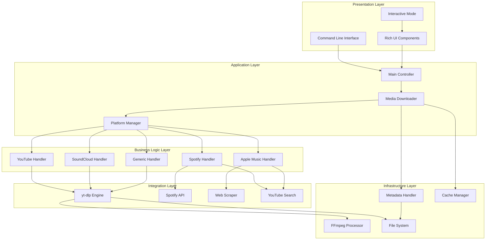

## Component Breakdown

### 1. Presentation Layer

#### CLI Interface
```python
class CommandLineInterface:
    """Handles command-line argument parsing and validation."""
    
    def parse_arguments(self) -> argparse.Namespace:
        """Parse and validate command-line arguments."""
        pass
    
    def validate_inputs(self, args: argparse.Namespace) -> bool:
        """Validate user inputs."""
        pass
```

#### Interactive Mode
```python
class InteractiveMode:
    """Manages interactive user sessions."""
    
    def start_session(self):
        """Start interactive mode loop."""
        pass
    
    def handle_command(self, command: str):
        """Process user commands."""
        pass
```

### 2. Application Layer

#### Main Controller
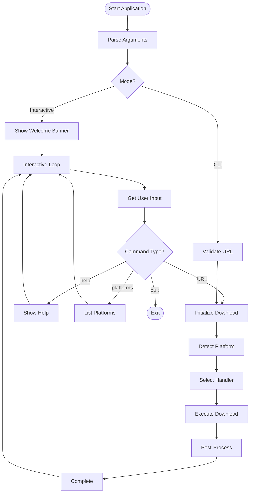

### 3. Platform Detection System

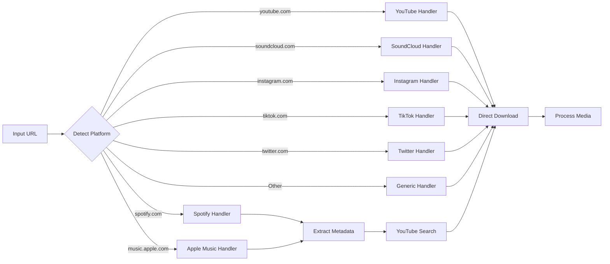

## Data Flow Diagrams

### Download Workflow

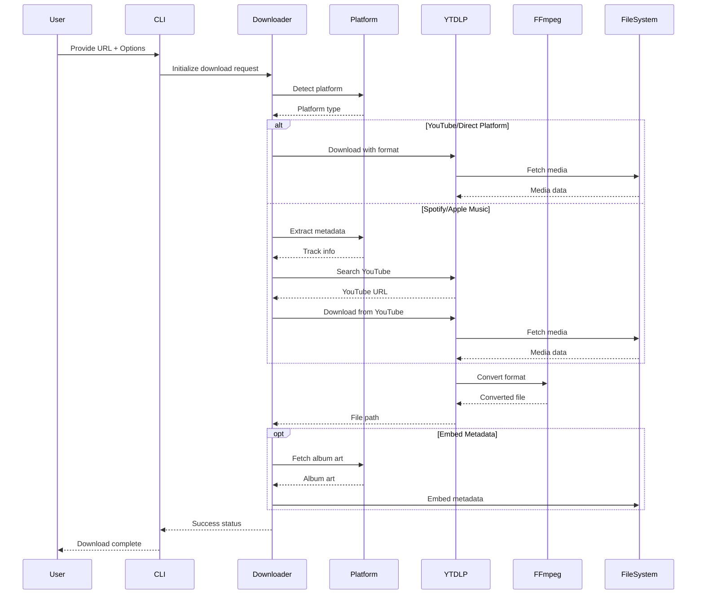

### Playlist Processing

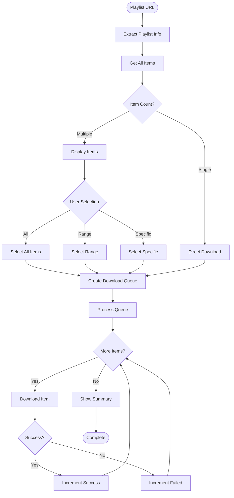

### Metadata Embedding Flow

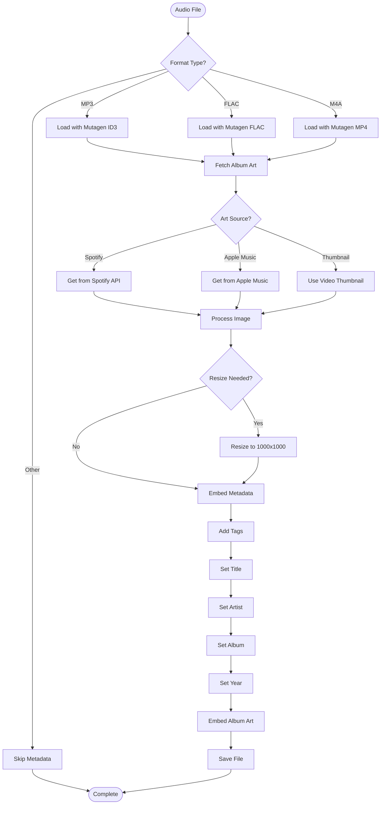

## Class Diagram

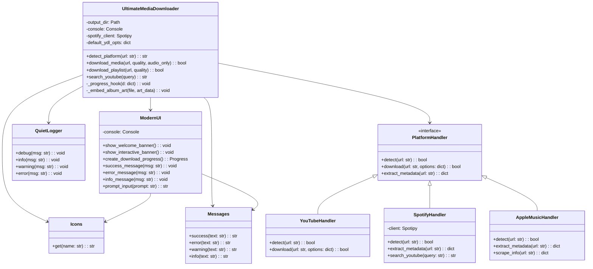

## Design Patterns Used

### 1. Strategy Pattern
Used for platform-specific download handlers.

```python
class PlatformStrategy:
    """Strategy interface for platform handlers."""
    def download(self, url: str, options: dict) -> bool:
        raise NotImplementedError

class YouTubeStrategy(PlatformStrategy):
    def download(self, url: str, options: dict) -> bool:
        # YouTube-specific implementation
        pass

class SpotifyStrategy(PlatformStrategy):
    def download(self, url: str, options: dict) -> bool:
        # Spotify-specific implementation
        pass
```

### 2. Factory Pattern
Used for creating platform handlers.

```python
class PlatformHandlerFactory:
    @staticmethod
    def create_handler(platform: str) -> PlatformStrategy:
        handlers = {
            'youtube': YouTubeStrategy,
            'spotify': SpotifyStrategy,
            'apple_music': AppleMusicStrategy,
        }
        return handlers.get(platform, GenericStrategy)()
```

### 3. Observer Pattern
Used for progress tracking.

```python
class DownloadObserver:
    def update(self, progress_data: dict):
        raise NotImplementedError

class ProgressBarObserver(DownloadObserver):
    def update(self, progress_data: dict):
        # Update progress bar
        pass

class LoggerObserver(DownloadObserver):
    def update(self, progress_data: dict):
        # Log progress
        pass
```

### 4. Singleton Pattern
Used for configuration management.

```python
class Config:
    _instance = None
    
    def __new__(cls):
        if cls._instance is None:
            cls._instance = super().__new__(cls)
        return cls._instance
```

## State Management

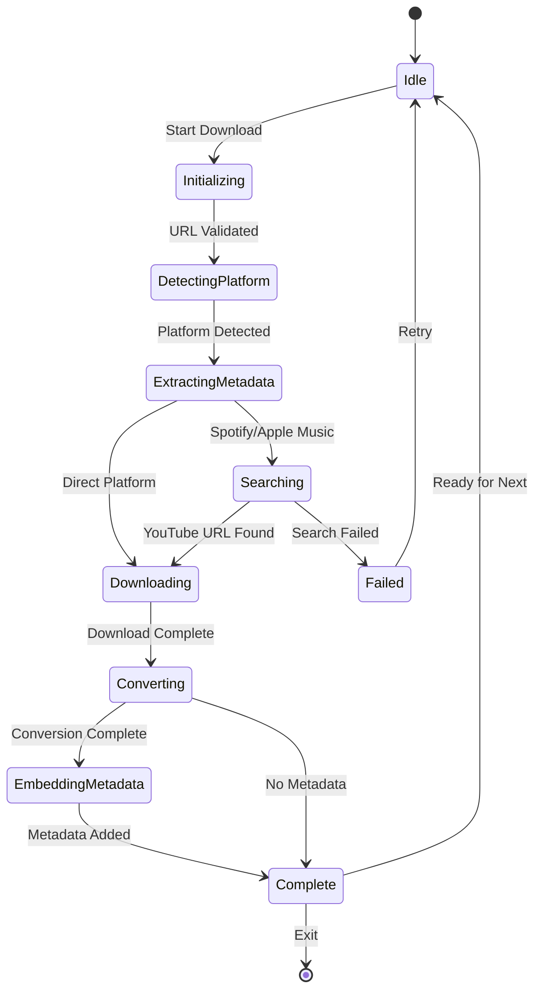

## Performance Optimization

### Concurrent Downloads

```mermaid
gantt
    title Parallel Download Timeline
    dateFormat X
    axisFormat %L
    
    section Thread 1
    URL 1 Download: 0, 1000
    URL 1 Convert: 1000, 1500
    
    section Thread 2
    URL 2 Download: 0, 800
    URL 2 Convert: 800, 1200
    
    section Thread 3
    URL 3 Download: 0, 1200
    URL 3 Convert: 1200, 1800
    
    section Main Thread
    Queue Management: 0, 1800
    Final Processing: 1800, 2000
```

### Caching Strategy

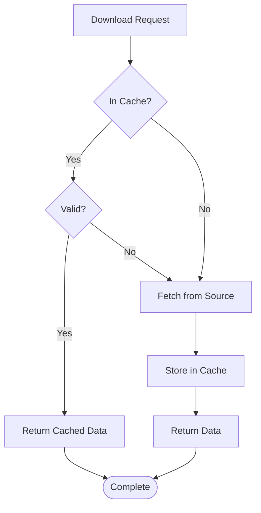

## Error Handling

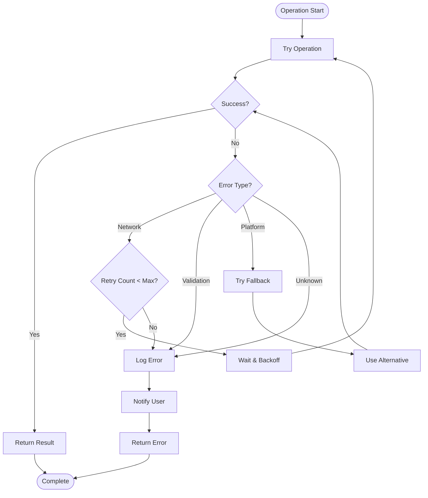

## Security Considerations

### URL Validation

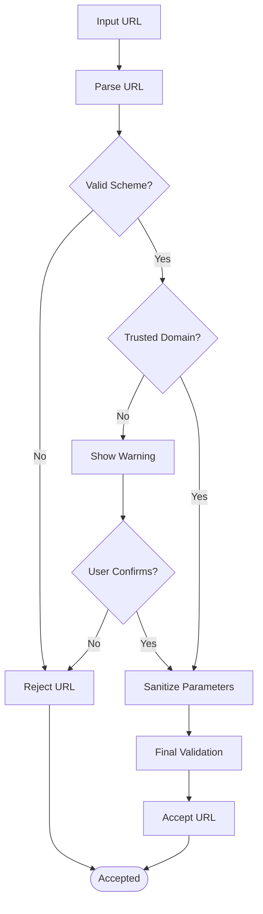

## Deployment Architecture

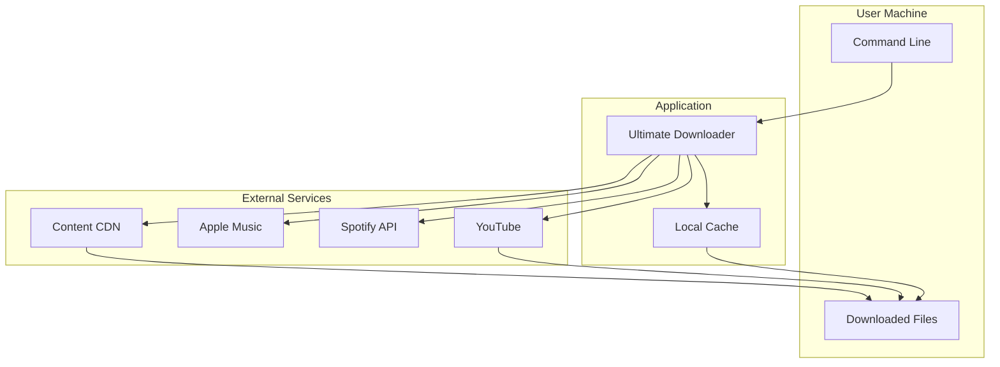

---

*This architecture document is maintained alongside the codebase and updated with major changes.*
