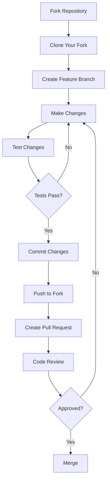

# Contributing to Ultimate Media Downloader

Thank you for your interest in contributing to Ultimate Media Downloader. This document provides guidelines and instructions for contributing to the project.

## Table of Contents

- [Code of Conduct](#code-of-conduct)
- [Getting Started](#getting-started)
- [How to Contribute](#how-to-contribute)
- [Development Setup](#development-setup)
- [Coding Standards](#coding-standards)
- [Submitting Changes](#submitting-changes)
- [Reporting Issues](#reporting-issues)

---

## Code of Conduct

By participating in this project, you agree to maintain a respectful and inclusive environment. Please:

- Be respectful of differing viewpoints and experiences
- Accept constructive criticism gracefully
- Focus on what is best for the community
- Show empathy towards other community members

---

## Getting Started

### Prerequisites

Before contributing, make sure you have:

- Python 3.9 or higher installed
- Git installed and configured
- A GitHub account
- Basic understanding of Python and command-line tools

### Understanding the Project

Before making changes, familiarize yourself with:

1. [Project Overview](documentations/PROJECT_OVERVIEW.md) - High-level understanding
2. [Architecture](documentations/ARCHITECTURE.md) - System design
3. [File Structure](documentations/FILE_STRUCTURE.md) - Code organization
4. [Handlers Documentation](documentations/HANDLERS.md) - Platform handlers

---

## How to Contribute

### Types of Contributions

I welcome various types of contributions:

| Type | Description |
|------|-------------|
| Bug Fixes | Fix issues reported in GitHub Issues |
| New Features | Add new functionality or platform support |
| Documentation | Improve or add documentation |
| Tests | Add or improve test coverage |
| Code Quality | Refactoring, optimization, cleanup |

### Contribution Workflow



---

## Development Setup

### Step 1: Fork and Clone

```bash
# Fork the repository on GitHub, then clone your fork
git clone https://github.com/YOUR_USERNAME/umd.git
cd umd
```

### Step 2: Set Up Virtual Environment

```bash
# Create virtual environment
python3 -m venv venv

# Activate virtual environment
# On macOS/Linux:
source venv/bin/activate
# On Windows:
venv\Scripts\activate
```

### Step 3: Install Dependencies

```bash
# Install all dependencies
pip install -r requirements.txt

# Install development dependencies (if available)
pip install pytest black flake8 mypy
```

### Step 4: Set Up Upstream Remote

```bash
# Add the original repository as upstream
git remote add upstream https://codeberg.org/nk2552003/umd.git

# Verify remotes
git remote -v
```

### Step 5: Create Feature Branch

```bash
# Fetch latest changes
git fetch upstream

# Create branch from main
git checkout -b feature/your-feature-name upstream/main
```

---

## Coding Standards

### Python Style Guide

Follow PEP 8 style guidelines with these specifics:

| Aspect | Standard |
|--------|----------|
| Indentation | 4 spaces |
| Line Length | Maximum 100 characters |
| Imports | Grouped (standard, third-party, local) |
| Docstrings | Google style |
| Naming | snake_case for functions, PascalCase for classes |

### Code Example

```python
#!/usr/bin/env python3
"""
Module description goes here.
Brief explanation of what this module does.
"""

import os
import sys
from pathlib import Path

import requests
from rich.console import Console

from utils.utils import sanitize_filename
from utils.ui_components import Icons, Messages


class ExampleHandler:
    """Handler for example platform.
    
    This class handles downloads from the example platform,
    including videos, playlists, and user content.
    
    Attributes:
        downloader: Reference to main downloader instance
        console: Rich console for output
    """
    
    def __init__(self, downloader):
        """Initialize handler with reference to main downloader.
        
        Args:
            downloader: UltimateMediaDownloader instance
        """
        self.downloader = downloader
        self.console = Console()
    
    def download(self, url, options=None):
        """Download content from URL.
        
        Args:
            url: URL to download from
            options: Optional dictionary of download options
            
        Returns:
            True if successful, False otherwise
            
        Raises:
            ValueError: If URL is invalid
        """
        if not url:
            raise ValueError("URL cannot be empty")
        
        # Implementation here
        return True
```

### Documentation Standards

- All public functions and classes must have docstrings
- Use type hints where appropriate
- Update relevant documentation when adding features
- Include examples in docstrings for complex functions

### Commit Message Format

Use clear, descriptive commit messages:

```
type: short description

Longer description if needed. Explain what changed and why.

Fixes #123
```

Types:
- `feat`: New feature
- `fix`: Bug fix
- `docs`: Documentation only
- `style`: Code style changes (formatting)
- `refactor`: Code refactoring
- `test`: Adding or updating tests
- `chore`: Maintenance tasks

Examples:

```
feat: add handler for new platform XYZ

Implemented XYZHandler class that supports:
- Single video downloads
- Playlist extraction
- Quality selection

Closes #45

---

fix: resolve SSL certificate error on certain sites

Added permissive SSL context creation for sites with
certificate issues. Falls back to secure context when possible.

Fixes #78

---

docs: update installation guide for Windows users

Added detailed FFmpeg installation instructions and
troubleshooting steps for common Windows issues.
```

---

## Submitting Changes

### Before Submitting

1. **Test your changes**

   ```bash
   # Run the application with your changes
   python ultimate_downloader.py --help
   
   # Test with actual URLs
   python ultimate_downloader.py "URL" --verbose
   ```

2. **Check code style**

   ```bash
   # Format code with black
   black *.py handlers/*.py utils/*.py
   
   # Check with flake8
   flake8 *.py handlers/*.py utils/*.py
   ```

3. **Update documentation** if you added or changed features

### Creating a Pull Request

1. Push your changes to your fork:

   ```bash
   git push origin feature/your-feature-name
   ```

2. Go to GitHub and create a Pull Request

3. Fill in the PR template:
   - Describe what changes you made
   - Reference any related issues
   - List any breaking changes
   - Include screenshots if relevant

### Pull Request Checklist

Before submitting, ensure:

- [ ] Code follows the project style guidelines
- [ ] Self-review of code completed
- [ ] Comments added for complex logic
- [ ] Documentation updated if needed
- [ ] No new warnings introduced
- [ ] Changes tested locally
- [ ] Commit messages are clear and descriptive

---

## Reporting Issues

### Bug Reports

When reporting a bug, include:

1. **Description**: Clear description of the issue
2. **Steps to Reproduce**: Exact steps to reproduce the problem
3. **Expected Behavior**: What you expected to happen
4. **Actual Behavior**: What actually happened
5. **Environment**:
   - Operating System
   - Python version
   - Application version
6. **Error Messages**: Full error output if available
7. **URL**: The URL you were trying to download (if not private)

### Feature Requests

When requesting a feature:

1. **Description**: Clear description of the feature
2. **Use Case**: Why this feature would be useful
3. **Examples**: Examples of how it would work
4. **Alternatives**: Any alternatives you considered

---

## Adding a New Platform Handler

If you want to add support for a new platform:

### Step 1: Create Handler File

Create `handlers/newplatform_handler.py`:

```python
#!/usr/bin/env python3
"""
NewPlatform Handler Module
Handles downloading from NewPlatform.
"""

import warnings
warnings.filterwarnings('ignore')

try:
    from rich.console import Console
    RICH_AVAILABLE = True
except ImportError:
    RICH_AVAILABLE = False

from utils.utils import sanitize_filename
from utils.ui_components import Icons, Messages


class NewPlatformHandler:
    """Handles NewPlatform downloads."""
    
    SUPPORTED_DOMAINS = ['newplatform.com', 'www.newplatform.com']
    
    def __init__(self, downloader):
        self.downloader = downloader
        self.console = Console() if RICH_AVAILABLE else None
    
    @classmethod
    def is_supported_url(cls, url):
        """Check if URL is from NewPlatform."""
        return any(domain in url.lower() for domain in cls.SUPPORTED_DOMAINS)
    
    def search_and_download(self, url, interactive=True):
        """Main entry point for downloading."""
        # Implement download logic
        pass
```

### Step 2: Register Handler

Update `ultimate_downloader.py` to import and use your handler.

### Step 3: Add Platform Detection

Update `utils/platform_utils.py` to detect the new platform.

### Step 4: Document

- Add handler documentation to `documentations/HANDLERS.md`
- Update platform list in README

### Step 5: Test

Test with various URL types from the platform.

---

## Questions

If you have questions about contributing:

1. Check existing documentation
2. Search closed issues and PRs
3. Open a new issue with the "question" label

---

## Recognition

Contributors are recognized in:

- GitHub contributors list
- Release notes when their changes are included

Thank you for contributing to Ultimate Media Downloader!
