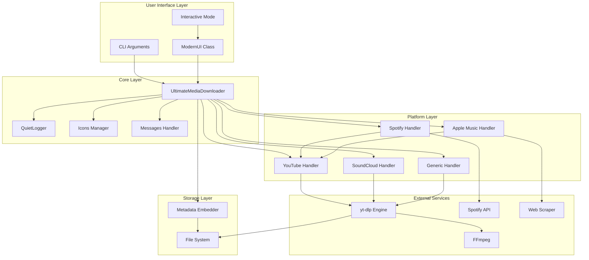
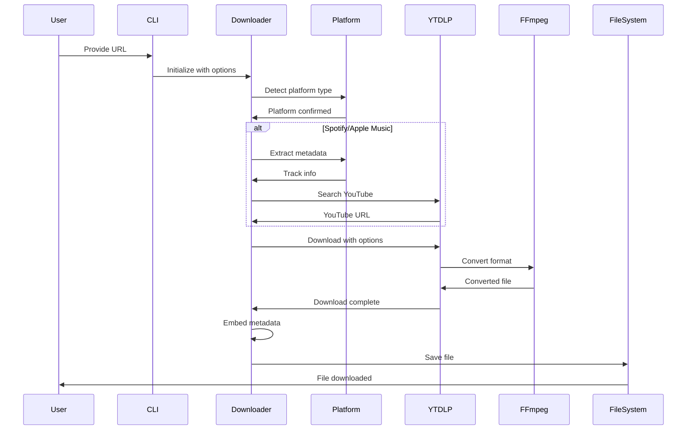

# Ultimate Media Downloader - Complete Documentation

## Table of Contents

1. [Introduction](#introduction)
2. [Architecture Overview](#architecture-overview)
3. [Class Documentation](#class-documentation)
4. [API Reference](#api-reference)
5. [Configuration](#configuration)
6. [Advanced Usage](#advanced-usage)
7. [Troubleshooting](#troubleshooting)
8. [Development Guide](#development-guide)

---

## Introduction

The Ultimate Media Downloader is a powerful Python-based tool for downloading media from 1000+ platforms. It uses yt-dlp as its core engine and provides a beautiful CLI interface with Rich library integration.

### Design Philosophy

- **User-Friendly**: Both CLI and interactive modes for all skill levels
- **Robust**: Comprehensive error handling and retry mechanisms
- **Extensible**: Modular design for easy feature additions
- **Performance**: Optimized for speed with concurrent downloads
- **Beautiful**: Modern UI with progress bars and colored output

---

## Architecture Overview

### System Architecture



### Data Flow



---

## Class Documentation

### 1. UltimateMediaDownloader

The main class that handles all download operations.

#### Attributes

```python
output_dir: Path              # Output directory for downloads
cancelled: bool               # Flag for cancellation
console: Console             # Rich console for output
current_progress: Progress   # Current progress bar
spotify_client: Spotipy      # Spotify API client
apple_music_downloader       # Apple Music downloader
browser_driver              # Selenium browser driver
default_ydl_opts: dict      # Default yt-dlp options
```

#### Key Methods

##### `detect_platform(url: str) -> str`
Detects the platform from a URL.

**Parameters:**
- `url`: Media URL to analyze

**Returns:**
- Platform name: 'youtube', 'spotify', 'soundcloud', 'apple_music', 'social_media', or 'generic'

**Example:**
```python
downloader = UltimateMediaDownloader()
platform = downloader.detect_platform("https://www.youtube.com/watch?v=dQw4w9WgXcQ")
# Returns: 'youtube'
```

##### `download_media(url, quality, audio_only, output_format, ...)`
Downloads media from a URL with specified options.

**Parameters:**
- `url` (str): Media URL to download
- `quality` (str): Video quality ('best', '1080p', '720p', etc.)
- `audio_only` (bool): Download audio only
- `output_format` (str): Output format ('mp3', 'flac', 'mp4', etc.)
- `custom_format` (str): Custom yt-dlp format string
- `interactive` (bool): Enable interactive prompts
- `add_metadata` (bool): Embed metadata
- `add_thumbnail` (bool): Embed thumbnail

**Returns:**
- `bool`: True if download successful

**Example:**
```python
downloader = UltimateMediaDownloader()
success = downloader.download_media(
    url="https://www.youtube.com/watch?v=dQw4w9WgXcQ",
    quality="1080p",
    audio_only=False,
    output_format="mp4",
    add_metadata=True
)
```

##### `download_playlist(url, quality, audio_only, ...)`
Downloads an entire playlist or selected items.

**Parameters:**
- `url` (str): Playlist URL
- `quality` (str): Video quality
- `audio_only` (bool): Download audio only
- `output_format` (str): Output format
- `max_downloads` (int): Maximum number of items to download
- `start_index` (int): Starting index for download
- `interactive` (bool): Enable interactive selection

**Example:**
```python
downloader.download_playlist(
    url="https://www.youtube.com/playlist?list=PLAYLIST_ID",
    quality="best",
    audio_only=True,
    output_format="mp3",
    max_downloads=10,
    interactive=True
)
```

##### `search_and_download_spotify_track(spotify_url)`
Downloads Spotify track by searching on YouTube.

**Example:**
```python
downloader.search_and_download_spotify_track(
    "https://open.spotify.com/track/TRACK_ID"
)
```

##### `search_and_download_apple_music_track(apple_music_url)`
Downloads Apple Music track by searching on YouTube.

**Example:**
```python
downloader.search_and_download_apple_music_track(
    "https://music.apple.com/us/album/track/ID"
)
```

### 2. ModernUI

Handles all user interface elements and display.

#### Methods

##### `show_welcome_banner()`
Displays the welcome banner with ASCII art.

##### `show_interactive_banner()`
Displays the interactive mode banner.

##### `create_download_progress()`
Creates a Rich progress bar for downloads.

##### `success_message(message: str)`
Displays a success message with formatting.

##### `error_message(message: str)`
Displays an error message with formatting.

##### `info_message(message: str)`
Displays an info message with formatting.

##### `prompt_input(prompt_text: str, default=None)`
Prompts user for input with styling.

### 3. QuietLogger

Custom logger to suppress verbose yt-dlp output while showing important messages.

#### Methods

##### `debug(msg: str)`
Handles debug messages (suppressed).

##### `info(msg: str)`
Handles info messages (filtered).

##### `warning(msg: str)`
Displays warning messages.

##### `error(msg: str)`
Displays error messages.

### 4. Icons

Manages icons for terminal output.

#### Methods

##### `get(name: str) -> str`
Returns an icon character for the given name.

**Available Icons:**
- Media: `video`, `audio`, `music`, `playlist`, `download`
- Platforms: `youtube`, `spotify`, `soundcloud`, `instagram`
- Status: `success`, `error`, `warning`, `info`, `loading`
- Quality: `hd`, `quality`, `format`

### 5. Messages

Centralized message templates with Rich formatting.

#### Methods

##### `success(text: str)`
Returns formatted success message.

##### `error(text: str)`
Returns formatted error message.

##### `warning(text: str)`
Returns formatted warning message.

##### `info(text: str)`
Returns formatted info message.

---

## API Reference

### Configuration Options

#### yt-dlp Options

The downloader uses extensive yt-dlp configuration for optimal performance:

```python
default_ydl_opts = {
    'format': 'bestvideo+bestaudio/best',  # Best quality
    'outtmpl': '%(artist,uploader)s - %(title)s.%(ext)s',  # Output template
    'writethumbnail': True,  # Download thumbnail
    'retries': 10,  # Number of retries
    'fragment_retries': 10,  # Fragment retry count
    'concurrent_fragments': 8,  # Parallel fragment downloads
    'http_chunk_size': 10485760,  # 10MB chunk size
    'quiet': True,  # Suppress verbose output
    'no_warnings': True,  # Suppress warnings
    'logger': QuietLogger(),  # Custom logger
}
```

#### Audio Format Options

```python
audio_formats = {
    'mp3': {
        'format': 'bestaudio/best',
        'postprocessors': [{
            'key': 'FFmpegExtractAudio',
            'preferredcodec': 'mp3',
            'preferredquality': '320',
        }]
    },
    'flac': {
        'format': 'bestaudio[acodec=flac]/bestaudio',
        'postprocessors': [{
            'key': 'FFmpegExtractAudio',
            'preferredcodec': 'flac',
        }]
    },
    'opus': {
        'format': 'bestaudio[acodec=opus]/bestaudio',
        'preferredquality': '256',
    }
}
```

### Platform-Specific Handling

#### YouTube

Direct download using yt-dlp with format selection:

```python
# Best video + audio
format = 'bestvideo+bestaudio/best'

# Specific resolution
format = 'bestvideo[height<=1080]+bestaudio/best[height<=1080]'

# Audio only
format = 'bestaudio[acodec=opus]/bestaudio'
```

#### Spotify

1. Extract track metadata using Spotify API
2. Search for track on YouTube
3. Download from YouTube
4. Embed Spotify metadata and album art

#### Apple Music

1. Scrape metadata from Apple Music page
2. Search for track on YouTube
3. Download from YouTube
4. Embed metadata

#### SoundCloud

Direct download using yt-dlp with authentication if needed.

---

## Configuration

### Environment Variables

Optional environment variables for enhanced functionality:

```bash
# Spotify API credentials (optional)
export SPOTIPY_CLIENT_ID='your_client_id'
export SPOTIPY_CLIENT_SECRET='your_client_secret'

# Apple Music token (optional, for gamdl)
export APPLE_MUSIC_TOKEN='your_token'

# Custom output directory
export DOWNLOADER_OUTPUT_DIR='/path/to/downloads'
```

### Configuration File

Create a `config.json` file for persistent settings:

```json
{
  "output_dir": "downloads",
  "default_quality": "best",
  "default_format": "mp4",
  "audio_format": "mp3",
  "embed_metadata": true,
  "embed_thumbnail": true,
  "max_concurrent_downloads": 3,
  "spotify": {
    "client_id": "your_client_id",
    "client_secret": "your_client_secret"
  }
}
```

---

## Advanced Usage

### Custom Format Selection

Use yt-dlp's powerful format selection:

```bash
# Best video (up to 1080p) + best audio
python ultimate_downloader.py "URL" \
    --custom-format "bestvideo[height<=1080]+bestaudio"

# Best video with VP9 codec
python ultimate_downloader.py "URL" \
    --custom-format "bestvideo[vcodec^=vp9]+bestaudio"

# Best audio with FLAC codec
python ultimate_downloader.py "URL" --audio-only \
    --custom-format "bestaudio[acodec=flac]/bestaudio"
```

### Batch Processing with Custom Script

```python
from ultimate_downloader import UltimateMediaDownloader

# Initialize downloader
downloader = UltimateMediaDownloader(output_dir="my_downloads")

# List of URLs
urls = [
    "https://www.youtube.com/watch?v=VIDEO1",
    "https://www.youtube.com/watch?v=VIDEO2",
    "https://soundcloud.com/artist/track"
]

# Download all with custom settings
for url in urls:
    downloader.download_media(
        url=url,
        quality="1080p",
        audio_only=False,
        output_format="mp4",
        add_metadata=True
    )
```

### Playlist Processing

```python
from ultimate_downloader import UltimateMediaDownloader

downloader = UltimateMediaDownloader()

# Download playlist with filtering
downloader.download_playlist(
    url="https://www.youtube.com/playlist?list=PLAYLIST_ID",
    quality="best",
    audio_only=True,
    output_format="flac",
    max_downloads=50,
    start_index=1,
    interactive=False  # Non-interactive mode
)
```

### Metadata Embedding

```python
# Embed metadata after download
from ultimate_downloader import UltimateMediaDownloader

downloader = UltimateMediaDownloader()

# Download with full metadata
downloader.download_media(
    url="URL",
    audio_only=True,
    output_format="mp3",
    add_metadata=True,
    add_thumbnail=True
)

# Manual metadata embedding
audio_file = "path/to/audio.mp3"
downloader._enhance_audio_with_metadata(
    audio_file_path=audio_file,
    track_name="Song Title",
    artist_name="Artist Name",
    fetch_from_streaming=True
)
```

---

## Troubleshooting

### Common Issues

#### 1. FFmpeg Not Found

**Problem:** `FFmpeg not found` error

**Solution:**
```bash
# macOS
brew install ffmpeg

# Ubuntu/Debian
sudo apt-get install ffmpeg

# Windows
# Download from https://ffmpeg.org/download.html
```

#### 2. Import Errors

**Problem:** `ModuleNotFoundError: No module named 'yt_dlp'`

**Solution:**
```bash
# Activate virtual environment
source venv/bin/activate  # macOS/Linux
# or
venv\Scripts\activate  # Windows

# Install dependencies
pip install -r requirements.txt
```

#### 3. Spotify API Issues

**Problem:** Spotify downloads failing

**Solution:**
- Spotify tracks are downloaded via YouTube search
- No Spotify API credentials required
- Ensure YouTube search is working

#### 4. Apple Music Extraction Fails

**Problem:** Cannot extract Apple Music metadata

**Solution:**
- Apple Music requires web scraping
- Ensure `beautifulsoup4` is installed
- Try alternative search: manually input track name

#### 5. Download Speed Slow

**Problem:** Downloads are very slow

**Solution:**
```bash
# Use optimized batch mode
python ultimate_downloader.py --batch-file urls.txt \
    --optimized-batch --max-concurrent 5

# Increase fragment concurrency (in code)
'concurrent_fragments': 16
```

#### 6. Playlist Download Interrupted

**Problem:** Playlist download stops midway

**Solution:**
```bash
# Use start index to resume
python ultimate_downloader.py "PLAYLIST_URL" --playlist \
    --start-index 25  # Resume from item 25
```

### Debug Mode

Enable verbose logging for troubleshooting:

```python
# Modify QuietLogger to show debug messages
class QuietLogger:
    def debug(self, msg):
        print(f"[DEBUG] {msg}")  # Uncomment to see debug messages
```

### Getting Help

1. Check [GitHub Issues](https://github.com/yourusername/ultimate-downloader/issues)
2. Read [yt-dlp documentation](https://github.com/yt-dlp/yt-dlp)
3. Join discussions on GitHub Discussions
4. Check FFmpeg installation: `ffmpeg -version`

---

## Development Guide

### Setting Up Development Environment

```bash
# Clone repository
git clone https://github.com/yourusername/ultimate-downloader.git
cd ultimate-downloader

# Create virtual environment
python3 -m venv venv
source venv/bin/activate

# Install dependencies
pip install -r requirements.txt

# Install development dependencies
pip install pytest black flake8 mypy pylint
```

### Code Style

We follow PEP 8 with some modifications:

```bash
# Format code with Black
black ultimate_downloader.py

# Check with flake8
flake8 ultimate_downloader.py --max-line-length=120

# Type checking with mypy
mypy ultimate_downloader.py
```

### Testing

```bash
# Run tests
pytest tests/

# Run specific test
pytest tests/test_downloader.py::test_detect_platform

# With coverage
pytest --cov=ultimate_downloader tests/
```

### Adding New Platform Support

1. Add platform detection in `detect_platform()`:
```python
def detect_platform(self, url):
    if 'newplatform.com' in url_lower:
        return 'newplatform'
```

2. Add platform configuration:
```python
self.platform_configs['newplatform'] = {
    'extractors': ['newplatform'],
    'formats': ['mp4', 'mp3']
}
```

3. Add download handler if needed:
```python
def _download_newplatform_track(self, url):
    # Implementation
    pass
```

### Building Documentation

```bash
# Generate API documentation
pdoc --html ultimate_downloader.py -o docs/

# Build with Sphinx (if using)
cd docs
make html
```

### Release Process

1. Update version in `ultimate_downloader.py`
2. Update CHANGELOG.md
3. Run tests: `pytest`
4. Create git tag: `git tag v2.0.0`
5. Push tag: `git push origin v2.0.0`
6. Create GitHub release

---

## Performance Optimization

### Download Speed

```python
# Increase concurrent fragments
'concurrent_fragments': 16

# Increase chunk size
'http_chunk_size': 20971520  # 20MB

# Use multiple connections
'external_downloader': 'aria2c'
'external_downloader_args': ['-x', '16', '-k', '1M']
```

### Memory Usage

```python
# Reduce cache size
'cachedir': False  # Disable cache

# Stream processing
'buffersize': 1024  # Smaller buffer
```

### Parallel Processing

```python
# Use ThreadPoolExecutor
from concurrent.futures import ThreadPoolExecutor

with ThreadPoolExecutor(max_workers=5) as executor:
    futures = [executor.submit(download_func, url) for url in urls]
    results = [f.result() for f in futures]
```

---

## Security Considerations

### Safe URL Handling

```python
# Validate URLs before processing
from urllib.parse import urlparse

def is_safe_url(url):
    parsed = urlparse(url)
    return parsed.scheme in ['http', 'https']
```

### File Path Sanitization

```python
# Sanitize filenames
def sanitize_filename(filename):
    return "".join(c for c in filename 
                   if c.isalnum() or c in (' ', '-', '_', '.')).rstrip()
```

### API Key Security

- Never commit API keys to version control
- Use environment variables
- Consider using python-dotenv

---

## License

This project is licensed under the MIT License. See LICENSE file for details.

## Credits

- **yt-dlp Team**: Core download engine
- **FFmpeg Project**: Audio/video processing
- **Rich Library**: Beautiful terminal UI
- **All Contributors**: Thank you for your contributions!

---

*Last Updated: 2024*
