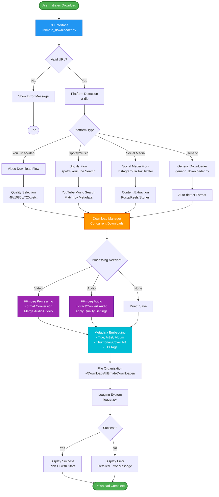
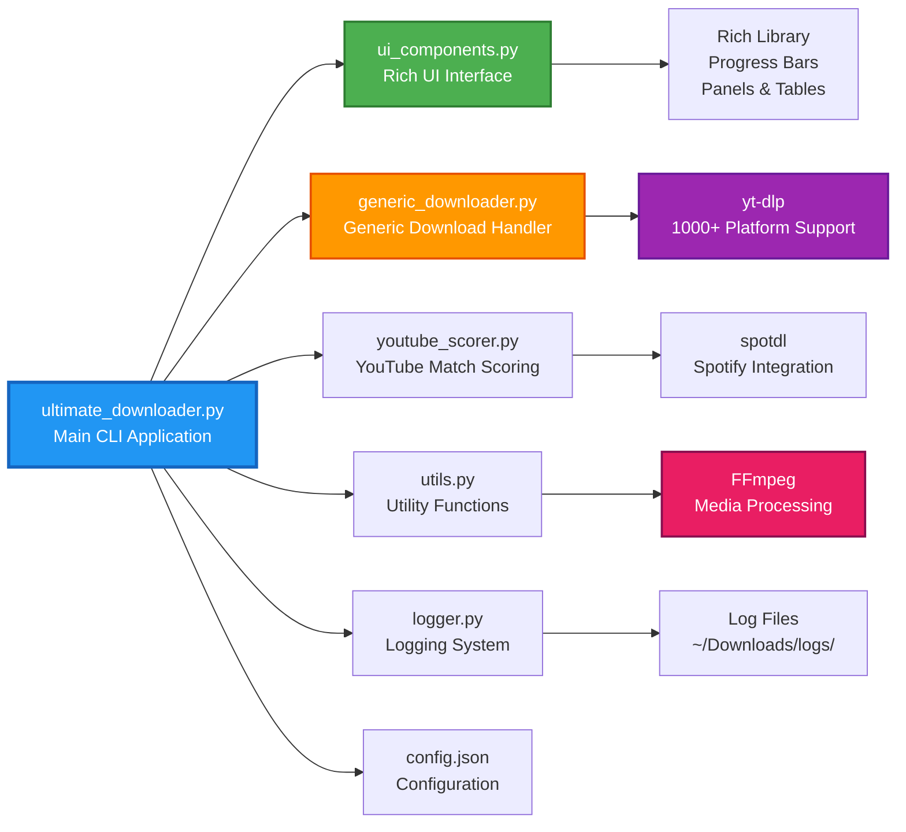
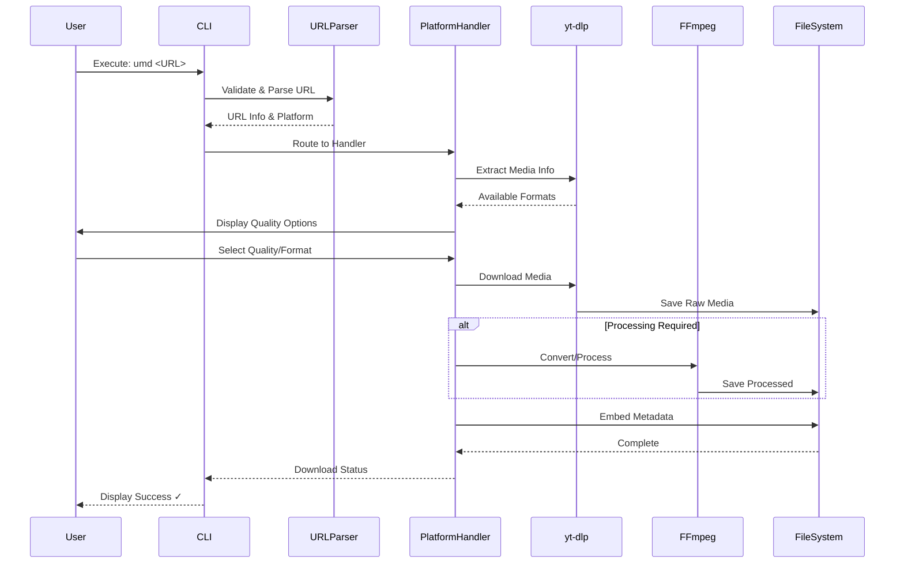
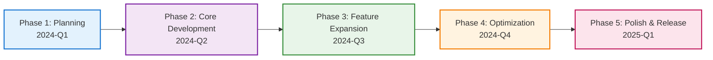
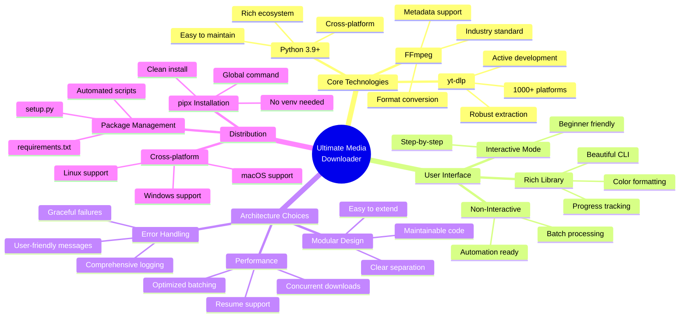
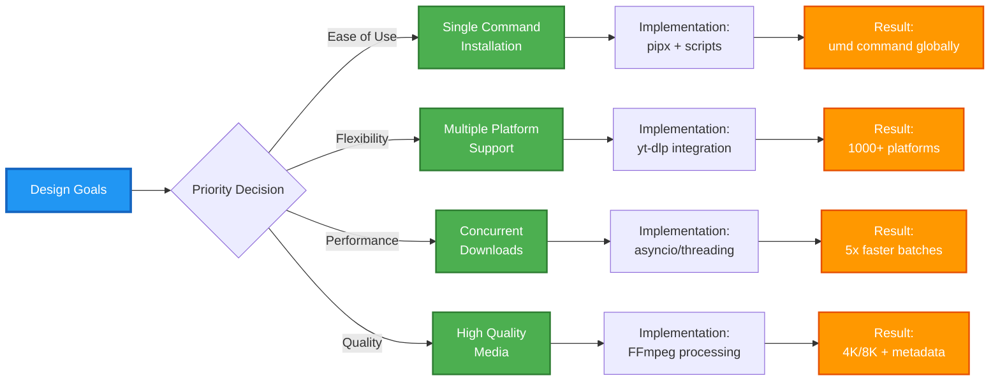
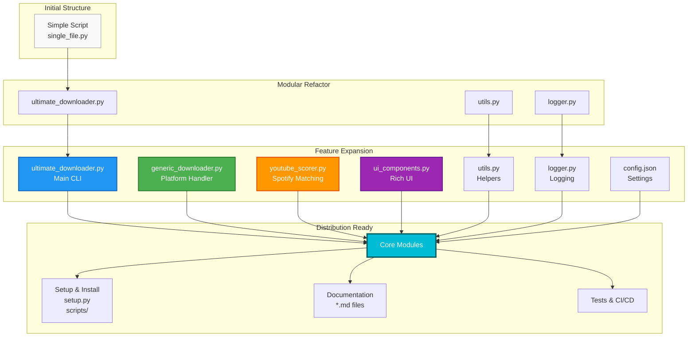

<div align="center">

# Ultimate Media Downloader

[](https://www.python.org/downloads/)
[](LICENSE)
[](https://github.com/NK2552003/ULTIMATE-MEDIA-DOWNLOADER)
[](https://github.com/NK2552003/ULTIMATE-MEDIA-DOWNLOADER/commits/main)
[](https://github.com/NK2552003/ULTIMATE-MEDIA-DOWNLOADER)

**Download media from 1000+ platforms with just one command: `umd`**

[Features](#features) • [Installation](#installation) • [Quick Start](#quick-start) • [Documentation](#documentation) • [Contributing](CONTRIBUTING.md) • [Code of Conduct](CODE_OF_CONDUCT.md)

</div>

---

## Overview

**Ultimate Media Downloader** is a professional-grade, open-source media downloading tool that supports over 1000+ platforms including YouTube, Spotify, SoundCloud, Instagram, TikTok, and many more. Built with Python and featuring a beautiful Rich CLI interface, it provides enterprise-level features with consumer-friendly simplicity.

### Why Choose Ultimate Media Downloader?

- **One Command**: Install once, use `umd` from anywhere
- **1000+ Platforms**: YouTube, Spotify, Instagram, TikTok, SoundCloud, and more
- **No Virtual Environment**: Clean installation with `pipx`
- **Auto Organization**: Downloads saved to `~/Downloads/UltimateDownloader`
- **Beautiful UI**: Modern CLI with progress bars and rich formatting
- **Fast Downloads**: Concurrent downloads with resume support
- **High Quality**: 4K/8K video, 320kbps audio, metadata embedding
- ️ **Active Development**: Regular updates and improvements

---

## Demo

<div align="center">

https://github.com/NK2552003/ULTIMATE-MEDIA-DOWNLOADER/blob/main/demo_video/demo.mp4

*Watch the Ultimate Media Downloader in action*

</div>

---

## Features

### Core Capabilities

 **Video Downloads**
- YouTube (4K/8K), Vimeo, Dailymotion
- Live streams and premieres
- Age-restricted content support
- Custom quality selection

 **Audio Downloads**
- Spotify (via YouTube search)
- SoundCloud, Apple Music
- MP3, FLAC, M4A, OPUS formats
- Automatic metadata & cover art embedding

 **Social Media**
- Instagram (Posts, Reels, IGTV, Stories)
- TikTok (Videos, User content)
- Twitter/X (Video tweets)
- Facebook (Videos, Live streams)

 **Streaming Platforms**
- Twitch (VODs, Clips, Live)
- YouTube Live
- Facebook Live
- And 1000+ more sites!

### Advanced Features

 **Smart URL Handling**
- YouTube Mix/Radio playlists (auto-extract single video)
- Playlist support with selection options
- Batch downloads from file
- Parallel processing

 **Quality & Format**
- Choose quality: Best, 4K, 1080p, 720p, 480p, 360p
- Multiple formats: MP4, MKV, MP3, FLAC, M4A, OPUS
- Custom format strings for advanced users
- Audio language selection

 **User Experience**
- Interactive mode for beginners
- Non-interactive mode for automation
- Real-time progress tracking
- Beautiful terminal UI with Rich
- Comprehensive error messages

 **Metadata & Thumbnails**
- Auto-embed album art
- ID3 tags (artist, title, album, year)
- Thumbnail embedding
- Spotify/Apple Music cover art fetching

---

## Installation

### Quick Install (Recommended)

Install in just **2 commands** - no virtual environment needed!

```bash
git clone https://github.com/NK2552003/ULTIMATE-MEDIA-DOWNLOADER.git
cd ULTIMATE-MEDIA-DOWNLOADER
./scripts/install.sh
```

**Windows users:**
```batch
git clone https://github.com/NK2552003/ULTIMATE-MEDIA-DOWNLOADER.git
cd ULTIMATE-MEDIA-DOWNLOADER
scripts\install.bat
```

That's it! Now use from anywhere:

```bash
umd <URL>
```

### What Gets Installed

 No virtual environment needed  
 Global `umd` command available everywhere  
 All dependencies handled automatically  
 FFmpeg installed/verified  
 Downloads directory created at `~/Downloads/UltimateDownloader`  

**Installation time**: 2-5 minutes

---

### Prerequisites

Before installing, ensure you have:

- **Python 3.9+** - [Download here](https://www.python.org/downloads/)
- **Git** - [Download here](https://git-scm.com/downloads)
- **FFmpeg** (optional, will be prompted during installation)

Check your Python version:
```bash
python3 --version
```

---

### Alternative Installation Methods

<details>
<summary><b>Method 1: Using pipx (Manual)</b></summary>

```bash
# Install pipx if not already installed
brew install pipx  # macOS
# or
pip install --user pipx  # Linux/Windows

# Clone and install
git clone https://github.com/NK2552003/ULTIMATE-MEDIA-DOWNLOADER.git
cd ULTIMATE-MEDIA-DOWNLOADER
pipx install -e .
```

</details>

<details>
<summary><b>Method 2: Using pip</b></summary>

```bash
git clone https://github.com/NK2552003/ULTIMATE-MEDIA-DOWNLOADER.git
cd ULTIMATE-MEDIA-DOWNLOADER
pip3 install -e .
```

</details>

<details>
<summary><b>Method 3: Virtual Environment</b></summary>

```bash
git clone https://github.com/NK2552003/ULTIMATE-MEDIA-DOWNLOADER.git
cd ULTIMATE-MEDIA-DOWNLOADER
python3 -m venv venv
source venv/bin/activate  # On Windows: venv\Scripts\activate
pip install -r requirements.txt
python ultimate_downloader.py <URL>
```

</details>

---

### ️ Platform-Specific Installation

<details>
<summary><b> macOS</b></summary>

```bash
# Install prerequisites
brew install python@3.11 ffmpeg pipx

# Clone and install
git clone https://github.com/NK2552003/ULTIMATE-MEDIA-DOWNLOADER.git
cd ULTIMATE-MEDIA-DOWNLOADER
./scripts/install.sh
```

If `umd` command not found, add to PATH:
```bash
echo 'export PATH="$PATH:$HOME/Library/Python/3.11/bin"' >> ~/.zshrc
source ~/.zshrc
```

</details>

<details>
<summary><b> Linux (Ubuntu/Debian)</b></summary>

```bash
# Install prerequisites
sudo apt update
sudo apt install -y python3 python3-pip ffmpeg git

# Clone and install
git clone https://github.com/NK2552003/ULTIMATE-MEDIA-DOWNLOADER.git
cd ULTIMATE-MEDIA-DOWNLOADER
./scripts/install.sh
```

If `umd` command not found, add to PATH:
```bash
echo 'export PATH="$PATH:$HOME/.local/bin"' >> ~/.bashrc
source ~/.bashrc
```

</details>

<details>
<summary><b>🪟 Windows</b></summary>

**Step 1: Install Prerequisites**
1. Install Python from [python.org](https://www.python.org/downloads/) (Check "Add Python to PATH")
2. Install Git from [git-scm.com](https://git-scm.com/downloads)
3. Install FFmpeg:
   - Using Chocolatey: `choco install ffmpeg`
   - Or download from [ffmpeg.org](https://ffmpeg.org/download.html)

**Step 2: Install Ultimate Media Downloader**
```batch
git clone https://github.com/NK2552003/ULTIMATE-MEDIA-DOWNLOADER.git
cd ULTIMATE-MEDIA-DOWNLOADER
scripts\install.bat
```

</details>

---

### Verify Installation

```bash
# Check if installed
umd --version

# Show help
umd --help

# Test with a video
umd "https://www.youtube.com/watch?v=dQw4w9WgXcQ" --info
```

---

### Detailed Installation Guide

For comprehensive installation instructions, troubleshooting, and platform-specific guides, see:

**[📖 Complete Installation Guide](docs/INSTALLATION_GUIDE.md)**

---

## Quick Start

### Basic Usage

```bash
# Interactive mode (easiest for beginners)
umd

# Download a video
umd "https://youtube.com/watch?v=VIDEO_ID"

# Download audio only as MP3
umd "https://youtube.com/watch?v=VIDEO_ID" --audio-only --format mp3

# Download in specific quality
umd "URL" --quality 1080p

# Download entire playlist
umd "https://youtube.com/playlist?list=PLAYLIST_ID"

# Show all available options
umd --help
```

### Advanced Examples

```bash
# Download with metadata and thumbnail
umd "URL" --audio-only --embed-metadata --embed-thumbnail

# Batch download from file
umd --batch-file urls.txt --audio-only

# Parallel batch download
umd --batch-file urls.txt --optimized-batch --max-concurrent 5

# Custom output directory
umd "URL" --output /path/to/folder

# Show available formats
umd "URL" --show-formats

# Download specific quality video
umd "URL" --quality 1080p --format mp4
```

### Download Locations

Downloads are automatically saved to:
```
~/Downloads/UltimateDownloader/
├── Artist Name - Song Title.mp3
├── Video Title.mp4
├── Playlist Name/
│   ├── Song 1.mp3
│   ├── Song 2.mp3
│   └── Song 3.mp3
└── Album Name/
    └── tracks...
```

For more examples and detailed usage, see **[Quick Start Guide](docs/QUICKSTART.md)**

---

## Supported Platforms

<details>
<summary><b>Click to see full list of 1000+ supported platforms</b></summary>

### Video Platforms
- YouTube (Videos, Playlists, Live Streams, Shorts)
- Vimeo (Videos, Private content)
- Dailymotion
- Twitch (VODs, Clips, Streams)
- Facebook (Videos, Live)
- And many more...

### Social Media
- Instagram (Posts, Reels, IGTV, Stories)
- TikTok (Videos, User content)
- Twitter/X (Video tweets)
- Reddit (Videos)
- Snapchat

### Music Platforms
- Spotify (Tracks, Albums, Playlists - via YouTube search)
- SoundCloud (Tracks, Playlists, Sets)
- Apple Music (Tracks, Albums - via YouTube search)
- Bandcamp
- Mixcloud

### Streaming Services
- Twitch
- YouTube Live
- Facebook Live
- And more...

**Total: 1000+ supported sites via yt-dlp**

Use `umd --list-platforms` to see detailed platform support.

</details>

---

## Documentation

### User Documentation

- **[Installation Guide](docs/INSTALLATION_GUIDE.md)** - Comprehensive installation instructions
- **[Quick Start Guide](docs/QUICKSTART.md)** - Get started in 5 minutes
- **[Getting Started](docs/GETTING_STARTED.md)** - Step-by-step beginner guide
- **[Project Summary](docs/PROJECT_SUMMARY.md)** - Overview of the project
- **[Documentation Summary](docs/DOCUMENTATION_SUMMARY.md)** - All documentation in one place

### Technical Documentation

- **[File Structure](docs/FILE_STRUCTURE.md)** - Project file organization
- **[Contributing Guide](CONTRIBUTING.md)** - How to contribute
- **[Changelog](docs/CHANGELOG.md)** - Version history and updates

### Installation & Setup Guides

- **[Install Guide](docs/INSTALL.md)** - Installation instructions
- **[Uninstall Guide](docs/UNINSTALL.md)** - How to remove the application
- **[Windows Batch Files](docs/WINDOWS_BATCH_FILES.md)** - Windows installation help

---

## 🔧 How It Works

Ultimate Media Downloader uses a sophisticated multi-layered architecture to provide seamless media downloading from thousands of platforms.

### System Architecture



### Component Breakdown



### Download Process Flow



---

## 🚀 How I Created It

This project was built through careful planning, iterative development, and community feedback. Here's the journey:

### Development Timeline



#### 📅 Development Phases

| Phase | Period | Key Achievements |
|-------|--------|------------------|
| **🎯 Phase 1: Planning** | 2024-Q1 | • Research & Ideation<br/>• Studied yt-dlp capabilities<br/>• Analyzed user needs<br/>• Designed architecture |
| **🔨 Phase 2: Core Development** | 2024-Q2 | • Built CLI Interface<br/>• Integrated yt-dlp<br/>• Added FFmpeg support<br/>• Created download manager |
| **🚀 Phase 3: Feature Expansion** | 2024-Q3 | • Added Spotify support<br/>• Implemented metadata embedding<br/>• Built Rich UI interface<br/>• Added batch downloads |
| **⚡ Phase 4: Optimization** | 2024-Q4 | • Parallel downloads<br/>• Error handling<br/>• Installation scripts<br/>• Cross-platform support |
| **✨ Phase 5: Polish & Release** | 2025-Q1 | • Documentation<br/>• Testing & bug fixes<br/>• Public release<br/>• Community feedback |

### Technology Stack Decision Process



### Key Development Decisions



### Project Structure Evolution



### Lessons Learned & Best Practices

1. **User-Centric Design**: Always prioritize ease of use over technical complexity
2. **Modular Architecture**: Separation of concerns makes maintenance easier
3. **Error Handling**: Comprehensive error messages save hours of support time
4. **Documentation**: Good docs are as important as good code
5. **Community Feedback**: Early user feedback shaped many key features
6. **Testing**: Platform diversity requires extensive real-world testing
7. **Performance**: Concurrent downloads were a game-changer for batch operations

---

## Use Cases

### For Music Lovers
```bash
# Download Spotify playlist as MP3 with metadata
umd "SPOTIFY_PLAYLIST_URL" --audio-only --format mp3 --embed-metadata

# Download album in FLAC quality
umd "ALBUM_URL" --audio-only --format flac
```

### For Content Creators
```bash
# Download 4K video for editing
umd "URL" --quality 4k --format mp4

# Download entire channel
umd "CHANNEL_URL" --playlist
```

### For Researchers
```bash
# Batch download educational content
umd --batch-file lectures.txt --quality 1080p

# Download with subtitles
umd "URL" --write-subs --sub-lang en
```

### For Automation
```bash
# Automated batch download (non-interactive)
umd --batch-file daily_downloads.txt --no-interactive --optimized-batch
```

---

## ️ System Requirements

### Minimum Requirements
- **Operating System**: Linux, macOS 10.12+, Windows 10+
- **Python**: 3.9 or higher
- **RAM**: 2GB minimum, 4GB recommended
- **Storage**: 100MB for installation + space for downloads
- **Internet**: Stable internet connection

### Required Software
- **Python 3.9+**: Core runtime
- **FFmpeg**: Video/audio processing (can be auto-installed)
- **pip**: Python package manager

---

## Contributing

We welcome contributions! Here's how you can help:

1. Fork the repository
2. Create a feature branch (`git checkout -b feature/AmazingFeature`)
3. Commit your changes (`git commit -m 'Add some AmazingFeature'`)
4. Push to the branch (`git push origin feature/AmazingFeature`)
5. Open a Pull Request

See **[CONTRIBUTING.md](CONTRIBUTING.md)** for detailed guidelines.

### Development Setup

```bash
# Clone your fork
git clone https://github.com/YOUR_USERNAME/ULTIMATE-MEDIA-DOWNLOADER.git
cd ULTIMATE-MEDIA-DOWNLOADER

# Create virtual environment
python3 -m venv venv
source venv/bin/activate

# Install development dependencies
pip install -r requirements-dev.txt

# Run tests
pytest
```

---

## License

This project is licensed under the MIT License - see the [LICENSE](LICENSE) file for details.

---

## ️ Disclaimer

This tool is for personal use only. Users are responsible for complying with copyright laws and terms of service of the platforms they download from. The developers assume no liability for misuse of this software.

**Please respect:**
- Copyright laws and fair use policies
- Platform terms of service
- Content creator rights
- Regional restrictions and DRM

---

## Acknowledgments

Built with:
- [yt-dlp](https://github.com/yt-dlp/yt-dlp) - Media extraction engine
- [Rich](https://github.com/Textualize/rich) - Beautiful terminal formatting
- [FFmpeg](https://ffmpeg.org/) - Media processing
- [SpotDL](https://github.com/spotDL/spotify-downloader) - Spotify integration

Special thanks to all contributors and the open-source community!

---

## Support & Contact

- **Bug Reports**: [Open an issue](https://github.com/NK2552003/ULTIMATE-MEDIA-DOWNLOADER/issues)
- **Feature Requests**: [Start a discussion](https://github.com/NK2552003/ULTIMATE-MEDIA-DOWNLOADER/discussions)
- **Contact**: [Create an issue](https://github.com/NK2552003/ULTIMATE-MEDIA-DOWNLOADER/issues)
- ⭐ **Show Support**: [Star the repository](https://github.com/NK2552003/ULTIMATE-MEDIA-DOWNLOADER)

---

## Roadmap

- [ ] GUI interface
- [ ] Browser extension
- [ ] Docker support
- [ ] Multi-language support
- [ ] Advanced scheduling
- [ ] Cloud storage integration
- [ ] Mobile app

---

## Statistics

- **Lines of Code**: 5000+
- **Supported Platforms**: 1000+
- **Active Users**: Growing
- **Last Updated**: October 2025

---

<div align="center">

**Made with ️ by [NK2552003](https://github.com/NK2552003)**

⭐ Star this repository if you find it useful!

[Report Bug](https://github.com/NK2552003/ULTIMATE-MEDIA-DOWNLOADER/issues) • [Request Feature](https://github.com/NK2552003/ULTIMATE-MEDIA-DOWNLOADER/issues) • [Documentation](docs/DOCUMENTATION_SUMMARY.md)

</div>
