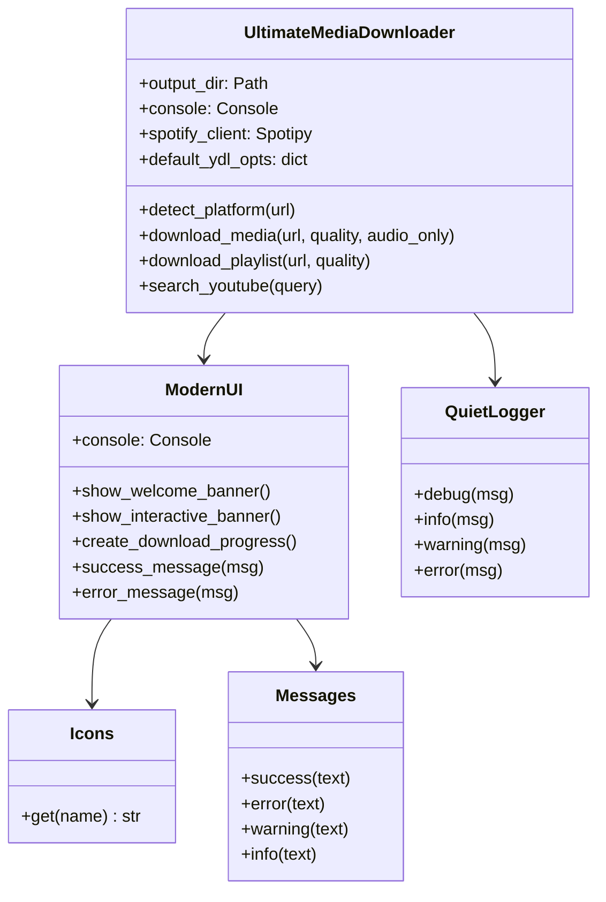
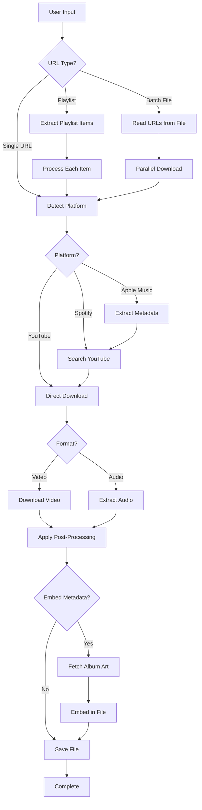

# Ultimate Media Downloader

<div align="center">


**A powerful, feature-rich media downloader supporting 1000+ platforms including YouTube, Spotify, Instagram, TikTok, SoundCloud, Apple Music, and more!**

[Features](#-features) • [Installation](#-installation) • [Usage](#-usage) • [Documentation](#-documentation) • [Contributing](#-contributing)

</div>

---

## 📋 Table of Contents

- [Features](#-features)
- [Supported Platforms](#-supported-platforms)
- [Installation](#-installation)
- [Quick Start](#-quick-start)
- [Usage Examples](#-usage-examples)
- [Architecture](#-architecture)
- [Documentation](#-documentation)
- [Contributing](#-contributing)
- [License](#-license)
- [Acknowledgments](#-acknowledgments)

---

## ✨ Features

### Core Features
- 🎬 **Multi-Platform Support**: Download from 1000+ platforms
- 🎵 **Audio Extraction**: High-quality audio extraction with format conversion
- 📺 **Video Download**: Multiple quality options (360p to 4K)
- 📝 **Playlist Support**: Download entire playlists or select specific tracks
- 🔄 **Batch Downloads**: Process multiple URLs with parallel downloading
- 🎨 **Beautiful UI**: Modern CLI interface with Rich library integration

### Advanced Features
- 🎼 **Metadata Embedding**: Automatic metadata and album art embedding
- 🔍 **Smart Search**: YouTube search for Spotify/Apple Music tracks
- 🎯 **Quality Selection**: Interactive quality selection
- ⚡ **Optimized Performance**: Concurrent downloads and fragment optimization
- 🛡️ **Error Handling**: Robust error handling and retry mechanisms
- 📊 **Progress Tracking**: Real-time download progress with Rich progress bars

### Audio Formats Supported
- **Lossless**: FLAC, WAV
- **Lossy**: MP3 (320kbps), M4A, AAC, Opus

### Video Formats Supported
- MP4, WebM, MKV, FLV
- Quality: 4K, 1440p, 1080p, 720p, 480p, 360p

---

## 🌐 Supported Platforms

<table>
<tr>
<td width="50%">

### Video Platforms
- ✅ YouTube (Videos, Playlists, Live)
- ✅ Vimeo
- ✅ Dailymotion
- ✅ Facebook Videos
- ✅ Twitter/X Videos
- ✅ Twitch (VODs, Clips)
- ✅ Reddit Videos

</td>
<td width="50%">

### Audio Platforms
- ✅ Spotify (via YouTube search)
- ✅ SoundCloud
- ✅ Apple Music (via YouTube search)
- ✅ Bandcamp
- ✅ Mixcloud

</td>
</tr>
<tr>
<td width="50%">

### Social Media
- ✅ Instagram (Videos, Reels, IGTV)
- ✅ TikTok
- ✅ Snapchat Stories
- ✅ Pinterest Videos

</td>
<td width="50%">

### Other
- ✅ Udemy
- ✅ Coursera
- ✅ BBC iPlayer
- ✅ And 1000+ more!

</td>
</tr>
</table>

**Run `python ultimate_downloader.py --list-platforms` to see all supported sites**

---

## 📦 Installation

### Prerequisites

- **Python 3.8 or higher**
- **FFmpeg** (for audio/video conversion)
- **pip** (Python package manager)

### System-Specific Prerequisites

#### macOS
```bash
# Install Homebrew (if not already installed)
/bin/bash -c "$(curl -fsSL https://raw.githubusercontent.com/Homebrew/install/HEAD/install.sh)"

# Install FFmpeg
brew install ffmpeg

# Install Python 3 (if not already installed)
brew install python@3
```

#### Ubuntu/Debian
```bash
sudo apt update
sudo apt install python3 python3-pip ffmpeg
```

#### Fedora
```bash
sudo dnf install python3 python3-pip ffmpeg
```

#### Windows
1. Download and install [Python 3.8+](https://www.python.org/downloads/)
2. Download [FFmpeg](https://ffmpeg.org/download.html) and add to PATH

### Installation Steps

#### Option 1: Automated Setup (Recommended)

```bash
# Clone the repository
git clone https://github.com/yourusername/ultimate-downloader.git
cd ultimate-downloader

# Run the setup script
chmod +x setup.sh
./setup.sh
```

#### Option 2: Manual Setup

```bash
# Clone the repository
git clone https://github.com/yourusername/ultimate-downloader.git
cd ultimate-downloader

# Create virtual environment
python3 -m venv venv

# Activate virtual environment
# On macOS/Linux:
source venv/bin/activate
# On Windows:
venv\Scripts\activate

# Install dependencies
pip install -r requirements.txt
```

---

## 🚀 Quick Start

### Activate Environment

```bash
# On macOS/Linux
source activate_env.sh

# On Windows
.\venv\Scripts\activate
```

### Run Interactive Mode

```bash
python ultimate_downloader.py
```

### Download a Video

```bash
python ultimate_downloader.py "https://www.youtube.com/watch?v=VIDEO_ID"
```

### Download Audio Only

```bash
python ultimate_downloader.py "URL" --audio-only --format mp3
```

---

## 💡 Usage Examples

### Basic Usage

```bash
# Interactive mode (recommended for beginners)
python ultimate_downloader.py

# Download single video
python ultimate_downloader.py "https://www.youtube.com/watch?v=dQw4w9WgXcQ"

# Download with specific quality
python ultimate_downloader.py "URL" --quality 1080p

# Download audio only
python ultimate_downloader.py "URL" --audio-only
```

### Audio Downloads

```bash
# High-quality MP3 (320kbps)
python ultimate_downloader.py "URL" --audio-only --format mp3

# Lossless FLAC audio
python ultimate_downloader.py "URL" --audio-only --format flac

# Download from Spotify (searches YouTube)
python ultimate_downloader.py "https://open.spotify.com/track/TRACK_ID" \
    --audio-only --format mp3
```

### Playlist Downloads

```bash
# Interactive playlist download
python ultimate_downloader.py "PLAYLIST_URL" --playlist

# Download first 10 videos
python ultimate_downloader.py "PLAYLIST_URL" --playlist \
    --max-downloads 10 --no-interactive

# Download specific range
python ultimate_downloader.py "PLAYLIST_URL" --playlist \
    --start-index 5 --max-downloads 15
```

### Batch Downloads

```bash
# Create a file with URLs (one per line)
cat > urls.txt <<EOF
https://www.youtube.com/watch?v=VIDEO1
https://www.youtube.com/watch?v=VIDEO2
https://soundcloud.com/artist/track
EOF

# Download all URLs
python ultimate_downloader.py --batch-file urls.txt --audio-only

# Optimized parallel download
python ultimate_downloader.py --batch-file urls.txt \
    --optimized-batch --max-concurrent 5
```

### Advanced Options

```bash
# Embed metadata and thumbnails
python ultimate_downloader.py "URL" --audio-only --format mp3 \
    --embed-metadata --embed-thumbnail

# Custom output directory
python ultimate_downloader.py "URL" --output /path/to/downloads

# Show available formats
python ultimate_downloader.py "URL" --show-formats

# Custom format selection
python ultimate_downloader.py "URL" \
    --custom-format "bestvideo[height<=720]+bestaudio[ext=m4a]"
```

---

## 🏗️ Architecture

### Project Structure

```
ultimate-downloader/
├── ultimate_downloader.py    # Main application
├── requirements.txt           # Python dependencies
├── setup.sh                   # Automated setup script
├── install.sh                 # Dependency installation
├── activate_env.sh           # Environment activation
├── README.md                 # This file
├── DOCUMENTATION.md          # Detailed documentation
├── CONTRIBUTING.md           # Contribution guidelines
├── LICENSE                   # MIT License
└── downloads/                # Default download directory
```

### Core Classes



### Key Technologies

- **yt-dlp**: Core download engine
- **Rich**: Beautiful terminal UI
- **Spotipy**: Spotify API integration
- **Mutagen**: Audio metadata handling
- **BeautifulSoup4**: Web scraping
- **FFmpeg**: Audio/video processing
- **Selenium**: Browser automation (optional)

### Workflow Diagram



---

## 📚 Documentation

For detailed documentation, please see:

- **[DOCUMENTATION.md](DOCUMENTATION.md)** - Complete technical documentation
- **[CONTRIBUTING.md](CONTRIBUTING.md)** - How to contribute
- **[API Reference](DOCUMENTATION.md#api-reference)** - Class and method documentation

### Command-Line Options

```
usage: ultimate_downloader.py [-h] [-q {best,worst,4k,2160p,1440p,1080p,720p,480p,360p}]
                               [-a] [-f FORMAT] [-o OUTPUT] [-p] [-m MAX_DOWNLOADS]
                               [-s START_INDEX] [-i] [--show-formats]
                               [--custom-format CUSTOM_FORMAT] [--timeout TIMEOUT]
                               [--check-support] [--list-platforms] [--interactive]
                               [--no-interactive] [--audio-format {mp3,flac,opus,m4a,aac,wav}]
                               [--audio-quality {best,high,medium,low}]
                               [--max-concurrent MAX_CONCURRENT] [--embed-metadata]
                               [--embed-thumbnail] [--batch-file BATCH_FILE]
                               [--optimized-batch]
                               [url]
```

Run `python ultimate_downloader.py --help` for full documentation.

---

## 🤝 Contributing

Contributions are welcome! Please see [CONTRIBUTING.md](CONTRIBUTING.md) for details.

### How to Contribute

1. Fork the repository
2. Create a feature branch (`git checkout -b feature/AmazingFeature`)
3. Commit your changes (`git commit -m 'Add some AmazingFeature'`)
4. Push to the branch (`git push origin feature/AmazingFeature`)
5. Open a Pull Request

### Development Setup

```bash
# Clone your fork
git clone https://github.com/yourusername/ultimate-downloader.git
cd ultimate-downloader

# Create virtual environment
python3 -m venv venv
source venv/bin/activate

# Install dependencies
pip install -r requirements.txt

# Install development dependencies
pip install pytest black flake8 mypy
```

---

## 📄 License

This project is licensed under the MIT License - see the [LICENSE](LICENSE) file for details.

```
MIT License

Copyright (c) 2024 Ultimate Media Downloader Contributors

Permission is hereby granted, free of charge, to any person obtaining a copy
of this software and associated documentation files (the "Software"), to deal
in the Software without restriction, including without limitation the rights
to use, copy, modify, merge, publish, distribute, sublicense, and/or sell
copies of the Software, and to permit persons to whom the Software is
furnished to do so, subject to the following conditions:

The above copyright notice and this permission notice shall be included in all
copies or substantial portions of the Software.

THE SOFTWARE IS PROVIDED "AS IS", WITHOUT WARRANTY OF ANY KIND, EXPRESS OR
IMPLIED, INCLUDING BUT NOT LIMITED TO THE WARRANTIES OF MERCHANTABILITY,
FITNESS FOR A PARTICULAR PURPOSE AND NONINFRINGEMENT. IN NO EVENT SHALL THE
AUTHORS OR COPYRIGHT HOLDERS BE LIABLE FOR ANY CLAIM, DAMAGES OR OTHER
LIABILITY, WHETHER IN AN ACTION OF CONTRACT, TORT OR OTHERWISE, ARISING FROM,
OUT OF OR IN CONNECTION WITH THE SOFTWARE OR THE USE OR OTHER DEALINGS IN THE
SOFTWARE.
```

---

## 🙏 Acknowledgments

This project wouldn't be possible without these amazing open-source projects:

- **[yt-dlp](https://github.com/yt-dlp/yt-dlp)** - The core download engine
- **[FFmpeg](https://ffmpeg.org/)** - Audio/video processing
- **[Rich](https://github.com/Textualize/rich)** - Beautiful terminal UI
- **[Spotipy](https://github.com/spotipy-dev/spotipy)** - Spotify API wrapper
- **[Mutagen](https://github.com/quodlibet/mutagen)** - Audio metadata handling

### Special Thanks

- All contributors who have helped improve this project
- The open-source community for providing excellent tools and libraries
- Users who report bugs and suggest features

---

## 📞 Support

- **Issues**: [GitHub Issues](https://github.com/yourusername/ultimate-downloader/issues)
- **Discussions**: [GitHub Discussions](https://github.com/yourusername/ultimate-downloader/discussions)

---

## 🗺️ Roadmap

- [ ] GUI version using PyQt or Electron
- [ ] Support for more streaming platforms
- [ ] Built-in VPN support
- [ ] Download queue management
- [ ] Automatic subtitle download and embedding
- [ ] Video format conversion
- [ ] Cloud storage integration

---

<div align="center">

**Made with ❤️ by the Ultimate Media Downloader Team**

⭐ Star us on GitHub — it motivates us a lot!

[Report Bug](https://github.com/yourusername/ultimate-downloader/issues) • [Request Feature](https://github.com/yourusername/ultimate-downloader/issues)

</div>
