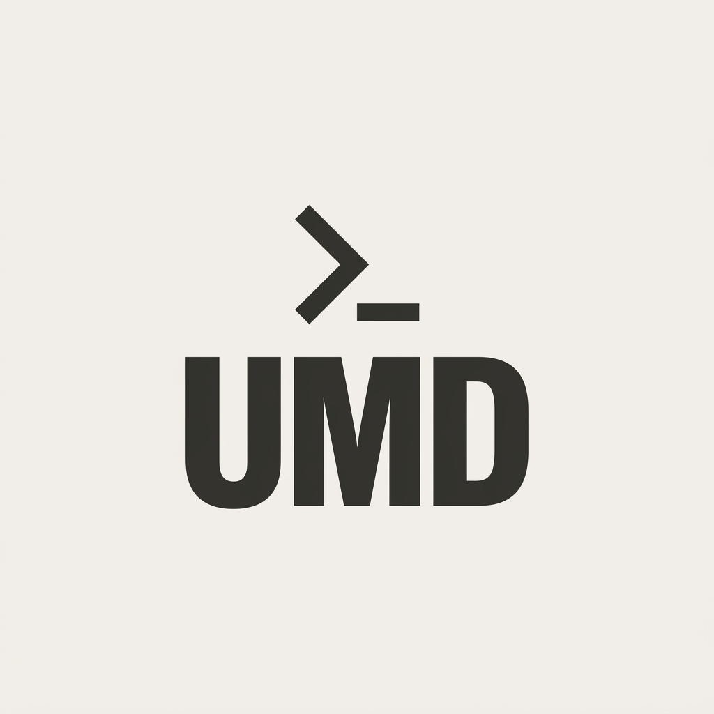

<div align="center">
  
  <h1>Ultimate Media Downloader (UMD)</h1>
  <p><strong>The official website and documentation for Ultimate Media Downloader.</strong></p>
</div>

---

> [!IMPORTANT]  
> **Official Codeberg Repository:** This is the ONLY website and repository for Ultimate Media Downloader that is maintained on Codeberg. Accept no substitutes.

## Overview

Welcome to the official repository for the Ultimate Media Downloader (UMD) website. UMD is a powerful, versatile tool designed to streamline your media downloading experience. This repository contains the source code for our next-generation website, built with modern web technologies to ensure a fast, responsive, and stunning user experience.

### Built With

- **Framework:** [Next.js](https://nextjs.org/)
- **Styling:** [Tailwind CSS](https://tailwindcss.com/)
- **Animations:** [Framer Motion](https://www.framer.com/motion/) & [GSAP](https://gsap.com/)
- **Icons:** [Lucide React](https://lucide.dev/) & [React Icons](https://react-icons.github.io/react-icons/)

## Legal & Disclaimer Notice

> [!WARNING]  
> **Please read this carefully before proceeding or using UMD.**

This project, its associated website, and any provided tools are developed strictly for **educational and personal use only**.

- **No Copyright Infringement Intended:** This tool is designed to allow users to download media for offline viewing of content they have the right to access (e.g., fair use, public domain, or with explicit permission from the copyright holder).
- **User Responsibility:** The creators, contributors, and maintainers of Ultimate Media Downloader take zero responsibility for how this tool is used. Any misuse of this tool to pirate, unlawfully distribute, or download copyrighted material is strictly prohibited and is solely the responsibility of the end user.
- **No Hosting:** We do not host, store, or distribute any copyrighted media on this repository, website, or our servers. 

By using this repository or the UMD software, you explicitly agree to comply with your local laws and the terms of service of any platform you interact with. If you do not agree, please do not use this software.

## Getting Started

To run the website locally for development:

1. Clone the repository:
   ```bash
   git clone https://codeberg.org/nk2552003/umd.git
   ```
2. Install dependencies:
   ```bash
   npm install
   ```
3. Start the development server:
   ```bash
   npm run dev
   ```
4. Open [http://localhost:3000](http://localhost:3000) in your browser.

## Contributing

Contributions, issues, and feature requests are welcome! Feel free to check the issues page.

---
<div align="center">
  <p>Maintained with ❤️ by NK2552003</p>
</div>
