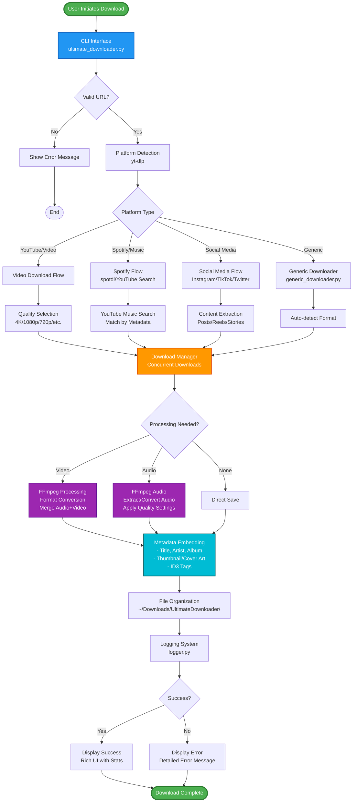
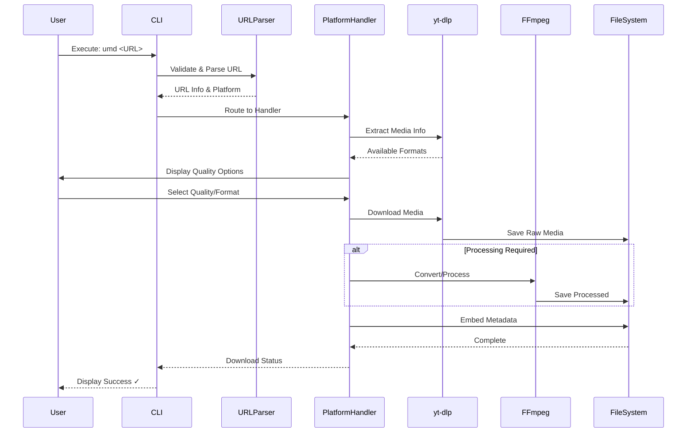

# Architecture - Ultimate Media Downloader

## System Overview

Ultimate Media Downloader is a Python-based CLI tool that downloads media from 1000+ platforms using a modular, extensible architecture.

## Core Components

### Main Entry Point
**`ultimate_downloader.py`**
- CLI interface and argument parsing
- Orchestrates the entire download process
- Handles user interaction and output formatting
- Routes URLs to appropriate handlers

### Platform Handlers

#### **`spotify_handler.py`**
- Handles Spotify URLs (tracks, albums, playlists)
- Searches YouTube for matching content
- Extracts metadata from Spotify API
- Integrates with YouTube downloader for actual downloads

#### **`apple_music_handler.py`**
- Handles Apple Music URLs
- Similar to Spotify handler but for Apple Music platform
- Searches YouTube for content matching Apple Music metadata

#### **`generic_downloader.py`**
- Fallback handler for unsupported platforms
- Uses yt-dlp as primary download engine
- Supports 1000+ platforms via yt-dlp
- Handles various download scenarios and edge cases

#### **`youtube_scorer.py`**
- Scores YouTube search results for relevance
- Used by Spotify/Apple Music handlers
- Matches metadata to find best YouTube equivalent

### User Interface Layer

#### **`ui_components.py`**
- Rich terminal UI components
- Progress bars, tables, and formatted output
- Color schemes and styling

#### **`ui_display.py`**
- Display logic for UI components
- Screen management and updates
- Interactive prompts and selections

#### **`ui_utils.py`**
- UI utility functions
- Text formatting and display helpers
- Terminal capability detection

#### **`progress_display.py`**
- Download progress visualization
- Speed and ETA calculations
- Multi-threaded progress tracking

### Utility Modules

#### **`file_manager.py`**
- File system operations
- Download directory management
- File organization and cleanup
- Path resolution and validation

#### **`logger.py`**
- Centralized logging system
- Debug and error tracking
- Log file management

#### **`url_validator.py`**
- URL format validation
- Platform detection from URLs
- Input sanitization

#### **`platform_info.py`**
- Platform capability database
- Supported format detection
- Platform-specific configuration

#### **`platform_utils.py`**
- Platform detection utilities
- URL parsing and normalization
- Platform-specific helpers

#### **`browser_utils.py`**
- Browser automation utilities
- Cloudflare bypass capabilities
- JavaScript rendering support

#### **`cli_args.py`**
- Command-line argument parsing
- Option validation and processing
- Help text generation

#### **`utils.py`**
- General-purpose utility functions
- Common helpers used across modules
- Data processing and formatting

### Configuration & Setup

#### **`config.json`**
- Default configuration settings
- User preferences and options
- Platform-specific configurations

#### **`setup.py`**
- Package configuration for pip installation
- Dependency management
- Entry point definitions

## Data Flow

```
User Input → CLI Parser → Platform Detection → Handler Selection → Download Process → File Output
     ↓           ↓             ↓                ↓              ↓              ↓
  URL/Text   Arguments    URL Analysis    Spotify/Generic   yt-dlp/FFmpeg   ~/Downloads/
```

## How It Works

Ultimate Media Downloader uses a sophisticated multi-layered architecture to provide seamless media downloading from thousands of platforms.

### System Architecture




### Download Process Flow



---

## Download Process

1. **URL Reception**: `ultimate_downloader.py` receives URL from CLI
2. **Platform Detection**: `platform_utils.py` identifies the platform
3. **Handler Routing**: Appropriate handler selected (Spotify, Apple Music, Generic)
4. **Metadata Extraction**: Handler extracts title, artist, etc.
5. **Download Execution**: yt-dlp downloads raw media
6. **Post-Processing**: FFmpeg converts formats, embeds metadata
7. **File Organization**: `file_manager.py` saves to organized structure

## Key Design Patterns

### Strategy Pattern
- Different handlers for different platforms
- Pluggable download strategies
- Extensible architecture for new platforms

### Factory Pattern
- Handler factory based on platform detection
- UI component factory
- Downloader factory for different scenarios

### Observer Pattern
- Progress tracking and updates
- Logging system notifications
- UI state management

## Dependencies

### Core Dependencies
- **yt-dlp**: Primary download engine for 1000+ platforms
- **rich**: Beautiful terminal UI and progress bars
- **click**: Command-line interface framework
- **requests**: HTTP client for API calls

### Audio/Video Processing
- **ffmpeg-python**: FFmpeg integration for format conversion
- **mutagen**: Audio metadata embedding (ID3 tags, etc.)

### Platform Specific
- **spotdl**: Spotify integration (optional)
- **selenium**: Browser automation for difficult sites
- **playwright**: Alternative browser automation

## File Organization

```
ULTIMATE-MEDIA-DOWNLOADER/
├── ultimate_downloader.py     # Main CLI
├── [platform]_handler.py      # Platform-specific handlers
├── generic_downloader.py      # Fallback downloader
├── ui_*.py                    # User interface components
├── *_utils.py                 # Utility modules
├── config.json                # Configuration
├── setup.py                   # Package setup
└── docs/                      # Documentation
```

## Extension Points

### Adding New Platforms
1. Create new handler in `[platform]_handler.py`
2. Implement platform-specific logic
3. Register handler in main CLI
4. Add platform detection in `platform_utils.py`

### Adding UI Components
1. Create component in `ui_components.py`
2. Add display logic in `ui_display.py`
3. Integrate with main CLI flow

### Adding Utilities
1. Create utility module with clear naming
2. Add to `utils.py` imports if general-purpose
3. Document functionality in module docstrings

## Performance Considerations

### Concurrent Downloads
- Thread pool for parallel processing
- Queue management for batch downloads
- Resource limiting to prevent overload

### Memory Management
- Streaming downloads to avoid memory issues
- Cleanup of temporary files
- Efficient data structures

### Error Handling
- Graceful degradation on failures
- Retry logic with exponential backoff
- Comprehensive error reporting

## Security

### Input Validation
- URL sanitization in `url_validator.py`
- Command injection prevention
- Path traversal protection

### Network Security
- SSL/TLS verification
- Proxy support for anonymity
- Rate limiting compliance

## Testing

### Unit Tests
- Individual module testing
- Mock external dependencies
- Edge case coverage

### Integration Tests
- End-to-end download testing
- Platform compatibility verification
- UI interaction testing

## Future Enhancements

### Planned Improvements
- GUI interface (Electron/PyQt)
- Plugin system for custom handlers
- Cloud storage integration
- Advanced scheduling features

### Scalability
- Microservice architecture option
- Distributed download processing
- API for third-party integrations