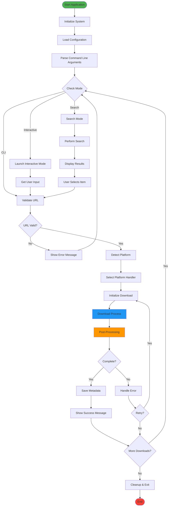
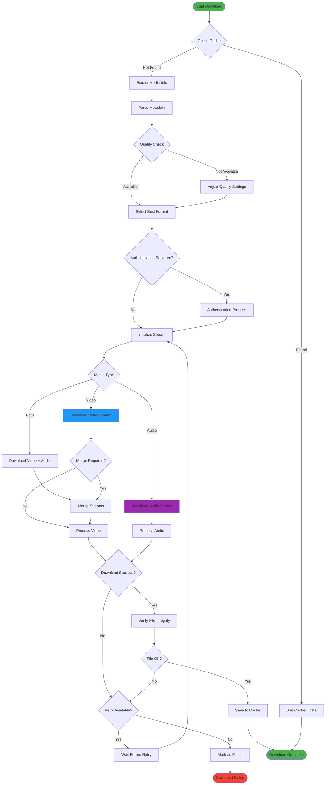
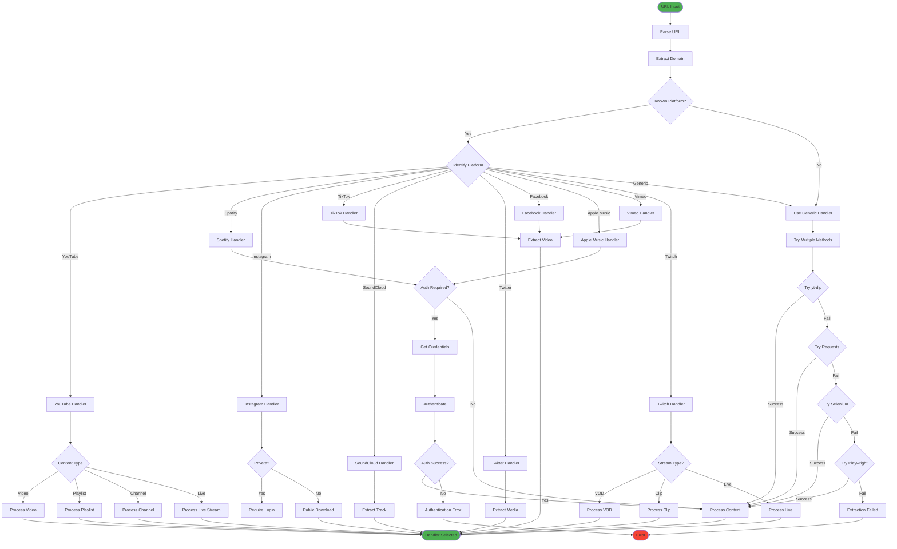
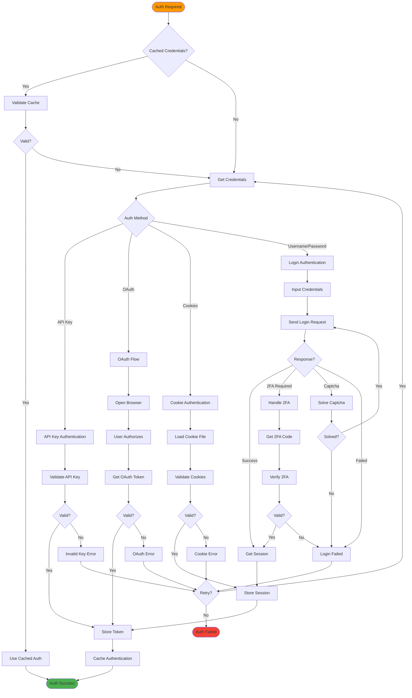
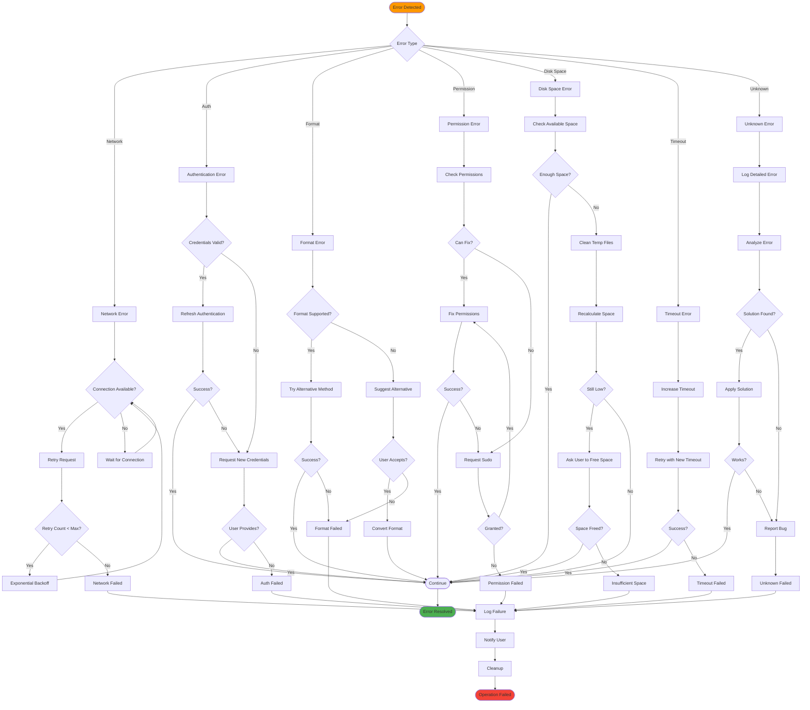
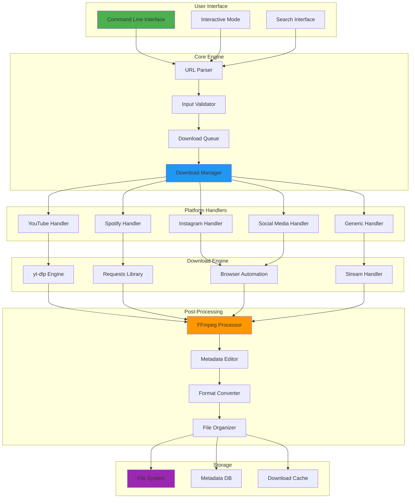
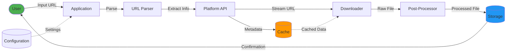

# Process Flowcharts - Ultimate Media Downloader

This document contains all the process flowcharts for the Ultimate Media Downloader system, created using Mermaid syntax.

## Table of Contents
1. [Main Application Flow](#1-main-application-flow)
2. [Download Process Flow](#2-download-process-flow)
3. [Platform Detection Flow](#3-platform-detection-flow)
4. [Authentication Flow](#4-authentication-flow)
5. [Post-Processing Flow](#5-post-processing-flow)
6. [Error Handling Flow](#6-error-handling-flow)
7. [Playlist Processing Flow](#7-playlist-processing-flow)
8. [Configuration Flow](#8-configuration-flow)

---

## 1. Main Application Flow

---

## 2. Download Process Flow

---

## 3. Platform Detection Flow

---

## 4. Authentication Flow

---

## 5. Post-Processing Flow

```mermaid
flowchart TD
    Start([File Downloaded]) --> CheckFormat{Format Conversion Needed?}
    
    CheckFormat -->|Yes| ConvertFormat[Convert Format]
    CheckFormat -->|No| CheckMetadata{Add Metadata?}
    
    ConvertFormat --> UseFFmpeg[Use FFmpeg]
    UseFFmpeg --> Conversion{Success?}
    Conversion -->|Yes| CheckMetadata
    Conversion -->|No| ConversionError[Conversion Error]
    
    CheckMetadata -->|Yes| ExtractMetadata[Extract Metadata]
    CheckMetadata -->|No| CheckThumbnail{Add Thumbnail?}
    
    ExtractMetadata --> ParseTags[Parse Tags]
    ParseTags --> GetArtwork[Get Artwork]
    GetArtwork --> ArtworkFound{Found?}
    ArtworkFound -->|Yes| DownloadArtwork[Download Artwork]
    ArtworkFound -->|No| UseDefault[Use Default]
    
    DownloadArtwork --> EmbedMetadata[Embed Metadata]
    UseDefault --> EmbedMetadata
    EmbedMetadata --> CheckThumbnail
    
    CheckThumbnail -->|Yes| GetThumbnail[Get Thumbnail]
    CheckThumbnail -->|No| CheckSubtitles{Add Subtitles?}
    
    GetThumbnail --> DownloadThumb[Download Thumbnail]
    DownloadThumb --> ProcessImage[Process Image]
    ProcessImage --> EmbedThumbnail[Embed Thumbnail]
    EmbedThumbnail --> CheckSubtitles
    
    CheckSubtitles -->|Yes| GetSubtitles[Get Subtitles]
    CheckSubtitles -->|No| CheckNormalize{Normalize Audio?}
    
    GetSubtitles --> DownloadSubs[Download Subtitles]
    DownloadSubs --> FormatSubs{Format Conversion?}
    FormatSubs -->|Yes| ConvertSubs[Convert Format]
    FormatSubs -->|No| EmbedSubs[Embed Subtitles]
    ConvertSubs --> EmbedSubs
    EmbedSubs --> CheckNormalize
    
    CheckNormalize -->|Yes| AnalyzeAudio[Analyze Audio]
    CheckNormalize -->|No| CheckQuality{Quality Check?}
    
    AnalyzeAudio --> NormalizeVolume[Normalize Volume]
    NormalizeVolume --> ApplyFilters[Apply Filters]
    ApplyFilters --> CheckQuality
    
    CheckQuality -->|Yes| VerifyQuality[Verify Quality]
    CheckQuality -->|No| FinalizeFile[Finalize File]
    
    VerifyQuality --> QualityOK{Quality OK?}
    QualityOK -->|Yes| FinalizeFile
    QualityOK -->|No| QualityWarning[Quality Warning]
    QualityWarning --> FinalizeFile
    
    FinalizeFile --> SetPermissions[Set Permissions]
    SetPermissions --> OrganizeFile[Organize File]
    OrganizeFile --> UpdateDatabase[Update Database]
    UpdateDatabase --> GenerateReport[Generate Report]
    GenerateReport --> Complete([Post-Processing Complete])
    
    ConversionError --> Error([Error])
    
    style Start fill:#2196F3
    style Complete fill:#4CAF50
    style Error fill:#F44336
```

---

## 6. Error Handling Flow

---

## 7. Playlist Processing Flow

```mermaid
flowchart TD
    Start([Playlist URL]) --> ParsePlaylist[Parse Playlist URL]
    ParsePlaylist --> ExtractID[Extract Playlist ID]
    ExtractID --> FetchMetadata[Fetch Playlist Metadata]
    
    FetchMetadata --> GetInfo{Info Retrieved?}
    GetInfo -->|No| RetryFetch[Retry Fetch]
    GetInfo -->|Yes| ParseItems[Parse Playlist Items]
    RetryFetch --> FetchMetadata
    
    ParseItems --> CountItems[Count Items]
    CountItems --> CheckRange{User Range Specified?}
    
    CheckRange -->|Yes| ApplyRange[Apply Range Filter]
    CheckRange -->|No| UseAll[Use All Items]
    
    ApplyRange --> FilterItems[Filter Items]
    UseAll --> FilterItems
    FilterItems --> CheckReverse{Reverse Order?}
    
    CheckReverse -->|Yes| ReverseList[Reverse List]
    CheckReverse -->|No| InitQueue[Initialize Queue]
    ReverseList --> InitQueue
    
    InitQueue --> CheckArchive{Archive Mode?}
    CheckArchive -->|Yes| LoadArchive[Load Archive]
    CheckArchive -->|No| CreateBatches[Create Download Batches]
    
    LoadArchive --> FilterDownloaded[Filter Downloaded]
    FilterDownloaded --> CreateBatches
    
    CreateBatches --> SetConcurrency[Set Concurrency Level]
    SetConcurrency --> StartWorkers[Start Worker Threads]
    
    StartWorkers --> ProcessBatch[Process Next Batch]
    ProcessBatch --> GetNextItem{Next Item Available?}
    
    GetNextItem -->|Yes| AssignWorker[Assign to Worker]
    GetNextItem -->|No| AllDone{All Items Processed?}
    
    AssignWorker --> DownloadItem[Download Item]
    DownloadItem --> ItemSuccess{Success?}
    
    ItemSuccess -->|Yes| UpdateArchive[Update Archive]
    ItemSuccess -->|No| HandleItemError[Handle Error]
    
    UpdateArchive --> UpdateProgress[Update Progress]
    HandleItemError --> RetryItem{Retry Item?}
    
    RetryItem -->|Yes| RequeueItem[Requeue Item]
    RetryItem -->|No| MarkFailed[Mark as Failed]
    
    RequeueItem --> UpdateProgress
    MarkFailed --> UpdateProgress
    UpdateProgress --> ProcessBatch
    
    AllDone -->|Yes| WaitWorkers[Wait for Workers]
    AllDone -->|No| ProcessBatch
    
    WaitWorkers --> CollectResults[Collect Results]
    CollectResults --> GenerateStats[Generate Statistics]
    GenerateStats --> CheckFailed{Any Failed?}
    
    CheckFailed -->|Yes| ShowFailures[Show Failed Items]
    CheckFailed -->|No| AllSuccess[All Successful]
    
    ShowFailures --> SaveFailedList[Save Failed List]
    SaveFailedList --> Complete([Playlist Complete])
    AllSuccess --> Complete
    
    style Start fill:#4CAF50
    style Complete fill:#4CAF50
    style DownloadItem fill:#2196F3
```

---

## 8. Configuration Flow

```mermaid
flowchart TD
    Start([Application Start]) --> CheckConfig{Config Exists?}
    
    CheckConfig -->|Yes| LoadConfig[Load Configuration]
    CheckConfig -->|No| CreateDefault[Create Default Config]
    
    CreateDefault --> SetDefaults[Set Default Values]
    SetDefaults --> SaveConfig[Save Configuration]
    SaveConfig --> LoadConfig
    
    LoadConfig --> ParseJSON[Parse JSON]
    ParseJSON --> ValidConfig{Valid JSON?}
    
    ValidConfig -->|No| ConfigError[Configuration Error]
    ValidConfig -->|Yes| ValidateSettings[Validate Settings]
    
    ConfigError --> UseDefaults[Use Default Values]
    UseDefaults --> ValidateSettings
    
    ValidateSettings --> CheckSections{Check All Sections}
    
    CheckSections --> ValidateDownload[Validate Download Settings]
    ValidateDownload --> DownloadOK{Settings OK?}
    DownloadOK -->|No| FixDownload[Fix Download Settings]
    DownloadOK -->|Yes| ValidateAuth[Validate Auth Settings]
    
    FixDownload --> ValidateAuth
    ValidateAuth --> AuthOK{Settings OK?}
    AuthOK -->|No| FixAuth[Fix Auth Settings]
    AuthOK -->|Yes| ValidateProxy[Validate Proxy Settings]
    
    FixAuth --> ValidateProxy
    ValidateProxy --> ProxyOK{Settings OK?}
    ProxyOK -->|No| FixProxy[Fix Proxy Settings]
    ProxyOK -->|Yes| ValidatePaths[Validate Paths]
    
    FixProxy --> ValidatePaths
    ValidatePaths --> CheckPaths{Paths Exist?}
    CheckPaths -->|No| CreatePaths[Create Directories]
    CheckPaths -->|Yes| CheckPermissions{Permissions OK?}
    
    CreatePaths --> CheckPermissions
    CheckPermissions -->|No| FixPermissions[Fix Permissions]
    CheckPermissions -->|Yes| MergeCLI[Merge CLI Args]
    
    FixPermissions --> MergeCLI
    MergeCLI --> OverrideCLI[Override with CLI]
    OverrideCLI --> FinalValidation[Final Validation]
    
    FinalValidation --> AllValid{All Valid?}
    AllValid -->|Yes| ApplyConfig[Apply Configuration]
    AllValid -->|No| ShowWarnings[Show Warnings]
    
    ShowWarnings --> UseAvailable[Use Available Settings]
    UseAvailable --> ApplyConfig
    
    ApplyConfig --> CacheConfig[Cache in Memory]
    CacheConfig --> SetupLogger[Setup Logger]
    SetupLogger --> SetupProxy[Setup Proxy]
    SetupProxy --> InitHandlers[Initialize Handlers]
    InitHandlers --> Complete([Config Complete])
    
    style Start fill:#4CAF50
    style Complete fill:#4CAF50
    style ConfigError fill:#FF9800
```

---

## System Overview Diagram

---

## Data Flow Diagram

---

**Last Updated**: October 2, 2025  
**Version**: 2.0.0  
**Author**: Nitish Kumar
