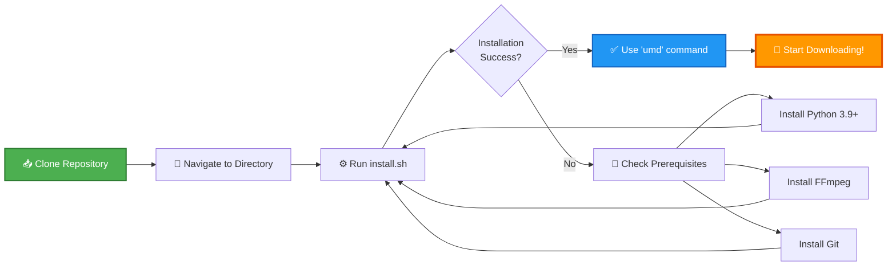
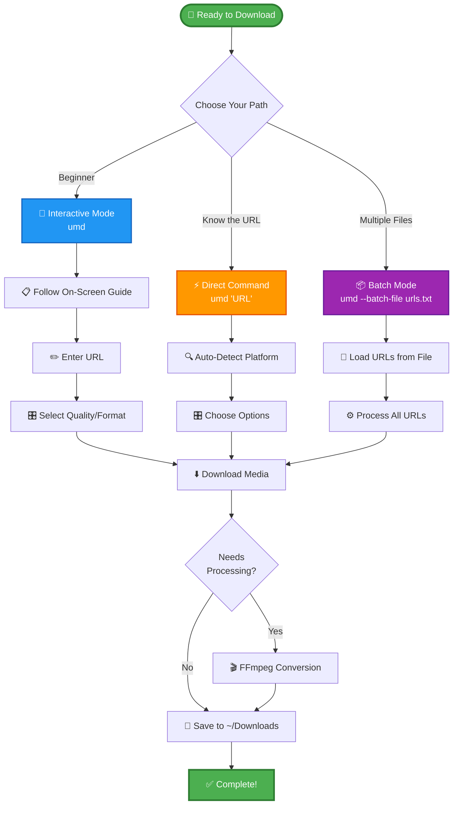

# Getting Started - Navigation Guide

## Quick Links

| What do you want to do? | Go here |
|-------------------------|---------|
| **Install the app** | [Installation Guide](INSTALL.md) or run `./scripts/install.sh` |
| **Quick start** | [Quick Start Guide](QUICKSTART.md) |
| **See what's new** | [Changelog](CHANGELOG.md) |
| **Read full documentation** | [Documentation Summary](DOCUMENTATION_SUMMARY.md) |
| **Understand the code** | [File Structure](FILE_STRUCTURE.md) |
| **Report a bug** | [GitHub Issues](https://github.com/NK2552003/ULTIMATE-MEDIA-DOWNLOADER/issues) |
| **Contribute** | [Contributing Guide](CONTRIBUTING.md) |

---

## For First-Time Users

### Step 1: Install
```bash
git clone https://github.com/NK2552003/ULTIMATE-MEDIA-DOWNLOADER.git
cd ULTIMATE-MEDIA-DOWNLOADER
./scripts/install.sh
```

### Step 2: Try it out
```bash
umd   # Interactive mode - easiest!
```

### Step 3: Learn more
Read the [Quick Start Guide](QUICKSTART.md) for common examples.

---

## Documentation Structure

```
📚 Documentation
│
├── 📄 README.md                    ← Start here! Main overview
├── 📄 QUICKSTART.md               ← Quick reference for commands
├── 📄 INSTALL.md                  ← Installation instructions
├── 📄 INSTALLATION_GUIDE.md       ← Comprehensive installation guide
├── 📄 GETTING_STARTED.md          ← You are here!
├── 📄 CHANGELOG.md                ← Latest changes & features
├── � DOCUMENTATION_SUMMARY.md    ← All documentation in one place
├── 📄 PROJECT_SUMMARY.md          ← Project overview
├── 📄 FILE_STRUCTURE.md           ← File organization
├── 📄 CONTRIBUTING.md             ← How to contribute
├── 📄 UNINSTALL.md                ← Uninstallation guide
├── 📄 WINDOWS_BATCH_FILES.md      ← Windows-specific help
├── 📄 LICENSE                     ← MIT License
│
├── 📁 scripts/                    ← Installation & setup scripts
│   ├── install.sh                 ← Unix/Mac installer
│   ├── install.bat                ← Windows installer
│   ├── setup.sh                   ← Setup script
│   ├── uninstall.sh              ← Unix/Mac uninstaller
│   └── uninstall.bat             ← Windows uninstaller
│
└── 📁 Core Python Files
    ├── ultimate_downloader.py     ← Main application
    ├── generic_downloader.py      ← Generic download handler
    ├── youtube_scorer.py          ← YouTube match scoring
    ├── ui_components.py           ← Rich UI components
    ├── utils.py                   ← Utility functions
    ├── logger.py                  ← Logging system
    └── config.json                ← Configuration file
```

---

## 🎨 Visual Quick Start Guide

### Installation Flow



### Your First Download



### Learning Path Visualization

```mermaid
journey
    title Your Journey to Mastering Ultimate Media Downloader
    section Day 1: Getting Started
      Read README: 5: User
      Install Application: 4: User
      First Download: 5: User
      Try Interactive Mode: 5: User
    section Day 2: Basic Usage
      Download Videos: 5: User
      Download Audio: 5: User
      Try Quality Options: 4: User
      Learn Format Selection: 4: User
    section Week 1: Advanced Features
      Batch Downloads: 4: User
      Playlist Downloads: 5: User
      Metadata Embedding: 4: User
      Custom Output Paths: 3: User
    section Week 2: Power User
      Optimized Batching: 4: User
      Automation Scripts: 3: User
      Contribute to Project: 5: User
      Help Others: 5: User
```

---

## Common Tasks

### I want to...

#### Download a YouTube video
```bash
umd "https://youtube.com/watch?v=VIDEO_ID"
```
 More: [QUICKSTART.md](QUICKSTART.md)

#### Download audio only
```bash
umd "URL" --audio-only --format mp3
```
 More: [QUICKSTART.md](QUICKSTART.md)

#### Download a playlist
```bash
umd "PLAYLIST_URL"
```
 More: [QUICKSTART.md](QUICKSTART.md)

#### Batch download multiple URLs
```bash
umd --batch-file urls.txt
```
 More: [QUICKSTART.md](QUICKSTART.md)

#### Download Spotify music
```bash
umd "SPOTIFY_URL" --audio-only
```
 More: [README.md](README.md#-features)

#### Troubleshoot an issue
 See: [GitHub Issues](https://github.com/NK2552003/ULTIMATE-MEDIA-DOWNLOADER/issues) or [Documentation Summary](DOCUMENTATION_SUMMARY.md)

---

## For Developers

### Understanding the Code

1. **[File Structure](FILE_STRUCTURE.md)** - File organization and project structure
2. **[How It Works](README.md#-how-it-works)** - System architecture with Mermaid diagrams
3. **[How I Created It](README.md#-how-i-created-it)** - Development journey and decisions
4. **[Project Summary](PROJECT_SUMMARY.md)** - Overview of the project

### Contributing

1. Read [CONTRIBUTING.md](CONTRIBUTING.md)
2. Check [open issues](https://github.com/NK2552003/ULTIMATE-MEDIA-DOWNLOADER/issues)
3. Fork, code, and submit a PR!

### Key Files

| File | Purpose |
|------|---------|
| `ultimate_downloader.py` | Main CLI application - handles user interface and orchestration |
| `generic_downloader.py` | Generic download handler for various platforms |
| `youtube_scorer.py` | YouTube match scoring for Spotify/music downloads |
| `utils.py` | Utility functions and helpers |
| `ui_components.py` | Rich UI components & beautiful terminal formatting |
| `logger.py` | Logging system for debugging and tracking |
| `setup.py` | Package configuration for installation |
| `config.json` | Configuration settings |

---

## Learning Path

### 🌱 Beginner
1. [README.md](README.md) - Overview and features
2. [INSTALL.md](INSTALL.md) or [INSTALLATION_GUIDE.md](INSTALLATION_GUIDE.md) - Installation
3. [QUICKSTART.md](QUICKSTART.md) - Basic usage and examples

### 📚 Intermediate
4. [DOCUMENTATION_SUMMARY.md](DOCUMENTATION_SUMMARY.md) - Complete documentation overview
5. [PROJECT_SUMMARY.md](PROJECT_SUMMARY.md) - Project details and capabilities
6. [CHANGELOG.md](CHANGELOG.md) - Version history and updates

### 🚀 Advanced
7. [README.md - How It Works](README.md#-how-it-works) - Technical architecture with diagrams
8. [README.md - How I Created It](README.md#-how-i-created-it) - Development journey
9. [FILE_STRUCTURE.md](FILE_STRUCTURE.md) - Code organization
10. [CONTRIBUTING.md](CONTRIBUTING.md) - Contribute code and features

---

## Getting Help

### 🆘 Something not working?

1. **Check the docs**: [DOCUMENTATION_SUMMARY.md](DOCUMENTATION_SUMMARY.md)
2. **Read installation guide**: [INSTALLATION_GUIDE.md](INSTALLATION_GUIDE.md)
3. **Search issues**: [GitHub Issues](https://github.com/NK2552003/ULTIMATE-MEDIA-DOWNLOADER/issues)
4. **Ask for help**: [Create a new issue](https://github.com/NK2552003/ULTIMATE-MEDIA-DOWNLOADER/issues/new)

### Common Issues & Solutions

- **Command not found (`umd`)**: 
  - macOS/Linux: Add to PATH - `export PATH="$PATH:$HOME/.local/bin"`
  - Windows: Reinstall and check "Add Python to PATH"
  - See [INSTALLATION_GUIDE.md](INSTALLATION_GUIDE.md) for details

- **FFmpeg error**: 
  - macOS: `brew install ffmpeg`
  - Linux: `sudo apt install ffmpeg`
  - Windows: Use Chocolatey `choco install ffmpeg` or download from [ffmpeg.org](https://ffmpeg.org)

- **Download fails**: 
  - Check your internet connection
  - Verify the URL is correct and accessible
  - Try with `--verbose` flag for detailed error messages
  - Check [GitHub Issues](https://github.com/NK2552003/ULTIMATE-MEDIA-DOWNLOADER/issues) for similar problems

- **Permission denied**: 
  - Unix/Mac: Make scripts executable with `chmod +x scripts/*.sh`
  - Run with appropriate permissions

- **Python version issues**: 
  - Ensure Python 3.9+ is installed: `python3 --version`
  - Update if needed from [python.org](https://www.python.org/downloads/)

---

## ⚡ Quick Commands Reference

```bash
# Interactive mode (easiest for beginners)
umd

# Download video
umd "URL"

# Download audio only
umd "URL" --audio-only
# or use shorthand
umd "URL" -a

# Download in specific quality
umd "URL" --quality 1080p

# Download in specific format
umd "URL" --format mp4
umd "URL" --audio-only --format mp3

# Download playlist
umd "PLAYLIST_URL"

# Download Spotify (as MP3 from YouTube)
umd "SPOTIFY_URL" --audio-only --format mp3

# Batch download from file
umd --batch-file urls.txt

# Optimized batch download (parallel)
umd --batch-file urls.txt --optimized-batch --max-concurrent 5

# Show help
umd --help

# Show version
umd --version

# Show supported platforms
umd --list-platforms

# Get media info without downloading
umd "URL" --info

# Show available formats
umd "URL" --show-formats

# Download with metadata and thumbnail
umd "URL" --audio-only --embed-metadata --embed-thumbnail

# Custom output directory
umd "URL" --output /path/to/folder

# Verbose mode (for debugging)
umd "URL" --verbose
```

For more examples, see [QUICKSTART.md](QUICKSTART.md)

---

## 📁 Project Organization

```
ULTIMATE-MEDIA-DOWNLOADER/
├── 📄 ultimate_downloader.py      → Main CLI application
├── 📄 generic_downloader.py       → Generic platform handler
├── 📄 youtube_scorer.py           → YouTube matching for Spotify
├── 📄 ui_components.py            → Rich UI components
├── 📄 utils.py                    → Utility functions
├── 📄 logger.py                   → Logging system
├── 📄 setup.py                    → Package configuration
├── 📄 config.json                 → Configuration file
│
├── 📄 README.md                   → Main documentation
├── 📄 QUICKSTART.md              → Quick reference guide
├── 📄 INSTALL.md                 → Installation guide
├── 📄 INSTALLATION_GUIDE.md      → Comprehensive installation
├── 📄 GETTING_STARTED.md         → This file
├── 📄 DOCUMENTATION_SUMMARY.md   → All docs overview
├── 📄 PROJECT_SUMMARY.md         → Project overview
├── 📄 FILE_STRUCTURE.md          → File organization
├── 📄 CONTRIBUTING.md            → Contribution guide
├── 📄 CHANGELOG.md               → Version history
├── 📄 UNINSTALL.md               → Uninstallation guide
├── 📄 WINDOWS_BATCH_FILES.md     → Windows help
├── 📄 LICENSE                    → MIT License
│
├── 📄 requirements.txt            → Dependencies
├── 📄 requirements-dev.txt        → Dev dependencies
│
├── 📁 scripts/                    → Installation & setup scripts
│   ├── install.sh                → Unix/Mac installer
│   ├── install.bat               → Windows installer
│   ├── setup.sh                  → Setup script
│   ├── setup.bat                 → Windows setup
│   ├── uninstall.sh             → Unix/Mac uninstaller
│   ├── uninstall.bat            → Windows uninstaller
│   ├── activate-env.sh          → Activate virtual environment
│   └── activate-env.bat         → Windows activate env
│
├── 📁 homebrew/                   → Homebrew formula
│   └── ultimate-downloader.rb   → macOS Homebrew package
│
├── 📁 demo_video/                 → Demo videos
│   └── demo.mp4                  → Application demo
│
└── 📁 __pycache__/                → Python cache (auto-generated)
```

**Clean, organized, and easy to navigate!** ✨

For detailed explanations of each file, see [FILE_STRUCTURE.md](FILE_STRUCTURE.md)

---

## 🎯 Ready to Start?

### Option 1: Quick Install (Recommended)
```bash
git clone https://github.com/NK2552003/ULTIMATE-MEDIA-DOWNLOADER.git
cd ULTIMATE-MEDIA-DOWNLOADER
./scripts/install.sh
```

### Option 2: Try Interactive Mode First
```bash
umd   # Guides you through the process step-by-step
```

### Option 3: Explore the Documentation
- 📖 [README.md](README.md) - Complete overview with features
- ⚡ [QUICKSTART.md](QUICKSTART.md) - Quick command reference
- 📚 [DOCUMENTATION_SUMMARY.md](DOCUMENTATION_SUMMARY.md) - All documentation

---

## 💡 Pro Tips

1. **Start with interactive mode** (`umd` without arguments) to learn the basics
2. **Use `--help`** to see all available options: `umd --help`
3. **Check `--info`** before downloading to see available quality/formats: `umd "URL" --info`
4. **Create a `urls.txt` file** for batch downloads of multiple videos
5. **Use `--quality` flag** to specify exact quality: `umd "URL" --quality 1080p`
6. **Add metadata** to audio files: `umd "URL" --audio-only --embed-metadata --embed-thumbnail`

---

## 🔗 Useful Links

- 🏠 [GitHub Repository](https://github.com/NK2552003/ULTIMATE-MEDIA-DOWNLOADER)
- 🐛 [Report Issues](https://github.com/NK2552003/ULTIMATE-MEDIA-DOWNLOADER/issues)
- 💬 [Discussions](https://github.com/NK2552003/ULTIMATE-MEDIA-DOWNLOADER/discussions)
- ⭐ [Star the Project](https://github.com/NK2552003/ULTIMATE-MEDIA-DOWNLOADER)

---

<div align="center">

**Questions?** Check [DOCUMENTATION_SUMMARY.md](DOCUMENTATION_SUMMARY.md) or [open an issue](https://github.com/NK2552003/ULTIMATE-MEDIA-DOWNLOADER/issues)

**Happy Downloading!** 🎉

Made with ❤️ by [NK2552003](https://github.com/NK2552003)

[⬆ Back to Top](#getting-started---navigation-guide)

</div>
