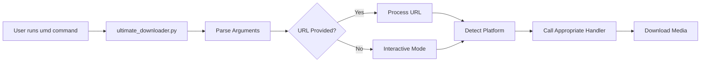
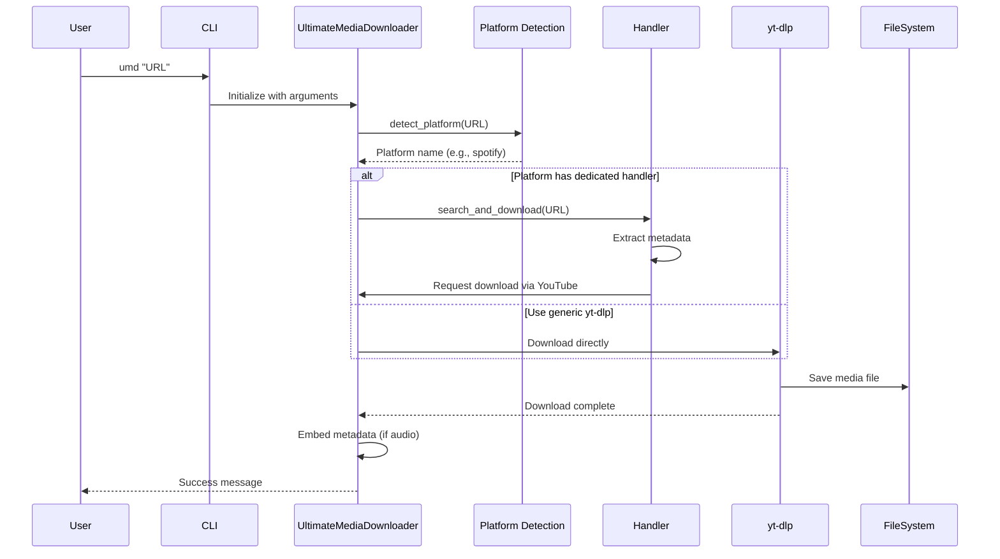
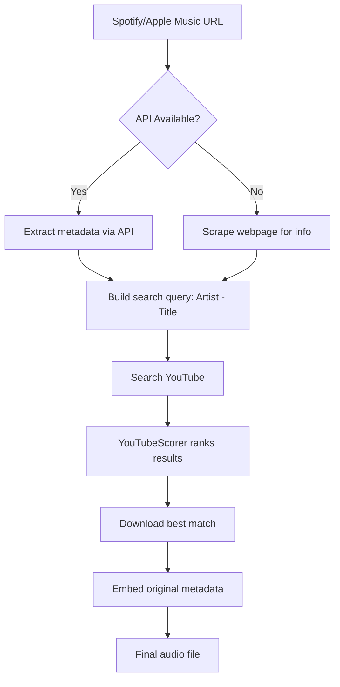
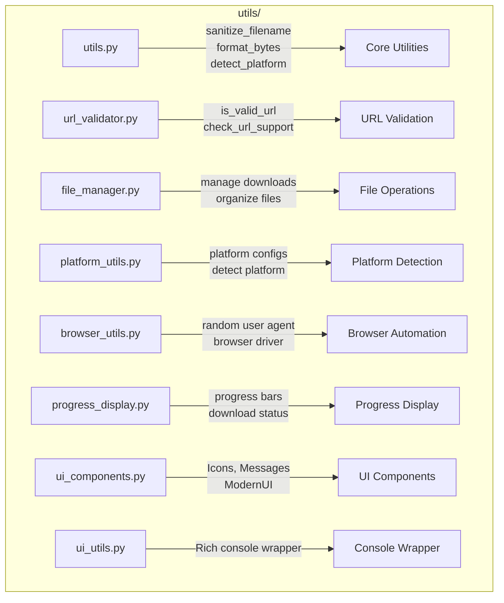
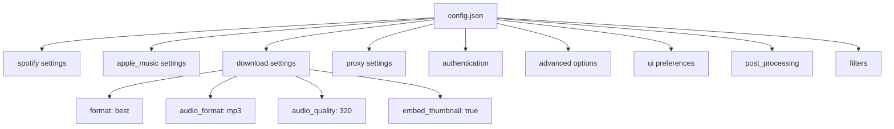
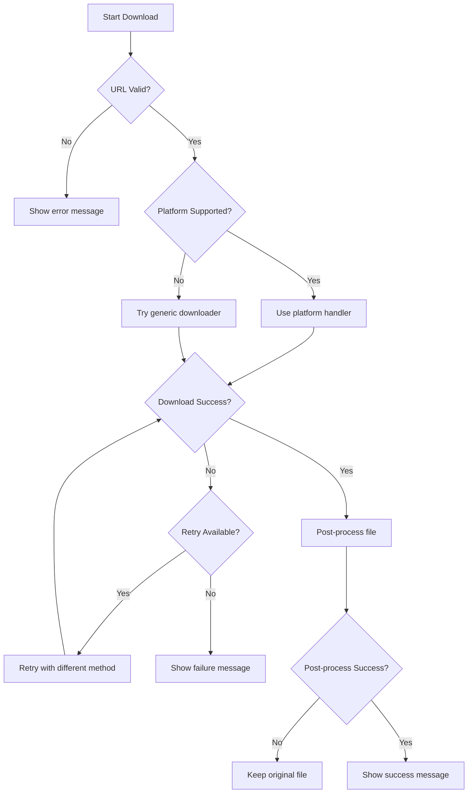

# System Architecture

This document explains how the Ultimate Media Downloader is designed and how its different parts work together. If you are a computer science student or someone trying to understand the project structure, this guide will walk you through everything step by step.

## Table of Contents

1. [Overview](#overview)
2. [High-Level Architecture](#high-level-architecture)
3. [Component Breakdown](#component-breakdown)
4. [Data Flow](#data-flow)
5. [Handler System](#handler-system)
6. [Utility Modules](#utility-modules)
7. [Configuration Management](#configuration-management)
8. [Error Handling](#error-handling)

---

## Overview

The Ultimate Media Downloader is a Python-based command-line application that downloads media content from over 100 different platforms. The application follows a modular architecture where different components handle specific responsibilities. This makes the code easier to maintain, test, and extend.

### Design Principles

The project follows these key principles:

- **Modularity**: Each component does one thing well
- **Extensibility**: New platforms can be added without changing existing code
- **Graceful Degradation**: If optional features are not available, the app still works
- **User Experience**: Beautiful CLI interface with progress indicators

---

## High-Level Architecture

The following diagram shows how the main components interact with each other:

```mermaid
graph TB
    subgraph "User Interface Layer"
        CLI[Command Line Interface]
        ARGS[Argument Parser]
        UI[Rich Console UI]
    end

    subgraph "Core Application Layer"
        MAIN[UltimateMediaDownloader]
        GENERIC[GenericSiteDownloader]
        SCORER[YouTube Scorer]
    end

    subgraph "Handler Layer"
        SPOTIFY[Spotify Handler]
        APPLE[Apple Music Handler]
        TUMBLR[Tumblr Handler]
        LINKEDIN[LinkedIn Handler]
        REDDIT[Reddit Handler]
        PINTEREST[Pinterest Handler]
        PH[Pornhub Handler]
        XNXX[XNXX Handler]
        XHAM[xHamster Handler]
        HiANIME[HiAnime Handler]
        TIKTOK[TikTok Handler]
        EPORNER[Eporner Handler]
        HQPORNER[HQPorner Handler]
        BEEG[Beeg Handler]
    end

    subgraph "Utility Layer"
        UTILS[Utility Functions]
        URL_VAL[URL Validator]
        FILE_MGR[File Manager]
        PLATFORM[Platform Utils]
        BROWSER[Browser Utils]
        PROGRESS[Progress Display]
    end

    subgraph "External Dependencies"
        YTDLP[yt-dlp]
        RICH[Rich Library]
        MUTAGEN[Mutagen]
        REQUESTS[Requests/HTTPX]
    end

    CLI --> ARGS
    ARGS --> MAIN
    MAIN --> UI
    
    MAIN --> SPOTIFY
    MAIN --> APPLE
    MAIN --> TUMBLR
    MAIN --> PH
    MAIN --> XNXX
    MAIN --> XHAM
    MAIN --> GENERIC
    MAIN --> HIANIME
    MAIN --> TIKTOK
    MAIN --> EPORNER
    MAIN --> HQPORNER
    MAIN --> BEEG
    MAIN --> LINKEDIN
    MAIN --> REDDIT
    MAIN --> PINTEREST

    SPOTIFY --> SCORER
    APPLE --> SCORER

    MAIN --> UTILS
    MAIN --> URL_VAL
    MAIN --> FILE_MGR
    MAIN --> PLATFORM
    MAIN --> BROWSER
    MAIN --> PROGRESS

    MAIN --> YTDLP
    UI --> RICH
    FILE_MGR --> MUTAGEN
    GENERIC --> REQUESTS
```

---

## Component Breakdown

### Entry Point

The application starts from `ultimate_downloader.py`. This file contains the main class `UltimateMediaDownloader` which orchestrates everything.

### Main Components

| Component | File | Purpose |
|-----------|------|---------|
| Main Downloader | `ultimate_downloader.py` | Core application logic and coordination |
| Generic Downloader | `generic_downloader.py` | Handles sites with special requirements like SSL bypass |
| CLI Parser | `cli_args.py` | Processes command-line arguments |
| Logger | `logger.py` | Custom logging to suppress verbose output |
| YouTube Scorer | `youtube_scorer.py` | Ranks YouTube search results for accuracy |
| Platform Info | `platform_info.py` | Displays supported platform information |

---

## Data Flow

When a user provides a URL, here is what happens inside the application:

---

## Handler System

The handler system is how the application supports different platforms. Each platform that needs special handling has its own handler class.

### Handler Architecture

```mermaid
classDiagram
    class UltimateMediaDownloader {
        +output_dir: Path
        +verbose: bool
        +spotify_handler: SpotifyHandler
        +apple_music_handler: AppleMusicHandler
        +tumblr_handler: TumblrHandler
        +download(url)
        +detect_platform(url)
    }

    class SpotifyHandler {
        +downloader: UltimateMediaDownloader
        +spotify_client: Spotipy
        +search_and_download(url)
        +_download_track(url)
        +_download_album(url)
        +_download_playlist(url)
    }

    class AppleMusicHandler {
        +downloader: UltimateMediaDownloader
        +search_and_download(url)
        +_download_track_enhanced(url)
        +_download_album_enhanced(url)
    }

    class TumblrHandler {
        +downloader: UltimateMediaDownloader
        +api: TumblrAPI
        +download_blog(url)
        +_extract_media(posts)
    }

    class HiAnimeHandler {
        +downloader: UltimateMediaDownloader
        +search_and_download(url)
        +_extract_episode_info(url)
        +_download_episode(url)
        +_download_series(url)
    }

    class TikTokHandler {
        +downloader: UltimateMediaDownloader
        +search_and_download(url)
        +_download_video(url)
        +_normalize_url(url)
    }

    class EpornerHandler {
        +downloader: UltimateMediaDownloader
        +search_and_download(url)
        +_download_video(url)
        +_try_fallback_methods(url)
    }

    class HQPornerHandler {
        +downloader: UltimateMediaDownloader
        +search_and_download(url)
        +_download_video(url)
        +_extract_sources(url)
    }

    class BeegHandler {
        +downloader: UltimateMediaDownloader
        +search_and_download(url)
        +_download_video(url)
        +_try_api_method(url)
    }

    class LinkedInHandler {
        +downloader: UltimateMediaDownloader
        +search_and_download(url)
        +_download_post(url)
        +_extract_media_urls(url)
    }

    class RedditHandler {
        +downloader: UltimateMediaDownloader
        +reddit: PRAW
        +search_and_download(url)
        +_download_post(url)
        +_download_user_posts(username)
    }

    class PinterestHandler {
        +downloader: UltimateMediaDownloader
        +search_and_download(url)
        +_download_pin(url)
        +_download_board(url)
        +_download_profile(url)
    }

    UltimateMediaDownloader --> SpotifyHandler
    UltimateMediaDownloader --> AppleMusicHandler
    UltimateMediaDownloader --> TumblrHandler
    UltimateMediaDownloader --> LinkedInHandler
    UltimateMediaDownloader --> RedditHandler
    UltimateMediaDownloader --> PinterestHandler
    UltimateMediaDownloader --> HiAnimeHandler
    UltimateMediaDownloader --> TikTokHandler
    UltimateMediaDownloader --> EpornerHandler
    UltimateMediaDownloader --> HQPornerHandler
    UltimateMediaDownloader --> BeegHandler
```

### How Handlers Work

1. **Detection**: The main class detects which platform a URL belongs to
2. **Delegation**: If a handler exists for that platform, the request is delegated
3. **Processing**: The handler extracts metadata and determines how to download
4. **Fallback**: If direct download is not possible, handlers search YouTube and download from there

### Spotify and Apple Music Flow

These platforms do not allow direct downloading. Here is how the application handles them:

---

## Utility Modules

The `utils/` directory contains helper modules that provide common functionality.

### Module Overview

### Key Utility Functions

| Module | Function | Description |
|--------|----------|-------------|
| utils.py | `sanitize_filename()` | Removes invalid characters from filenames |
| utils.py | `format_bytes()` | Converts bytes to human-readable format |
| utils.py | `detect_platform()` | Identifies platform from URL |
| url_validator.py | `is_valid_url()` | Checks if URL is properly formatted |
| url_validator.py | `check_url_support()` | Verifies if URL can be downloaded |
| ui_components.py | `Icons.get()` | Returns consistent icons for UI |
| ui_components.py | `Messages.success()` | Formats success messages |

---

## Configuration Management

The application uses a JSON configuration file to store settings.

### Configuration Structure

### Environment Variables

Some settings can be configured through environment variables:

| Variable | Purpose |
|----------|---------|
| `SPOTIFY_CLIENT_ID` | Spotify API authentication |
| `SPOTIFY_CLIENT_SECRET` | Spotify API authentication |
| `APPLE_MUSIC_TOKEN` | Apple Music direct download |
| `APPLE_MUSIC_STOREFRONT` | Apple Music region |

---

## Error Handling

The application handles errors gracefully to provide a good user experience.

### Error Handling Flow

### Fallback Strategies

1. **SSL Issues**: The generic downloader creates permissive SSL contexts
2. **Rate Limiting**: Automatic delays between requests
3. **Anti-bot Protection**: Multiple request methods (cloudscraper, curl-cffi, selenium)
4. **Missing Handlers**: Falls back to yt-dlp generic extractor

---

## Summary

The Ultimate Media Downloader is built with a clean, modular architecture that separates concerns and makes the codebase maintainable. The handler system allows easy extension for new platforms, while the utility modules provide reusable functionality across the application.

Understanding this architecture will help you:
- Navigate the codebase effectively
- Add new features or platforms
- Debug issues by tracing the data flow
- Contribute improvements to the project

For more details on specific components, refer to the individual source files and their inline documentation.
