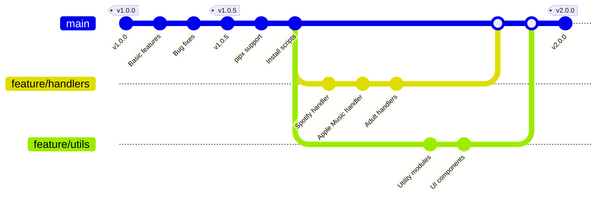
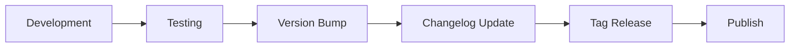

# Changelog

All notable changes to the Ultimate Media Downloader project are documented in this file.

The format is based on [Keep a Changelog](https://keepachangelog.com/en/1.0.0/), and this project adheres to [Semantic Versioning](https://semver.org/spec/v2.0.0.html).

---

## Table of Contents

<!-- - [Version 2.1.0](#version-210) -->
- [Version 2.0.0](#version-200)
- [Version 1.0.5](#version-105)
- [Version 1.0.0](#version-100)
- [Roadmap](#roadmap)

---

<!-- ## Version 2.1.0( not released yet)

**Release Date**: January 2026

This release focuses on social media platform support and handler improvements.

### Added

- **Pinterest Handler** with advanced features:
  - Multi-tier download strategy (gallery-dl → pinterest-downloader → yt-dlp → web scraping)
  - Interactive prompt for custom pin count
  - Real-time progress tracking with file names
  - High-quality media selection (1000px+ images)
  - 10 regex patterns and 7 extraction methods for robust scraping
  - Support for profiles, boards, and individual pins
  - No metadata JSON files (clean downloads)
- **LinkedIn Handler** improvements:
  - Simplified to support only direct post URLs
  - Removed profile scraping (authentication issues)
  - Rich progress bars with download speed and ETA
  - No Selenium dependency (faster and more reliable)
- **Reddit Handler** for downloading from Reddit posts and user profiles
- External library support:
  - `gallery-dl>=1.26.0` for Pinterest
  - `pinterest-downloader>=1.0.0` as alternative

### Changed

- LinkedIn handler simplified to direct URLs only (no profile scraping)
- Pinterest handler replaced Selenium with advanced web scraping
- Improved progress display across all handlers
- Updated requirements.txt with optional external libraries

### Fixed

- Selenium "Bad CPU type" errors (removed Selenium from LinkedIn and Pinterest)
- Pinterest metadata JSON files no longer created
- Video quality now defaults to high
- Real-time progress tracking for downloads

### Technical Changes

- Implemented subprocess streaming for real-time gallery-dl output
- Added Rich progress bars to download operations
- Created multi-method fallback system for Pinterest
- Removed Selenium dependencies where not needed

--- -->

## Version 2.0.0

**Release Date**: December 2025

This is a major release with significant architectural improvements and new features.

### Added

- Modular handler system for platform-specific downloads
- Spotify handler with API integration and YouTube search fallback
- Apple Music handler with metadata extraction
- Tumblr handler for blog media downloads
- Pornhub, XNXX, and xHamster handlers
- HiAnime handler for anime series and episodes
- TikTok handler for TikTok video downloads with SSL bypass
- Eporner handler with advanced SSL/TLS handling
- HQPorner handler for high-quality video downloads
- Beeg handler with API integration and curl fallback
- Generic site downloader with advanced bypass capabilities
- YouTube scoring algorithm for accurate search results
- Rich CLI interface with progress bars and colored output
- Interactive mode for guided downloads
- Batch download support with parallel processing
- Configuration file support (config.json)
- Environment variable configuration
- Comprehensive documentation in `/documentations` folder

### Changed

- Refactored codebase into modular components
- Moved utility functions to dedicated modules in `/utils`
- Improved error handling with graceful degradation
- Enhanced logging system with warning/error counting
- Updated default download directory to `~/Downloads/UltimateDownloader`
- Improved filename sanitization for cross-platform compatibility

### Fixed

- SSL certificate verification issues on certain sites
- Rate limiting detection and automatic delays
- Memory usage optimization for large playlists
- Resume functionality for interrupted downloads

### Technical Changes

- Split monolithic code into handler modules
- Created utility layer with reusable functions
- Added browser automation utilities
- Implemented proxy rotation support
- Added Cloudflare bypass capabilities

---

## Version 1.0.5

**Release Date**: October 2025

### Added

- pipx installation support
- Global `umd` command
- Installation scripts for all platforms
- Basic playlist download support

### Changed

- Improved installation process
- Better error messages
- Updated dependencies

### Fixed

- PATH issues on various operating systems
- Permission problems on Linux/macOS

---

## Version 1.0.0

**Release Date**: September 2025

Initial release of Ultimate Media Downloader.

### Features

- YouTube video and audio downloads
- Basic playlist support
- Quality selection
- Format conversion
- Metadata embedding
- Command-line interface

---

## Roadmap

### Planned for Future Releases

#### Version 2.1.0

- GUI application using Electron or native toolkit
- Download scheduling and queue management
- Browser extension for one-click downloads
- Enhanced metadata from MusicBrainz and Discogs

#### Version 2.2.0

- Mobile companion app
- Cloud storage integration
- Download history with search
- Automatic updates

#### Version 3.0.0

- Plugin system for community extensions
- REST API for remote control
- Docker containerization
- Multi-language support

---

## Version History Diagram



---

## Upgrade Guide

### From 1.x to 2.0

1. Uninstall the old version:

   ```bash
   pip uninstall ultimate-downloader
   #or run the script
   ./uninstall.sh #for mac

   .\uninstall.bat  # for windows
   ```

2. Clone the new repository:

   ```bash
   git clone https://github.com/NK2552003/ULTIMATE-MEDIA-DOWNLOADER.git
   cd ULTIMATE-MEDIA-DOWNLOADER
   ```

3. Install the new version:

   ```bash
   ./scripts/install.sh
   ```

4. Your existing downloads are not affected. The new version uses a different default directory.

### Configuration Migration

If you had custom settings, create a new `config.json` based on the template provided in the repository.

---

## Contributing to the Changelog

When contributing to the project:

1. Add your changes under the "Unreleased" section
2. Use the following categories:
   - **Added** for new features
   - **Changed** for changes in existing functionality
   - **Deprecated** for soon-to-be removed features
   - **Removed** for now removed features
   - **Fixed** for any bug fixes
   - **Security** for vulnerability fixes

---

## Release Process

Releases follow this workflow:



1. All changes are developed and tested
2. Version number is updated in relevant files
3. Changelog is updated with release notes
4. Git tag is created for the release
5. Release is published on GitHub
