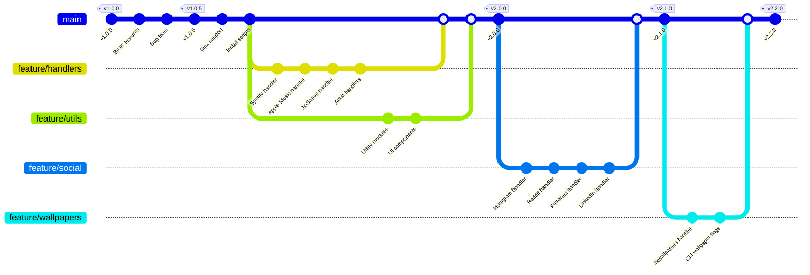
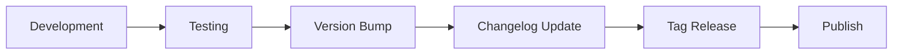

# Changelog

All notable changes to the Ultimate Media Downloader project are documented in this file.

The format is based on [Keep a Changelog](https://keepachangelog.com/en/1.0.0/), and this project adheres to [Semantic Versioning](https://semver.org/spec/v2.0.0.html).

---

## Table of Contents

- [Version 2.2.0](#version-220)
- [Version 2.1.0](#version-210)
- [Version 2.0.0](#version-200)
- [Version 1.0.5](#version-105)
- [Version 1.0.0](#version-100)
- [Roadmap](#roadmap)

---

## Version 2.2.0

**Release Date**: February 2026

This release adds a dedicated wallpaper downloader module for 4kwallpapers.com with a full interactive browsing and download experience.

### Added

- **4K Wallpapers Handler** (`handlers/four_k_wallpapers_handler.py`):
  - Interactive browsing with category, tag, and search menus
  - Pagination support — browse up to 2400 wallpapers per session using `?page=N`
  - Range-based selection (`1,3,4-7,10-12`, `all`, or press Enter to skip)
  - Multi-resolution download (auto-picks highest available resolution per image)
  - Parallel downloads with Rich progress bars
  - Cloudflare bypass using bare `cloudscraper` session (no browser args)
  - Home/Featured, Recently Added, Browse by Tag, Categories, and Search modes
  - Direct URL routing — paste any 4kwallpapers.com link to auto-detect mode
  - `fetch_listing_paginated()` with deduplication and early-termination
  - Graceful fallback when a page returns fewer than 20 results
- **CLI flags** (`cli_args.py`):
  - `--wallpaper` — open 4K Wallpapers interactive menu directly
  - `--wallpaper-search QUERY` — jump straight to search results
- **Interactive mode commands** (`ultimate_downloader.py`):
  - New commands `wallpaper`, `wallpapers`, `wp` in interactive prompt
  - Pasting a 4kwallpapers.com URL is now auto-routed to the handler
- **Platform detection** (`utils/platform_utils.py`, `utils/url_validator.py`):
  - `4kwallpapers.com` added to supported platforms and URL validator

### Changed

- Interactive banner and help menu updated to show `wallpaper / wp` command
- `ultimate_downloader.py` instantiates `FourKWallpapersHandler` on startup when available
- `handlers/__init__.py` exports `FourKWallpapersHandler`

### Fixed

- Cloudflare challenge responses (8 KB page) caused by incorrect `cloudscraper` browser args — fixed by removing browser emulation arguments from session creation
- Pasting a 4kwallpapers.com URL in interactive mode no longer triggers a yt-dlp error

### Technical Changes

- Added `four_k_wallpapers_handler.py` (~950 lines) with `FourKWallpapersHandler` class
- Implemented `_parse_selection(raw, total)` for flexible range parsing
- Implemented `fetch_listing_paginated(base_url, max_wallpapers)` for multi-page scraping
- Search results limited to one page (site restriction; 24 results max)
- Download URLs constructed as `https://4kwallpapers.com/images/wallpapers/<slug>-<WxH>-<id>.png`

---

## Version 2.1.0

**Release Date**: January 2026

This release focuses on social media platform support and handler improvements.

### Added

- **Instagram Handler** with comprehensive features:
  - Playwright-based browser automation for reliable extraction
  - Cookie persistence for authenticated sessions
  - Support for posts, reels, stories, and IGTV
  - Profile downloads with interactive menu options
  - Bulk download with progress tracking
  - Range selection (download posts 1-10, 5-20, etc.)
  - ZIP file creation for bundled downloads
  - Multi-format support (images, videos, carousels)
  - Story downloads before 24-hour expiration
  - User agent rotation to avoid detection
  - Error recovery for failed downloads
  - Rich progress bars with detailed status
- **JioSaavn Handler** with full music platform support:
  - Track, album, and playlist downloads via YouTube search
  - Intelligent YouTube scoring for accurate matches
  - Full metadata extraction and embedding
  - Interactive song selection for albums/playlists
  - Range and selective download support (1,3-5,7)
  - High-quality audio with cover art embedding
  - HTML entity decoding for proper character display
- **Gaana Handler** with comprehensive Indian music support:
  - Track, album, playlist, and artist downloads
  - Advanced web scraping with BeautifulSoup
  - Interactive song selection with flexible input (all, 1-10, 1,3,5)
  - YouTube search with intelligent scoring algorithm
  - Full metadata extraction (title, artist, album, year)
  - Cover art embedding from Gaana artwork
  - HTML entity decoding for special characters
  - Multiple format support (MP3, M4A, FLAC)
- **Pinterest Handler** with advanced features:
  - Multi-tier download strategy (gallery-dl → pinterest-downloader → yt-dlp → web scraping)
  - Interactive prompt for custom pin count
  - Real-time progress tracking with file names
  - High-quality media selection (1000px+ images)
  - 10 regex patterns and 7 extraction methods for robust scraping
  - Support for profiles, boards, and individual pins
  - No metadata JSON files (clean downloads)
- **LinkedIn Handler** for professional content:
  - Support for direct post URLs with media
  - Rich progress bars with download speed and ETA
  - No Selenium dependency (faster and more reliable)
  - Video and image extraction from posts
  - Simplified architecture for reliability
- **Reddit Handler** for social media content:
  - Download posts with media (videos, images, GIFs)
  - User profile content downloads
  - PRAW integration for API access
  - Automatic ZIP file creation for bulk downloads
  - Support for v.redd.it and i.redd.it domains
  - Gallery post support (multiple images)
  - Fallback to yt-dlp and web scraping
- External library support:
  - `playwright>=1.40.0` for Instagram browser automation
  - `gallery-dl>=1.26.0` for Pinterest
  - `pinterest-downloader>=1.0.0` as alternative
  - `praw>=7.7.1` for Reddit API access

### Changed

- Added six major platform handlers (Instagram, JioSaavn, Gaana, Pinterest, LinkedIn, Reddit)
- LinkedIn handler simplified to direct URLs only (no profile scraping)
- Pinterest handler replaced Selenium with advanced web scraping
- Instagram handler uses Playwright instead of traditional requests-only approach
- JioSaavn and Gaana handlers use intelligent YouTube search with scoring
- Improved progress display across all handlers
- Updated requirements.txt with Playwright and optional external libraries
- Enhanced metadata extraction for Indian music platforms

### Fixed

- Selenium "Bad CPU type" errors (removed Selenium from LinkedIn and Pinterest)
- Pinterest metadata JSON files no longer created
- Instagram login and authentication handling via cookies
- JioSaavn and Gaana metadata extraction with proper HTML entity decoding
- Video quality now defaults to high
- Real-time progress tracking for downloads
- Character encoding issues in Indian music platforms

### Technical Changes

- Implemented Playwright browser automation for Instagram
- Added cookie management system for Instagram sessions
- Created intelligent YouTube scoring algorithm for music platforms
- Implemented BeautifulSoup scraping for JioSaavn and Gaana
- Added flexible song selection parsing (ranges, lists, all)
- Implemented subprocess streaming for real-time gallery-dl output
- Added Rich progress bars to download operations
- Created multi-method fallback system for Pinterest
- Added PRAW integration for Reddit API access
- Removed Selenium dependencies where not needed
- Enhanced error handling for social media platforms
- Implemented HTML entity decoding for international characters

---

## Version 2.0.0

**Release Date**: December 2025

This is a major release with significant architectural improvements and new features.

### Added

- Modular handler system for platform-specific downloads
- Spotify handler with API integration and YouTube search fallback
- Apple Music handler with metadata extraction
- Tumblr handler for blog media downloads
- Pornhub, XNXX, and xHamster handlers
- HiAnime handler for anime series and episodes
- TikTok handler for TikTok video downloads with SSL bypass
- Eporner handler with advanced SSL/TLS handling
- HQPorner handler for high-quality video downloads
- Beeg handler with API integration and curl fallback
- Generic site downloader with advanced bypass capabilities
- YouTube scoring algorithm for accurate search results
- Rich CLI interface with progress bars and colored output
- Interactive mode for guided downloads
- Batch download support with parallel processing
- Configuration file support (config.json)
- Environment variable configuration
- Comprehensive documentation in `/documentations` folder

### Changed

- Refactored codebase into modular components
- Moved utility functions to dedicated modules in `/utils`
- Improved error handling with graceful degradation
- Enhanced logging system with warning/error counting
- Updated default download directory to `~/Downloads/UltimateDownloader`
- Improved filename sanitization for cross-platform compatibility

### Fixed

- SSL certificate verification issues on certain sites
- Rate limiting detection and automatic delays
- Memory usage optimization for large playlists
- Resume functionality for interrupted downloads

### Technical Changes

- Split monolithic code into handler modules
- Created utility layer with reusable functions
- Added browser automation utilities
- Implemented proxy rotation support
- Added Cloudflare bypass capabilities

---

## Version 1.0.5

**Release Date**: October 2025

### Added

- pipx installation support
- Global `umd` command
- Installation scripts for all platforms
- Basic playlist download support

### Changed

- Improved installation process
- Better error messages
- Updated dependencies

### Fixed

- PATH issues on various operating systems
- Permission problems on Linux/macOS

---

## Version 1.0.0

**Release Date**: September 2025

Initial release of Ultimate Media Downloader.

### Features

- YouTube video and audio downloads
- Basic playlist support
- Quality selection
- Format conversion
- Metadata embedding
- Command-line interface

---

## Roadmap

### Planned for Future Releases

#### Version 2.3.0

- GUI application using Electron or native toolkit
- Download scheduling and queue management
- Browser extension for one-click downloads
- Enhanced metadata from MusicBrainz and Discogs
- Mobile companion app
- Cloud storage integration
- Download history with search
- Automatic updates

#### Version 3.0.0

- Plugin system for community extensions
- REST API for remote control
- Docker containerization
- Multi-language support

---

## Version History Diagram



---

## Upgrade Guide

### From 1.x to 2.0

1. Uninstall the old version:

   ```bash
   pip uninstall ultimate-downloader
   #or run the script
   ./uninstall.sh #for mac

   .\uninstall.bat  # for windows
   ```

2. Clone the new repository:

   ```bash
   git clone https://github.com/NK2552003/ULTIMATE-MEDIA-DOWNLOADER.git
   cd ULTIMATE-MEDIA-DOWNLOADER
   ```

3. Install the new version:

   ```bash
   ./scripts/install.sh
   ```

4. Your existing downloads are not affected. The new version uses a different default directory.

### Configuration Migration

If you had custom settings, create a new `config.json` based on the template provided in the repository.

---

## Contributing to the Changelog

When contributing to the project:

1. Add your changes under the "Unreleased" section
2. Use the following categories:
   - **Added** for new features
   - **Changed** for changes in existing functionality
   - **Deprecated** for soon-to-be removed features
   - **Removed** for now removed features
   - **Fixed** for any bug fixes
   - **Security** for vulnerability fixes

---

## Release Process

Releases follow this workflow:



1. All changes are developed and tested
2. Version number is updated in relevant files
3. Changelog is updated with release notes
4. Git tag is created for the release
5. Release is published on GitHub
