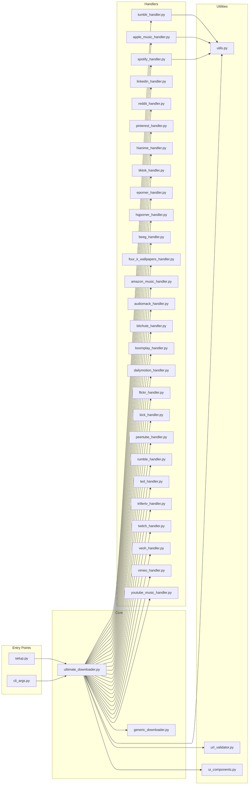

# File Structure

This document describes the organization of files and directories in the Ultimate Media Downloader project.

## Table of Contents

1. [Directory Overview](#directory-overview)
2. [Root Files](#root-files)
3. [Handlers Directory](#handlers-directory)
4. [Utils Directory](#utils-directory)
5. [Scripts Directory](#scripts-directory)
6. [Documentation](#documentation)

---

## Directory Overview

```mermaid
graph TD
    ROOT[umd/] --> MAIN[Main Python Files]
    ROOT --> HANDLERS[handlers/]
    ROOT --> UTILS[utils/]
    ROOT --> SCRIPTS[scripts/]
    ROOT --> DOCS[documentations/]
    ROOT --> CONFIG[Configuration Files]

    MAIN --> M1[ultimate_downloader.py]
    MAIN --> M2[generic_downloader.py]
    MAIN --> M3[cli_args.py]
    MAIN --> M4[logger.py]
    MAIN --> M5[youtube_scorer.py]
    MAIN --> M6[platform_info.py]

    HANDLERS --> H1[spotify_handler.py]
    HANDLERS --> H2[apple_music_handler.py]
    HANDLERS --> H3[jiosaavn_handler.py]
    HANDLERS --> H4[gaana_handler.py]
    HANDLERS --> H5[tumblr_handler.py]
    HANDLERS --> H6[linkedin_handler.py]
    HANDLERS --> H7[reddit_handler.py]
    HANDLERS --> H8[pinterest_handler.py]
    HANDLERS --> H9[instagram_handler.py]
    HANDLERS --> H10[pornhub_handler.py]
    HANDLERS --> H11[xnxx_handler.py]
    HANDLERS --> H12[xhamster_handler.py]
    HANDLERS --> H13[hianime_handler.py]
    HANDLERS --> H14[tiktok_handler.py]
    HANDLERS --> H15[eporner_handler.py]
    HANDLERS --> H16[hqporner_handler.py]
    HANDLERS --> H17[beeg_handler.py]
    HANDLERS --> H18[four_k_wallpapers_handler.py]
    HANDLERS --> H19[amazon_music_handler.py]
    HANDLERS --> H20[audiomack_handler.py]
    HANDLERS --> H21[bitchute_handler.py]
    HANDLERS --> H22[boomplay_handler.py]
    HANDLERS --> H23[dailymotion_handler.py]
    HANDLERS --> H24[flickr_handler.py]
    HANDLERS --> H25[kick_handler.py]
    HANDLERS --> H26[peertube_handler.py]
    HANDLERS --> H27[rumble_handler.py]
    HANDLERS --> H28[ted_handler.py]
    HANDLERS --> H29[trillertv_handler.py]
    HANDLERS --> H30[twitch_handler.py]
    HANDLERS --> H31[veoh_handler.py]
    HANDLERS --> H32[vimeo_handler.py]
    HANDLERS --> H33[youtube_music_handler.py]

    UTILS --> U1[utils.py]
    UTILS --> U2[url_validator.py]
    UTILS --> U3[file_manager.py]
    UTILS --> U4[platform_utils.py]
    UTILS --> U5[browser_utils.py]
    UTILS --> U6[ui_components.py]
    UTILS --> U7[progress_display.py]
    UTILS --> U8[ui_utils.py]

    CONFIG --> C1[config.json]
    CONFIG --> C2[requirements.txt]
    CONFIG --> C3[setup.py]
```



---

## Root Files

### Main Application Files

| File | Lines | Description |
|------|-------|-------------|
| `ultimate_downloader.py` | ~3555 | Main application class and entry point |
| `generic_downloader.py` | ~1282 | Advanced downloader for sites with special requirements |
| `cli_args.py` | ~217 | Command-line argument parsing |
| `logger.py` | ~80 | Custom logging to suppress verbose output |
| `youtube_scorer.py` | ~1026 | Algorithm for ranking YouTube search results |
| `platform_info.py` | ~284 | Platform information display |

### Configuration Files

| File | Description |
|------|-------------|
| `config.json` | Application settings and preferences |
| `requirements.txt` | Python package dependencies |
| `setup.py` | Package installation configuration |

### Documentation Files

| File | Description |
|------|-------------|
| `README.md` | Main project documentation |
| `LICENSE` | Apache 2.0 license file |
| `THIRD_PARTY_LICENSES.md` | Third-party dependency licenses |

---

## Root Files Details

### ultimate_downloader.py

The main application file containing:

- `UltimateMediaDownloader` class
- Platform detection logic
- Download coordination
- Progress display
- Main entry point

```python
# Key components
class UltimateMediaDownloader:
    def __init__(self, output_dir, verbose)
    def download(self, url, options)
    def detect_platform(self, url)
    def search_and_download_spotify_track(self, url)
    # ... many more methods
```

### generic_downloader.py

Handles sites that need special treatment:

- SSL/TLS bypass
- Anti-bot protection bypass
- Cloudflare bypass
- Multiple fallback methods
- Proxy rotation

```python
class GenericSiteDownloader:
    def __init__(self, output_dir, verbose, proxies)
    def download(self, url)
    def _try_requests(self, url)
    def _try_cloudscraper(self, url)
    def _try_selenium(self, url)
```

### cli_args.py

Command-line interface definition:

- Argument parser configuration
- Help text and examples
- Option validation

### logger.py

Custom logging system:

- Suppresses verbose yt-dlp output
- Counts warnings and errors
- Shows summary after download

### youtube_scorer.py

Intelligent video selection:

- Scores YouTube search results
- Considers title match, popularity, quality
- Filters out unwanted content types

### platform_info.py

Platform documentation:

- List of supported platforms
- Platform-specific features
- Display formatting

---

## Handlers Directory

Location: `handlers/`

### Handler Files

| File | Lines | Platform |
|------|-------|----------|
| `__init__.py` | - | Package initialization |
| `spotify_handler.py` | ~1212 | Spotify tracks, albums, playlists |
| `apple_music_handler.py` | ~1123 | Apple Music content |
| `jiosaavn_handler.py` | ~1712 | JioSaavn tracks, albums, playlists |
| `gaana_handler.py` | ~1140 | Gaana tracks, albums, playlists, artists |
| `tumblr_handler.py` | ~614 | Tumblr blogs and media |
| `linkedin_handler.py` | ~800 | LinkedIn posts and profiles |
| `reddit_handler.py` | ~900 | Reddit posts and user content |
| `pinterest_handler.py` | ~700 | Pinterest pins, boards, profiles |
| `instagram_handler.py` | ~1719 | Instagram posts, reels, stories, profiles |
| `pornhub_handler.py` | ~613 | Pornhub videos |
| `xnxx_handler.py` | ~500 | XNXX videos |
| `xhamster_handler.py` | ~500 | xHamster content |
| `hianime_handler.py` | ~600 | HiAnime series and videos |
| `tiktok_handler.py` | ~372 | TikTok videos |
| `eporner_handler.py` | ~961 | Eporner videos |
| `hqporner_handler.py` | ~701 | HQPorner videos |
| `beeg_handler.py` | ~901 | Beeg videos |
| `four_k_wallpapers_handler.py` | ~950 | 4kwallpapers.com image browsing & download |
| `amazon_music_handler.py` | ~900 | Amazon Music content |
| `audiomack_handler.py` | ~900 | Audiomack songs and albums |
| `bitchute_handler.py` | ~900 | BitChute videos |
| `boomplay_handler.py` | ~900 | Boomplay tracks and albums |
| `dailymotion_handler.py` | ~900 | Dailymotion videos |
| `flickr_handler.py` | ~900 | Flickr photos and albums |
| `kick_handler.py` | ~900 | Kick VODs and streams |
| `peertube_handler.py` | ~900 | PeerTube videos |
| `rumble_handler.py` | ~900 | Rumble videos |
| `ted_handler.py` | ~900 | TED talks |
| `trillertv_handler.py` | ~900 | TrillerTV videos |
| `twitch_handler.py` | ~900 | Twitch streams and VODs |
| `veoh_handler.py` | ~900 | Veoh videos |
| `vimeo_handler.py` | ~900 | Vimeo videos |
| `youtube_music_handler.py` | ~924 | YouTube Music tracks and playlists |

### Handler Structure

Each handler follows this pattern:

```python
class PlatformHandler:
    def __init__(self, downloader):
        """Initialize with reference to main downloader"""
        self.downloader = downloader
    
    def search_and_download(self, url, interactive=True):
        """Main entry point for downloading"""
        pass
    
    def _download_track(self, url):
        """Download single item"""
        pass
    
    def _download_playlist(self, url):
        """Download collection"""
        pass
```

---

## Utils Directory

Location: `utils/`

### Utility Files

| File | Lines | Purpose |
|------|-------|---------|
| `__init__.py` | - | Package initialization |
| `utils.py` | ~336 | Core utility functions |
| `url_validator.py` | ~199 | URL validation and support checking |
| `file_manager.py` | ~150 | File operations and organization |
| `platform_utils.py` | ~157 | Platform detection and configuration |
| `browser_utils.py` | ~200 | Browser automation utilities |
| `ui_components.py` | ~276 | Icons, messages, UI elements |
| `ui_utils.py` | ~100 | Rich console wrapper |
| `progress_display.py` | ~200 | Progress bars and status display |

### Key Utility Functions

From `utils.py`:

```python
def sanitize_filename(filename)      # Remove invalid characters
def format_bytes(bytes_value)        # Human-readable file sizes
def format_duration(seconds)         # Human-readable durations
def detect_platform(url)             # Identify platform from URL
def is_playlist_url(url)             # Check if URL is a playlist
def load_config()                    # Load configuration file
def save_config(config)              # Save configuration file
```

From `url_validator.py`:

```python
class URLValidator:
    def is_valid_url(url)            # Check URL format
    def check_url_support(url)       # Verify platform support
```

From `ui_components.py`:

```python
class Icons:
    def get(name)                    # Get icon by name

class Messages:
    def success(text)                # Format success message
    def error(text)                  # Format error message
    def warning(text)                # Format warning message
    def info(text)                   # Format info message
```

---

## Scripts Directory

Location: `scripts/`

### Script Files

| File | Platform | Purpose |
|------|----------|---------|
| `install.sh` | Unix | Install application |
| `install.bat` | Windows | Install application |
| `uninstall.sh` | Unix | Remove application |
| `uninstall.bat` | Windows | Remove application |
| `setup.sh` | Unix | Initial setup |
| `setup.bat` | Windows | Initial setup |
| `activate-env.sh` | Unix | Activate virtual environment |
| `activate-env.bat` | Windows | Activate virtual environment |

### Script Usage

```bash
# Install (macOS/Linux)
./scripts/install.sh

# Install (Windows)
scripts\install.bat

# Uninstall (macOS/Linux)
./scripts/uninstall.sh

# Uninstall (Windows)
scripts\uninstall.bat
```

---

## Documentation

Location: `documentations/`

### Documentation Files

| File | Description |
|------|-------------|
| `ARCHITECTURE.md` | System design and components |
| `HANDLERS.md` | Platform handler documentation |
| `INSTALLATION.md` | Installation instructions |
| `USAGE.md` | Usage guide with examples |
| `CONFIGURATION.md` | Configuration options |
| `PROJECT_OVERVIEW.md` | Project summary |
| `FILE_STRUCTURE.md` | This file |

---

## Cache and Generated Files

These files are created during operation:

```text
umd/
    .cache/                  # Download cache
    __pycache__/            # Python bytecode cache
    handlers/__pycache__/   # Handler bytecode cache
    utils/__pycache__/      # Utils bytecode cache
    archive.txt             # Downloaded URL history
    *.egg-info/             # Package metadata (after install)
```

---

## File Relationships



---

## Summary

The project is organized into logical groups:

1. **Root**: Main application files and configuration
2. **Handlers**: Platform-specific download logic
3. **Utils**: Shared helper functions and UI components
4. **Scripts**: Installation and maintenance scripts
5. **Documentations**: User and developer guides

This structure makes it easy to:

- Find specific functionality
- Add new features
- Maintain existing code
- Understand the project
