# Platform Handlers Documentation

This document describes the platform-specific handlers in the Ultimate Media Downloader. Each handler is designed to work with a specific streaming or content platform, extracting metadata and facilitating downloads.

## Table of Contents

1. [Overview](#overview)
2. [Handler Architecture](#handler-architecture)
3. [Spotify Handler](#spotify-handler)
4. [Apple Music Handler](#apple-music-handler)
5. [JioSaavn Handler](#jiosaavn-handler)
6. [Gaana Handler](#gaana-handler)
7. [Tumblr Handler](#tumblr-handler)
8. [LinkedIn Handler](#linkedin-handler)
9. [Pinterest Handler](#pinterest-handler)
10. [Reddit Handler](#reddit-handler)
11. [Instagram Handler](#instagram-handler)
12. [Pornhub Handler](#pornhub-handler)
13. [XNXX Handler](#xnxx-handler)
14. [xHamster Handler](#xhamster-handler)
15. [HiAnime Handler](#hianime-handler)
16. [TikTok Handler](#tiktok-handler)
17. [Eporner Handler](#eporner-handler)
18. [HQPorner Handler](#hqporner-handler)
19. [Beeg Handler](#beeg-handler)
20. [4K Wallpapers Handler](#4k-wallpapers-handler)
21. [Creating Custom Handlers](#creating-custom-handlers)

---

## Overview

Handlers are specialized modules that know how to work with specific platforms. While yt-dlp can download from many sites directly, some platforms require special handling for:

- Metadata extraction and embedding
- Authentication or cookie management
- Content discovery (playlists, albums, channels)
- Quality selection
- Anti-bot bypass techniques

### Handler Location

All handlers are located in the `handlers/` directory:

```
handlers/
    __init__.py
    spotify_handler.py
    apple_music_handler.py
    jiosaavn_handler.py
    gaana_handler.py
    tumblr_handler.py
    linkedin_handler.py
    pinterest_handler.py
    reddit_handler.py
    instagram_handler.py
    pornhub_handler.py
    xnxx_handler.py
    xhamster_handler.py
    hianime_handler.py
    tiktok_handler.py
    eporner_handler.py
    hqporner_handler.py
    beeg_handler.py
    four_k_wallpapers_handler.py
```

---

## Handler Architecture

Every handler follows a consistent pattern that makes them predictable and easy to understand.

### Common Structure

```mermaid
classDiagram
    class BaseHandler {
        +downloader: UltimateMediaDownloader
        +console: Console
        +__init__(downloader)
        +search_and_download(url, interactive)
        +_print(message)
    }

    class SpotifyHandler {
        +spotify_client: Spotipy
        +_download_track(url)
        +_download_album(url)
        +_download_playlist(url)
        +_download_artist(url)
    }

    class AppleMusicHandler {
        +_download_track_enhanced(url)
        +_download_album_enhanced(url)
        +_download_playlist_enhanced(url)
    }

    class JioSaavnHandler {
        +_download_track(url)
        +_download_album(url)
        +_download_playlist(url)
        +_extract_metadata(track_id)
        +_decode_html_entities(text)
    }

    class TumblrHandler {
        +api: TumblrAPI
        +download_blog(url)
        +_extract_media(posts)
    }

    class LinkedInHandler {
        +_download_post(url)
        +_extract_media_urls(url)
    }

    class RedditHandler {
        +reddit: PRAW
        +_download_post(url)
        +_download_user_posts(username)
        +_create_zip(files, output_path)
    }

    class PinterestHandler {
        +_download_pin(url)
        +_download_board(url)
        +_download_profile(url)
        +_try_gallery_dl(url)
    }

    class InstagramHandler {
        +browser: Browser
        +page: Page
        +_download_single_post(url)
        +_download_profile_posts(username)
        +_download_stories(url)
        +_handle_profile_download(username)
    }

    class HiAnimeHandler {
        +_download_anime(url)
        +_download_episode(url)
        +_extract_metadata(url)
    }

    BaseHandler <|-- HiAnimeHandler
    BaseHandler <|-- SpotifyHandler
    BaseHandler <|-- AppleMusicHandler
    BaseHandler <|-- JioSaavnHandler
    BaseHandler <|-- TumblrHandler
    BaseHandler <|-- LinkedInHandler
    BaseHandler <|-- RedditHandler
    BaseHandler <|-- PinterestHandler
    BaseHandler <|-- InstagramHandler
```

### Common Methods

Every handler implements these core methods:

| Method | Purpose |
|--------|---------|
| `__init__(downloader)` | Initialize with reference to main downloader |
| `search_and_download(url)` | Main entry point for processing URLs |
| `_print(message)` | Print messages using Rich formatting if available |

---

## Spotify Handler

**File**: `handlers/spotify_handler.py`

The Spotify Handler enables downloading music from Spotify by searching for equivalent content on YouTube.

### How It Works

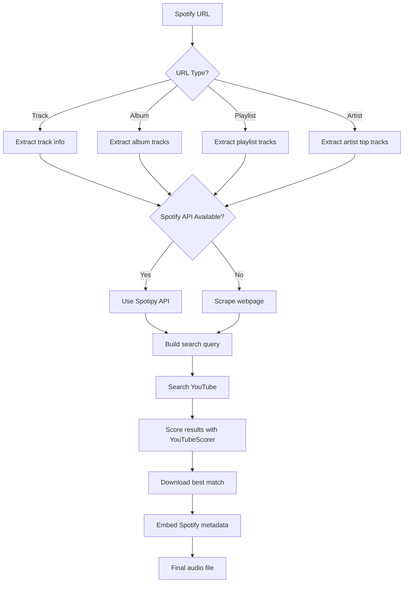

### Supported Content Types

| Content Type | URL Pattern | Example |
|--------------|-------------|---------|
| Track | `/track/` | `https://open.spotify.com/track/xxx` |
| Album | `/album/` | `https://open.spotify.com/album/xxx` |
| Playlist | `/playlist/` | `https://open.spotify.com/playlist/xxx` |
| Artist | `/artist/` | `https://open.spotify.com/artist/xxx` |

### Configuration

The handler can use the official Spotify API for better metadata extraction:

```bash
# Set environment variables for API access
export SPOTIFY_CLIENT_ID="your_client_id"
export SPOTIFY_CLIENT_SECRET="your_client_secret"
```

Without API credentials, the handler scrapes the Spotify webpage for basic information.

### Key Features

- Automatic album and playlist download with progress tracking
- High-quality metadata embedding (title, artist, album, year, cover art)
- Interactive quality selection
- Batch downloading support

---

## Apple Music Handler

**File**: `handlers/apple_music_handler.py`

The Apple Music Handler works similarly to Spotify, searching YouTube for equivalent content.

### Processing Flow

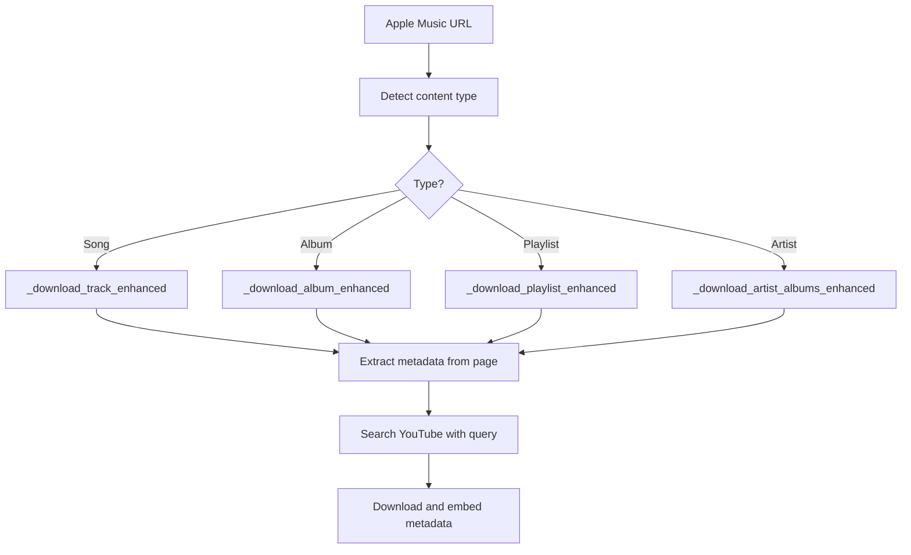

### Supported Content Types

| Content Type | URL Pattern |
|--------------|-------------|
| Song | `music.apple.com/.../song/...` |
| Album | `music.apple.com/.../album/...` |
| Playlist | `music.apple.com/.../playlist/...` |
| Artist | `music.apple.com/.../artist/...` |

### Metadata Extraction

The handler uses cloudscraper to bypass protection and BeautifulSoup to parse:

- Song title
- Artist name
- Album name
- Album artwork URL
- Track duration
- Release date

### Key Features

- Cloudflare bypass using cloudscraper
- Rich metadata extraction from Apple Music pages
- Album and playlist batch downloading
- Cover art embedding

---

## Gaana Handler

**File**: `handlers/gaana_handler.py`

The Gaana Handler downloads Indian music from Gaana platform with comprehensive metadata support and flexible song selection.

### Processing Flow

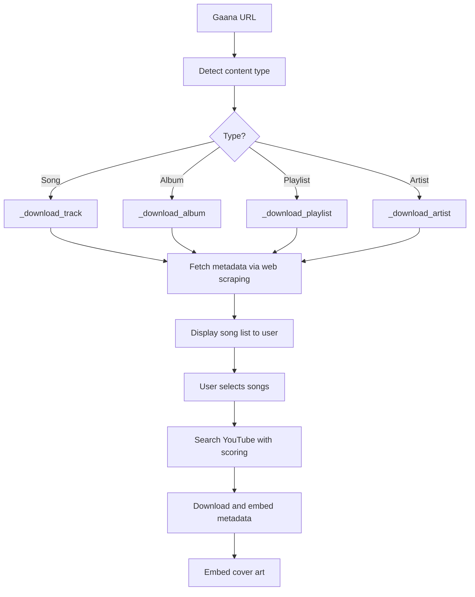

### Supported Content Types

| Content Type | URL Pattern |
|--------------|-------------|
| Song | `gaana.com/song/...` |
| Album | `gaana.com/album/...` |
| Playlist | `gaana.com/playlist/...` |
| Artist | `gaana.com/artist/...` |

### Web Scraping Integration

The handler uses BeautifulSoup for metadata extraction:

| Data Source | Purpose |
|----------|---------|
| Meta tags (og:title, og:image) | Basic metadata |
| JSON-LD structured data | Detailed track/album information |
| Page links | Song discovery for albums/playlists |

### Interactive Song Selection

For albums, playlists, and artists, the handler provides:

- **Display**: Numbered list of all songs with artist names
- **Selection Options**:
  - Press Enter or type 'all' → Download all tracks
  - Type specific numbers: `1,3,5` → Download songs 1, 3, and 5
  - Type ranges: `1-10` → Download songs 1 through 10
  - Combine: `1-5,8,10` → Download multiple ranges/songs
  - Type 'cancel' → Abort download

### Metadata Extraction

The handler extracts comprehensive metadata:

- Song title (with HTML entity decoding)
- Artist name(s)
- Album name
- Release year
- Album artwork URL
- Song duration

### YouTube Search with Scoring

Uses intelligent YouTube search with scoring algorithm:

| Factor | Weight |
|--------|--------|
| Title match | 100 points |
| Artist match | 50 points |
| Official content | 30 points |
| Audio/lyric video | 20 points |
| View count | Up to 30 points |
| Like ratio | Up to 15 points |
| Unwanted keywords | -50 points |

### Example Usage

```bash
# Download a single track
umd https://gaana.com/song/financer-5

# Download an album (with song selection)
umd https://gaana.com/album/financer

# Download a playlist (with song selection)
umd https://gaana.com/playlist/gaana-dj-haryanvi-top-50

# Download artist's songs (with song selection)
umd https://gaana.com/artist/bintu-pabra
```

### Format Support

Supports multiple audio formats with quality selection:

- **MP3**: Best quality (320kbps)
- **M4A**: High quality (256kbps AAC)
- **FLAC**: Lossless (larger files)
- **Auto**: Best available quality

### Technical Implementation

The handler implements several advanced features:

1. **HTML Entity Decoding**: Converts `&quot;`, `&amp;` to proper characters
2. **Smart Song Selection**: Parse user input like `1,3-5,7` for flexible downloads
3. **Format Preservation**: Selected format/quality passed to all track downloads
4. **Error Recovery**: Continues downloading remaining songs if one fails

### Key Features

- ✅ Single tracks with full metadata
- ✅ Complete albums with song selection
- ✅ Full playlists with song selection  
- ✅ Artist pages with song selection
- ✅ Album artwork embedding (MP3, M4A, FLAC)
- ✅ Flexible format selection (MP3/M4A/FLAC)
- ✅ Interactive song selection UI
- ✅ YouTube search with intelligent scoring

---

## JioSaavn Handler

**File**: `handlers/jiosaavn_handler.py`

The JioSaavn Handler downloads Indian music from JioSaavn platform with comprehensive metadata support.

### Processing Flow

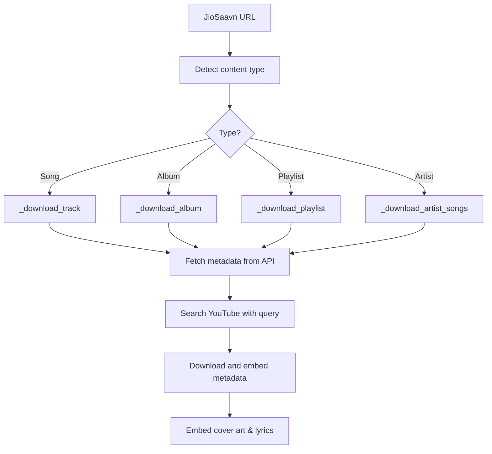

### Supported Content Types

| Content Type | URL Pattern |
|--------------|-------------|
| Song | `jiosaavn.com/song/...` |
| Album | `jiosaavn.com/album/...` |
| Playlist | `jiosaavn.com/featured/...` or `jiosaavn.com/s/playlist/...` |
| Artist | `jiosaavn.com/artist/...` |

### JioSaavn API Integration

The handler uses JioSaavn's unofficial API endpoints for metadata:

| Endpoint | Purpose |
|----------|---------|
| `autocomplete.get` | Search functionality |
| `song.getDetails` | Track metadata and streaming URLs |
| `content.getAlbumDetails` | Album information and track list |
| `playlist.getDetails` | Playlist contents |
| `lyrics.getLyrics` | Song lyrics in multiple languages |

### Metadata Extraction

The handler extracts comprehensive metadata:

- Song title (with HTML entity decoding)
- Artist name(s) (primary and featuring artists)
- Album name
- Release year
- Song duration
- High-quality cover art (500x500)
- Lyrics (if available)
- Album artist
- Copyright information

### Key Features

- **Official API Integration**: Uses JioSaavn's API for reliable metadata
- **High-Quality Metadata**: Extracts detailed song information including multiple artists
- **Lyrics Support**: Downloads and embeds lyrics when available
- **Cover Art**: Embeds high-resolution album artwork
- **HTML Entity Decoding**: Properly handles special characters in titles
- **Batch Processing**: Supports album and playlist downloads with progress tracking
- **Fallback API**: Uses alternative API endpoints if primary fails
- **Concurrent Downloads**: Multi-threaded downloading for playlists
- **YouTube Search**: Falls back to YouTube for actual audio streaming

### Example Usage

```bash
# Download a single track
umd https://www.jiosaavn.com/song/kesariya/...

# Download an entire album
umd https://www.jiosaavn.com/album/brahmastra/...

# Download a playlist
umd https://www.jiosaavn.com/featured/...

# Download artist's top songs
umd https://www.jiosaavn.com/artist/arijit-singh/...
```

### Technical Implementation

The handler implements several advanced features:

1. **HTML Entity Decoding**: Converts `&quot;`, `&amp;` to proper characters
2. **Multi-Artist Support**: Handles songs with multiple featured artists
3. **Error Handling**: Graceful degradation when API endpoints fail
4. **Progress Tracking**: Rich console progress bars for batch downloads
5. **Metadata Preservation**: Maintains all original JioSaavn metadata

---

## Tumblr Handler

**File**: `handlers/tumblr_handler.py`

The Tumblr Handler downloads images and videos from Tumblr blogs using the Tumblr API.

### Architecture

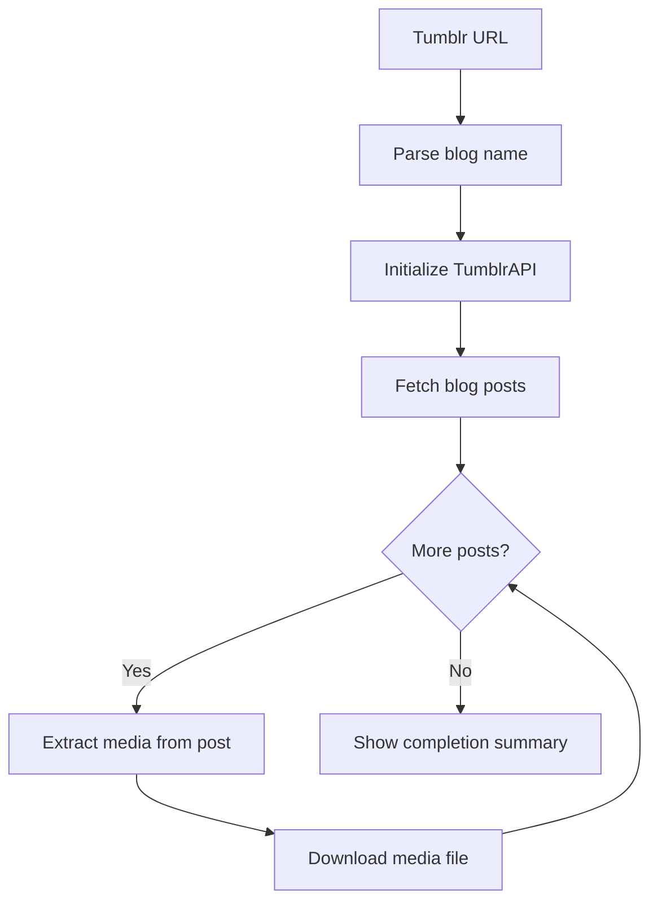

### TumblrAPI Class

The handler includes a built-in API wrapper:

| Method | Purpose |
|--------|---------|
| `get_blog_posts()` | Fetch posts from a blog |
| `get_post_media()` | Extract media URLs from a post |
| `_call()` | Make authenticated API requests |

### Supported Media Types

- Images (JPG, PNG, GIF)
- Videos (MP4)
- Multi-image posts (photo sets)
- Video posts

### Key Features

- Pagination support for large blogs
- Progress tracking during download
- Automatic filename sanitization
- Skips already downloaded files

---

## LinkedIn Handler

**File**: `handlers/linkedin_handler.py`

Handles downloading videos and images from LinkedIn direct post URLs. Profile scraping is not supported due to authentication requirements.

### Supported Content Types

| Content Type | URL Pattern | Example |
|--------------|-------------|---------||
| Direct Post | `/posts/username_POST_ID` | `https://www.linkedin.com/posts/username_POST_ID` |
| Feed Post | `/feed/update/urn:li:activity:...` | `https://www.linkedin.com/feed/update/...` |

### LinkedIn Architecture

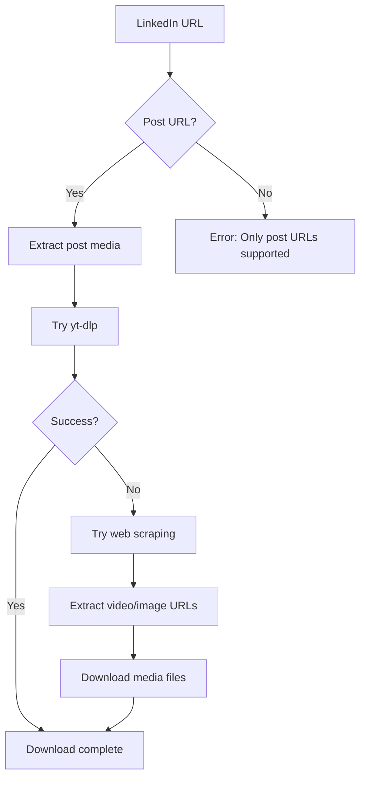

### Key Features

- Direct post URL support only (no profile scraping)
- Video and image extraction
- Multiple fallback methods
- Rich progress bars with download speed
- No Selenium dependency (faster and more reliable)
- User agent rotation
- Cloudflare bypass support

### Limitations

- Profile scraping removed due to authentication requirements
- Only works with publicly accessible posts
- May require cookies for private content

---

## Pinterest Handler

**File**: `handlers/pinterest_handler.py`

Handles downloading images and videos from Pinterest pins, boards, and user profiles with advanced multi-tier download strategy.

### Supported Content Types

| Content Type | URL Pattern | Example |
|--------------|-------------|---------||
| Single Pin | `/pin/PIN_ID/` | `https://www.pinterest.com/pin/123456789/` |
| Board | `/username/board-name/` | `https://www.pinterest.com/username/travel-photos/` |
| User Profile | `/username/` | `https://www.pinterest.com/username/` |
| Short Link | `pin.it/...` | `https://pin.it/abc123` |

### Pinterest Architecture

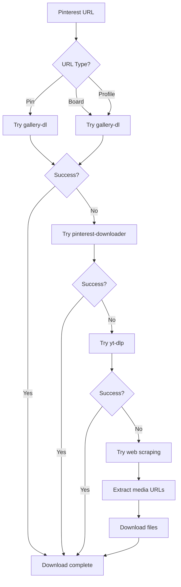

### Multi-Tier Download Strategy

The handler uses multiple methods in order of preference:

1. **gallery-dl** - Most reliable, supports boards and profiles
2. **pinterest-downloader** - Alternative library for Pinterest
3. **yt-dlp** - Generic extractor
4. **Web Scraping** - Fallback with 10 regex patterns and 7 extraction methods

### Key Features

- Multi-tier download strategy for maximum reliability
- Interactive prompt for custom pin count
- Real-time progress tracking with file names
- High-quality media selection (1000px+ images)
- 10 regex patterns for robust scraping
- Support for profiles, boards, and individual pins
- No metadata JSON files (clean downloads)
- ZIP file creation for bulk downloads
- User agent rotation and proxy support

### Pinterest API

The handler can use gallery-dl which interfaces with Pinterest's internal API:

| Tool | Purpose |
|------|---------||
| gallery-dl | Primary download tool |
| pinterest-downloader | Alternative download tool |
| Web scraping | Fallback extraction method |

---

## Reddit Handler

**File**: `handlers/reddit_handler.py`

Handles downloading videos, images, and GIFs from Reddit posts and user profiles with PRAW (Python Reddit API Wrapper) integration.

### Supported Content Types

| Content Type | URL Pattern | Example |
|--------------|-------------|---------||
| Single Post | `/r/subreddit/comments/POST_ID/title/` | `https://www.reddit.com/r/videos/comments/abc123/title/` |
| User Posts | `/user/username/` | `https://www.reddit.com/user/username/` |
| User Profile | `/u/username/` | `https://www.reddit.com/u/username/` |
| Short Link | `redd.it/POST_ID` | `https://redd.it/abc123` |

### Reddit Architecture

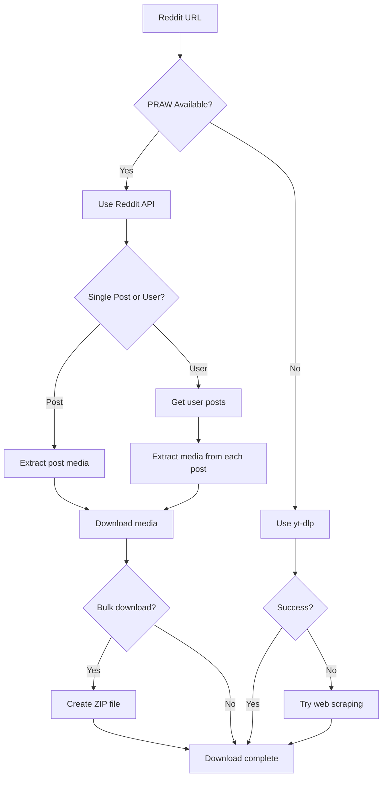

### PRAW Integration

The handler can use PRAW for API access:

| Method | Purpose |
|--------|---------||
| `submission()` | Get post by ID |
| `redditor().submissions.new()` | Get user posts |
| `subreddit().hot()` | Get subreddit posts |

### Configuration

Optional Reddit API credentials for enhanced functionality:

```bash
# Set environment variables
export REDDIT_CLIENT_ID="your_client_id"
export REDDIT_CLIENT_SECRET="your_client_secret"
export REDDIT_USER_AGENT="python:ultimate-downloader:v1.0"
```

Without API credentials, the handler uses yt-dlp and web scraping.

### Key Features

- PRAW integration for API access
- Bulk user post downloads
- Automatic ZIP file creation
- Support for videos, images, and GIFs
- Progress tracking with Rich
- Fallback to yt-dlp and web scraping
- Handles v.redd.it and i.redd.it domains
- User agent rotation
- Configurable post limits

### Media Types Supported

- Videos (v.redd.it)
- Images (i.redd.it)
- GIFs (hosted and external)
- Gallery posts (multiple images)
- Cross-posts
- External media (imgur, gfycat, etc.)

---

## Instagram Handler

**File**: `handlers/instagram_handler.py`

The Instagram Handler enables downloading posts, reels, stories, and images from Instagram using Playwright for browser automation. Supports bulk downloads with ZIP creation and range selection.

### Supported Content Types

| Content Type | URL Pattern | Example |
|--------------|-------------|---------|
| Single Post | `/p/POST_ID` | `https://instagram.com/p/ABC123` |
| Single Reel | `/reel/REEL_ID` or `/reels/REEL_ID` | `https://instagram.com/reel/XYZ789` |
| IGTV Video | `/tv/VIDEO_ID` | `https://instagram.com/tv/DEF456` |
| Stories | `/stories/USERNAME` | `https://instagram.com/stories/username` |
| Profile Posts | `/USERNAME/` | `https://instagram.com/username` |
| Profile Reels | `/USERNAME/reels/` | `https://instagram.com/username/reels` |

### Architecture

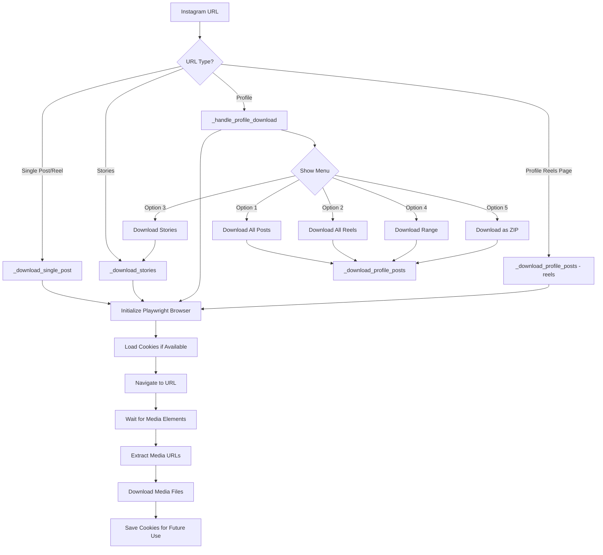

### Processing Flow

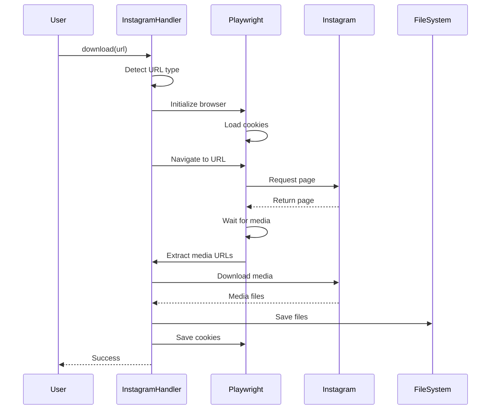

### Key Features

- **Playwright Integration**: Uses headless browser automation for reliable extraction
- **Cookie Persistence**: Saves and reuses cookies to avoid repeated logins
- **Bulk Downloads**: Download entire profiles or specific ranges
- **ZIP Creation**: Bundle downloads into ZIP files for easy sharing
- **Range Selection**: Download posts 1-10, 5-20, etc.
- **Story Support**: Download temporary stories before they expire
- **Multi-format**: Handles images, videos, carousels, and reels
- **Progress Tracking**: Rich progress bars with file names and status
- **Error Recovery**: Continues downloading remaining content if one item fails
- **User-Agent Rotation**: Random user agents to avoid detection

### Cookie Management

The handler looks for cookies in two locations:

1. `cookies.json` in project directory (preferred)
2. `~/.instagram_cookies.json` in home directory (fallback)

Cookies are automatically saved after successful sessions:

```python
# Cookie format
[
    {
        "name": "sessionid",
        "value": "...",
        "domain": ".instagram.com",
        "path": "/",
        "secure": true,
        "httpOnly": true
    }
]
```

### Profile Download Options

When downloading from a profile URL, users are presented with an interactive menu:

| Option | Description |
|--------|-------------|
| 1 | Download all posts (photos and videos) |
| 2 | Download all reels |
| 3 | Download active stories |
| 4 | Download specific range (e.g., posts 1-20) |
| 5 | Download as ZIP file (bundled) |

### Range Selection

Users can specify exact ranges when downloading:

```bash
# Examples
Enter range: 1-10      # Download posts 1 through 10
Enter range: 5-25      # Download posts 5 through 25
Enter range: 1-50      # Download posts 1 through 50
```

### Dependencies

The handler requires:

- **Playwright**: Browser automation
- **BeautifulSoup**: HTML parsing
- **Requests**: HTTP requests with retry logic
- **Rich**: Progress bars and UI

### Installation

```bash
# Install Playwright
pip install playwright
playwright install chromium

# Other dependencies
pip install beautifulsoup4 requests rich
```

### Usage Examples

```bash
# Download single post
umd https://instagram.com/p/ABC123

# Download single reel
umd https://instagram.com/reel/XYZ789

# Download profile (shows menu)
umd https://instagram.com/username

# Download profile reels (direct)
umd https://instagram.com/username/reels/

# Download stories
umd https://instagram.com/stories/username
```

### Error Handling

The handler implements robust error handling:

- **Login Required**: Prompts to provide cookies.json
- **Private Account**: Notifies that authentication is needed
- **Rate Limiting**: Implements delays between requests
- **Network Errors**: Retries failed downloads
- **Invalid URLs**: Clear error messages

### Technical Implementation

| Feature | Technology |
|---------|------------|
| Browser Automation | Playwright (Chromium) |
| HTML Parsing | BeautifulSoup4 |
| HTTP Requests | Requests + HTTPAdapter with retry |
| Progress Display | Rich Console and Progress Bars |
| Cookie Management | JSON file storage |
| User Agent | Random rotation from list |

### Supported Media Formats

- **Images**: JPG, PNG, WebP
- **Videos**: MP4, MOV
- **Carousels**: Multiple images/videos in one post
- **Reels**: Short-form videos
- **Stories**: Temporary 24-hour content

### Key Methods

| Method | Purpose |
|--------|---------|
| `can_handle(url)` | Check if URL is Instagram |
| `download(url, output_dir)` | Main download entry point |
| `_download_single_post(url)` | Download specific post/reel |
| `_download_profile_posts(username)` | Download from profile |
| `_download_stories(url)` | Download stories |
| `_handle_profile_download(username)` | Interactive menu for profiles |
| `_init_browser()` | Initialize Playwright browser |
| `_save_cookies()` | Persist cookies for reuse |

### Limitations

- **Authentication Required**: Private accounts need valid cookies
- **Rate Limiting**: Instagram may block excessive requests
- **Stories Expiration**: Stories only available for 24 hours
- **Playwright Dependency**: Requires browser installation

---

## Pornhub Handler

**File**: `handlers/pornhub_handler.py`

Handles video downloads from Pornhub with age verification bypass.

### Session Management

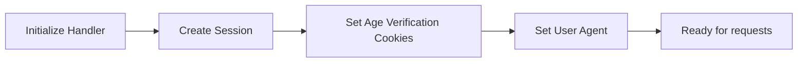

### Cookie Configuration

The handler automatically sets cookies to bypass age verification:

```python
cookies = {
    'age_verified': '1',
    'accessAgeDisclaimerPH': '1',
    'accessPH': '1'
}
```

### Supported Content

| Content | URL Pattern |
|---------|-------------|
| Single Video | `/view_video.php?viewkey=xxx` |
| Channel | `pornhub.com/channels/xxx` |
| Model | `pornhub.com/model/xxx` |
| Playlist | `pornhub.com/playlist/xxx` |

### Key Features

- Automatic age verification bypass
- Quality selection (best, 720p, 480p, etc.)
- Channel and playlist downloading
- User agent rotation

---

## XNXX Handler

**File**: `handlers/xnxx_handler.py`

Downloads videos from XNXX and its mirror domains.

### Supported Domains

The handler recognizes multiple domain variations:

- xnxx.com
- xnxx.dev
- xnxx.tv
- xnxx2.com, xnxx3.com, etc.

### Processing Flow

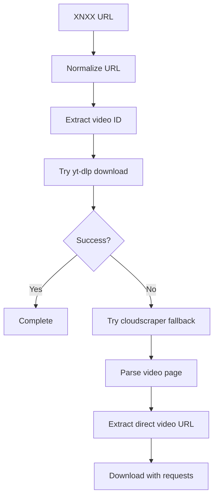

### Key Features

- Multiple domain support
- Fallback extraction methods
- SSL bypass for problematic connections

---

## xHamster Handler

**File**: `handlers/xhamster_handler.py`

Handles downloads from xHamster including videos and photo galleries.

### Supported Content Types

| Content | Description |
|---------|-------------|
| Videos | Standard video pages |
| Channels | Channel video listings |
| Photo Galleries | Image collections |
| Categories | Category browsing |

### Domain Support

The handler recognizes various mirror domains:

```python
patterns = [
    'xhamster',
    'xhwebsite', 
    'xhofficial',
    'xhlocal',
    'xhopen',
    'xhtotal',
    'megaxh',
    'xhwide',
    'xhtab',
    'xhtime'
]
```

### Key Features

- Mirror domain detection
- Photo gallery extraction
- Video quality selection
- Rate limiting to avoid bans

---

## HiAnime Handler

**File**: `handlers/hianime_handler.py`

Handles anime downloads from HiAnime with episode extraction and metadata support.

### Supported Content Types

| Content | Description |
|---------|-------------|
| Anime Series | Full series with all episodes |
| Episodes | Individual episode downloads |
| Movies | Anime movie files |
| Manga | Manga chapter collections |

### Processing Flow

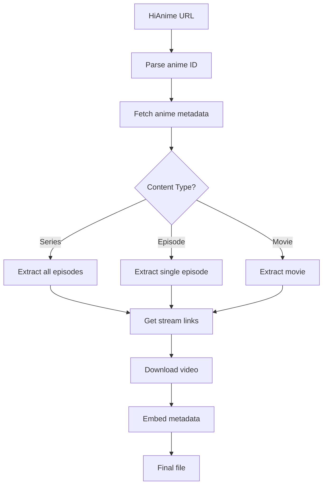

### Key Features

- Automatic episode detection
- Metadata extraction (title, synopsis, cover art)
- Multiple stream quality support
- Batch series downloading
- Episode number formatting

---

## TikTok Handler

**File**: `handlers/tiktok_handler.py`

The TikTok Handler downloads videos from TikTok with proper SSL handling and anti-bot bypass.

### TikTok Supported Domains

The handler recognizes multiple TikTok domain variations:

- tiktok.com
- www.tiktok.com
- vm.tiktok.com (shortened URLs)
- m.tiktok.com (mobile)
- vt.tiktok.com

### TikTok Processing Flow

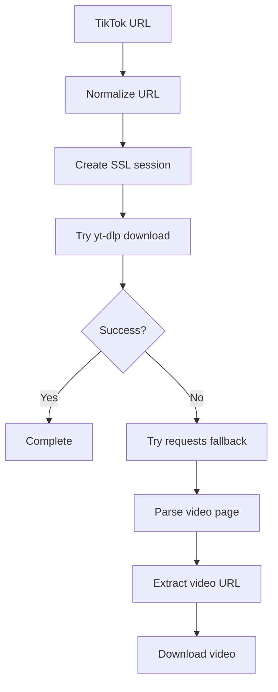

### TikTok Key Features

- Multiple domain support including shortened URLs
- SSL/TLS bypass for problematic connections
- User agent rotation
- Watermark-free download attempts
- Mobile and desktop URL handling

---

## Eporner Handler

**File**: `handlers/eporner_handler.py`

Handles video downloads from Eporner with advanced SSL bypass and multiple fallback methods.

### Eporner Supported Content

| Content | Description |
|---------|-------------|
| Videos | Standard video pages |
| Categories | Category browsing |
| Search Results | Search page videos |

### Eporner Processing Flow

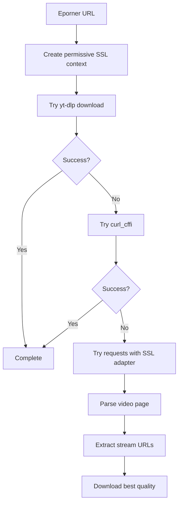

### Eporner Key Features

- Advanced SSL/TLS bypass with permissive context
- Multiple fallback extraction methods (yt-dlp, curl_cffi, requests)
- Quality selection support
- Rate limiting to avoid bans
- User agent rotation

---

## HQPorner Handler

**File**: `handlers/hqporner_handler.py`

Downloads high-quality videos from HQPorner with SSL handling and fallback methods.

### HQPorner Supported Domains

- hqporner.com
- www.hqporner.com

### HQPorner Processing Flow

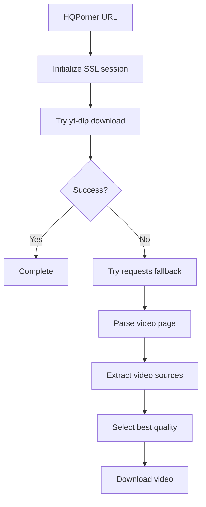

### HQPorner Key Features

- Custom SSL adapter for certificate issues
- High-quality video extraction
- Multiple resolution support
- Fallback extraction methods
- User agent rotation

---

## Beeg Handler

**File**: `handlers/beeg_handler.py`

Handles video downloads from Beeg using their API and fallback methods including subprocess curl.

### Beeg Architecture

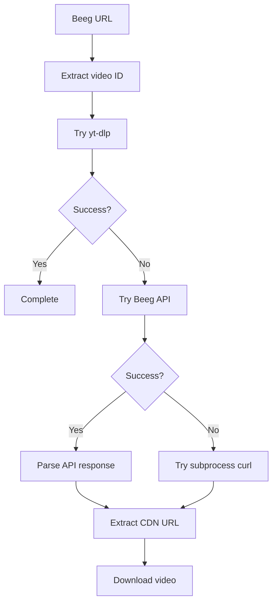

### Beeg API Integration

The handler uses Beeg's internal API for video information:

| Endpoint | Purpose |
|----------|---------|
| `store.externulls.com` | Video metadata API |
| `video.beeg.com` | Video CDN |

### Beeg Key Features

- Native API integration for reliable extraction
- Subprocess curl fallback for SSL issues
- Multiple quality options
- Progress bar display with Rich
- SSL context customization

---


## 4K Wallpapers Handler

**File**: `handlers/four_k_wallpapers_handler.py`

The 4K Wallpapers Handler enables browsing and downloading high-resolution wallpapers from [4kwallpapers.com](https://4kwallpapers.com). Unlike media handlers that use yt-dlp, this handler performs direct web scraping using `cloudscraper` and `BeautifulSoup`.

### How It Works

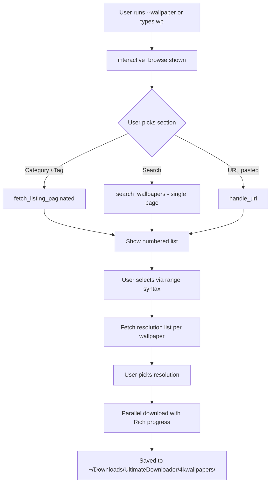

### Supported URL Types

| URL Pattern | Behaviour |
|-------------|-----------|
| `https://4kwallpapers.com/` (root) | Opens `interactive_browse()` |
| `https://4kwallpapers.com/<category>/` | Category listing (paginated) |
| `https://4kwallpapers.com/search/?q=query` | Search results (single page, 24 max) |
| `https://4kwallpapers.com/cat/slug-ID.html` | Single wallpaper download |

### Key Methods

| Method | Description |
|--------|-------------|
| `interactive_browse(search_query='')` | Main menu shown when user runs `--wallpaper` or types `wallpaper` in interactive mode |
| `handle_url(url)` | Auto-detects the URL type and routes to the appropriate flow |
| `fetch_listing(url)` | Fetches wallpapers from a single page |
| `fetch_listing_paginated(base_url, max_wallpapers=200)` | Paginates via `?page=N`, deduplicates by ID, stops on <20 results or duplicates |
| `search_wallpapers(query)` | Queries `https://4kwallpapers.com/search/?q=<query>` — single page only |
| `fetch_popular_tags()` | Scrapes live tag links from the homepage navigation |
| `_parse_wallpaper_listing(html)` | Parses `<a href="...cat/slug-ID.html">` links from listing HTML |
| `_parse_download_links(html)` | Extracts `/images/wallpapers/` hrefs with resolution regex `(\d{3,5}x\d{3,5})` |
| `_parse_selection(raw, total)` | Converts `"1,3,4-7,10-12"` / `"all"` to sorted 0-based index list |
| `_ask_selection(total)` | Interactive prompt that calls `_parse_selection` |
| `_run_listing_flow(section_name, listing_url)` | Full browse → select → download flow for any listing URL |

### Selection Syntax

The handler supports rich range-based selection:

```
all          → all wallpapers
1            → wallpaper #1 only
1,3,7        → wallpapers 1, 3, and 7
1-10         → wallpapers 1 through 10
1-5,8,10-15  → combined ranges
(Enter)      → skip / cancel
```

### Pagination Details

- Each page returns 24 wallpapers
- Pages are fetched via `?page=N` query parameter
- Fetching stops when:
  - A page returns fewer than 20 results (last page reached)
  - All wallpapers on the current page already exist in the set (duplicates detected)
  - The `max_wallpapers` limit is reached

### Cloudflare Bypass

The handler uses a **bare** `cloudscraper.create_scraper()` session (no `browser=` argument). Passing browser emulation arguments was found to trigger Cloudflare's challenge page (returning 8 KB instead of the expected 55 KB response). The bare session passes Cloudflare checks reliably.

### Download URL Format

```
https://4kwallpapers.com/images/wallpapers/<slug>-<WxH>-<id>.png
```

Example:
```
https://4kwallpapers.com/images/wallpapers/anime-girl-3840x2160-12345.png
```

---


## Creating Custom Handlers

If you want to add support for a new platform, follow this guide.

### Step 1: Create Handler File

Create a new file in `handlers/` directory:

```python
#!/usr/bin/env python3
"""
NewPlatform Handler Module
"""

import warnings
warnings.filterwarnings('ignore')

try:
    from rich.console import Console
    RICH_AVAILABLE = True
except ImportError:
    RICH_AVAILABLE = False

from utils.utils import sanitize_filename
from utils.ui_components import Icons, Messages


class NewPlatformHandler:
    """Handles downloads from NewPlatform"""
    
    def __init__(self, downloader):
        """Initialize handler with reference to main downloader"""
        self.downloader = downloader
        self.console = Console() if RICH_AVAILABLE else None
    
    def _print(self, message):
        """Print with Rich if available"""
        if self.console:
            self.console.print(message)
        else:
            print(message)
    
    def search_and_download(self, url, interactive=True):
        """Main entry point for downloading
        
        Args:
            url: URL to download from
            interactive: Whether to prompt user for options
            
        Returns:
            True if successful, False/None otherwise
        """
        # Implement your download logic here
        pass
    
    @classmethod
    def is_supported_url(cls, url):
        """Check if URL belongs to this platform"""
        return 'newplatform.com' in url.lower()
```

### Step 2: Register Handler in Main Downloader

Edit `ultimate_downloader.py` to import and initialize your handler:

```python
# At the top of the file
try:
    from handlers.newplatform_handler import NewPlatformHandler
    NEWPLATFORM_HANDLER_AVAILABLE = True
except ImportError:
    NEWPLATFORM_HANDLER_AVAILABLE = False

# In __init__ method
if NEWPLATFORM_HANDLER_AVAILABLE:
    self.newplatform_handler = NewPlatformHandler(self)
```

### Step 3: Add Platform Detection

Edit `utils/platform_utils.py`:

```python
# In detect_platform function
elif 'newplatform.com' in url_lower:
    return 'newplatform'
```

### Step 4: Add Configuration

Edit `config.json` if your handler needs settings:

```json
{
    "newplatform": {
        "enabled": true,
        "api_key": ""
    }
}
```

### Handler Best Practices

1. **Graceful Degradation**: Always check if dependencies are available
2. **Error Handling**: Catch exceptions and provide meaningful error messages
3. **Logging**: Use the `_print` method for consistent output
4. **Rate Limiting**: Add delays between requests to avoid getting blocked
5. **Fallbacks**: Implement multiple extraction methods when possible

---

## Summary

The handler system provides a flexible way to support different platforms. Each handler encapsulates the platform-specific logic while delegating common tasks (like actual downloading) to the main downloader class.

When adding new platforms:

- Follow the established patterns
- Test thoroughly with different URL types
- Handle errors gracefully
- Document the supported content types

For questions about handler development, refer to the existing handlers as examples.
