# Platform Handlers Documentation

This document describes the platform-specific handlers in the Ultimate Media Downloader. Each handler is designed to work with a specific streaming or content platform, extracting metadata and facilitating downloads.

## Table of Contents

1. [Overview](#overview)
2. [Handler Architecture](#handler-architecture)
3. [Spotify Handler](#spotify-handler)
4. [Apple Music Handler](#apple-music-handler)
5. [Tumblr Handler](#tumblr-handler)
6. [LinkedIn Handler](#linkedin-handler)
7. [Pinterest Handler](#pinterest-handler)
8. [Reddit Handler](#reddit-handler)
9. [Pornhub Handler](#pornhub-handler)
10. [XNXX Handler](#xnxx-handler)
11. [xHamster Handler](#xhamster-handler)
12. [HiAnime Handler](#hianime-handler)
13. [TikTok Handler](#tiktok-handler)
14. [Eporner Handler](#eporner-handler)
15. [HQPorner Handler](#hqporner-handler)
16. [Beeg Handler](#beeg-handler)
17. [Creating Custom Handlers](#creating-custom-handlers)

---

## Overview

Handlers are specialized modules that know how to work with specific platforms. While yt-dlp can download from many sites directly, some platforms require special handling for:

- Metadata extraction and embedding
- Authentication or cookie management
- Content discovery (playlists, albums, channels)
- Quality selection
- Anti-bot bypass techniques

### Handler Location

All handlers are located in the `handlers/` directory:

```
handlers/
    __init__.py
    spotify_handler.py
    apple_music_handler.py
    tumblr_handler.py
    linkedin_handler.py
    pinterest_handler.py
    reddit_handler.py
    pornhub_handler.py
    xnxx_handler.py
    xhamster_handler.py
    hianime_handler.py
    tiktok_handler.py
    eporner_handler.py
    hqporner_handler.py
    beeg_handler.py
```

---

## Handler Architecture

Every handler follows a consistent pattern that makes them predictable and easy to understand.

### Common Structure

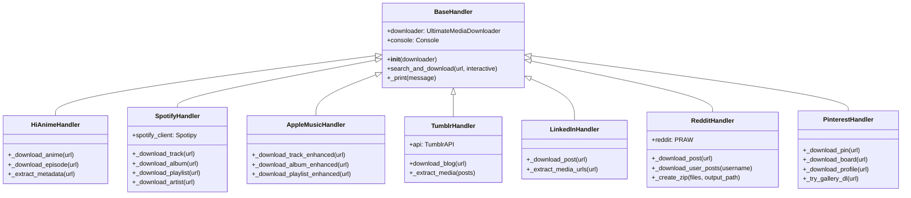

### Common Methods

Every handler implements these core methods:

| Method | Purpose |
|--------|---------|
| `__init__(downloader)` | Initialize with reference to main downloader |
| `search_and_download(url)` | Main entry point for processing URLs |
| `_print(message)` | Print messages using Rich formatting if available |

---

## Spotify Handler

**File**: `handlers/spotify_handler.py`

The Spotify Handler enables downloading music from Spotify by searching for equivalent content on YouTube.

### How It Works

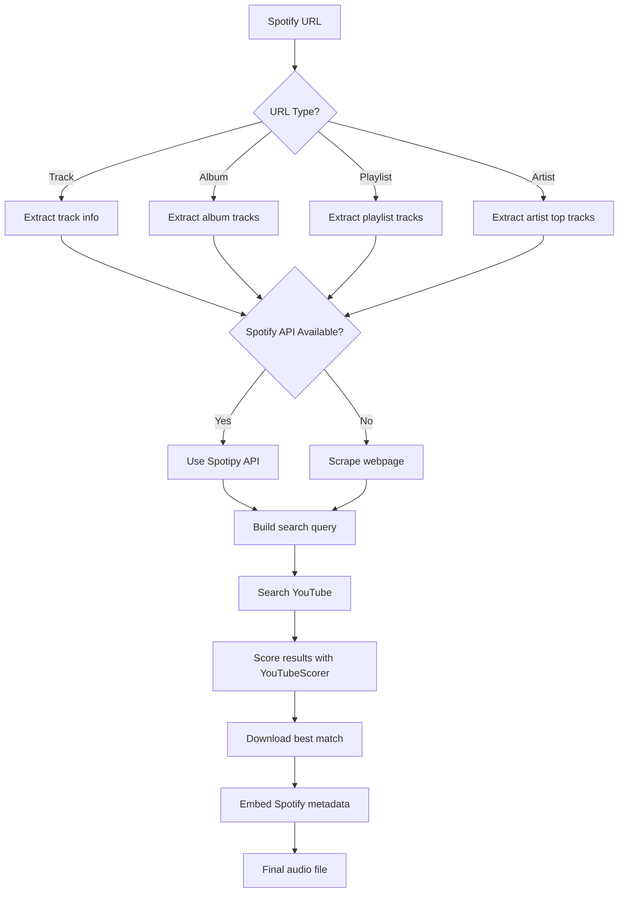

### Supported Content Types

| Content Type | URL Pattern | Example |
|--------------|-------------|---------|
| Track | `/track/` | `https://open.spotify.com/track/xxx` |
| Album | `/album/` | `https://open.spotify.com/album/xxx` |
| Playlist | `/playlist/` | `https://open.spotify.com/playlist/xxx` |
| Artist | `/artist/` | `https://open.spotify.com/artist/xxx` |

### Configuration

The handler can use the official Spotify API for better metadata extraction:

```bash
# Set environment variables for API access
export SPOTIFY_CLIENT_ID="your_client_id"
export SPOTIFY_CLIENT_SECRET="your_client_secret"
```

Without API credentials, the handler scrapes the Spotify webpage for basic information.

### Key Features

- Automatic album and playlist download with progress tracking
- High-quality metadata embedding (title, artist, album, year, cover art)
- Interactive quality selection
- Batch downloading support

---

## Apple Music Handler

**File**: `handlers/apple_music_handler.py`

The Apple Music Handler works similarly to Spotify, searching YouTube for equivalent content.

### Processing Flow

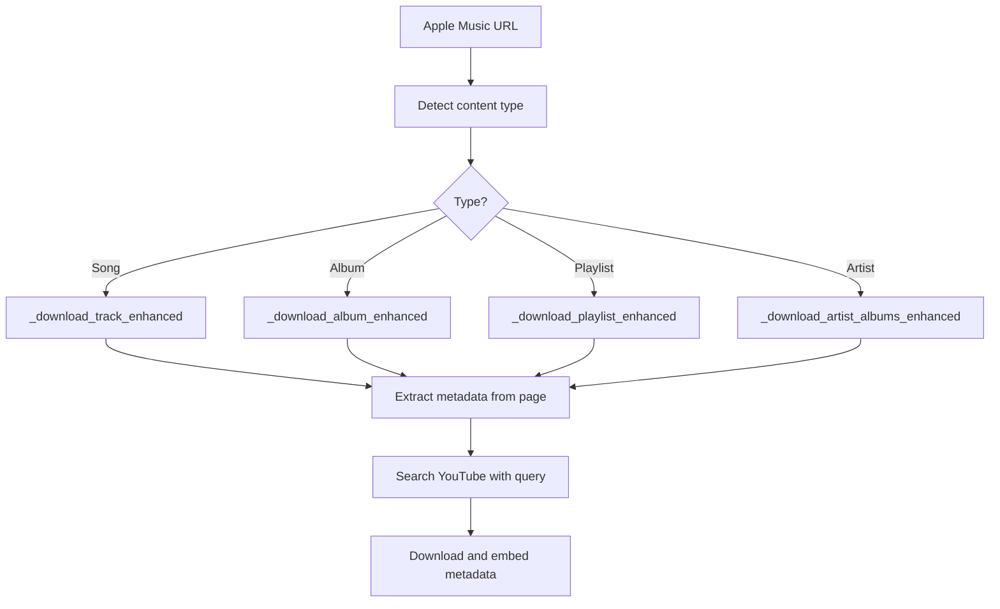

### Supported Content Types

| Content Type | URL Pattern |
|--------------|-------------|
| Song | `music.apple.com/.../song/...` |
| Album | `music.apple.com/.../album/...` |
| Playlist | `music.apple.com/.../playlist/...` |
| Artist | `music.apple.com/.../artist/...` |

### Metadata Extraction

The handler uses cloudscraper to bypass protection and BeautifulSoup to parse:

- Song title
- Artist name
- Album name
- Album artwork URL
- Track duration
- Release date

### Key Features

- Cloudflare bypass using cloudscraper
- Rich metadata extraction from Apple Music pages
- Album and playlist batch downloading
- Cover art embedding

---

## Tumblr Handler

**File**: `handlers/tumblr_handler.py`

The Tumblr Handler downloads images and videos from Tumblr blogs using the Tumblr API.

### Architecture

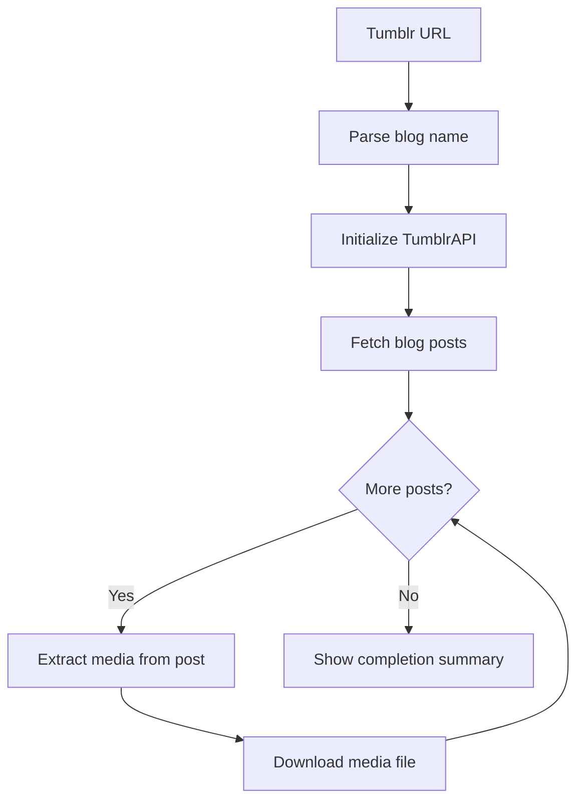

### TumblrAPI Class

The handler includes a built-in API wrapper:

| Method | Purpose |
|--------|---------|
| `get_blog_posts()` | Fetch posts from a blog |
| `get_post_media()` | Extract media URLs from a post |
| `_call()` | Make authenticated API requests |

### Supported Media Types

- Images (JPG, PNG, GIF)
- Videos (MP4)
- Multi-image posts (photo sets)
- Video posts

### Key Features

- Pagination support for large blogs
- Progress tracking during download
- Automatic filename sanitization
- Skips already downloaded files

---

## LinkedIn Handler

**File**: `handlers/linkedin_handler.py`

Handles downloading videos and images from LinkedIn direct post URLs. Profile scraping is not supported due to authentication requirements.

### Supported Content Types

| Content Type | URL Pattern | Example |
|--------------|-------------|---------||
| Direct Post | `/posts/username_POST_ID` | `https://www.linkedin.com/posts/username_POST_ID` |
| Feed Post | `/feed/update/urn:li:activity:...` | `https://www.linkedin.com/feed/update/...` |

### LinkedIn Architecture

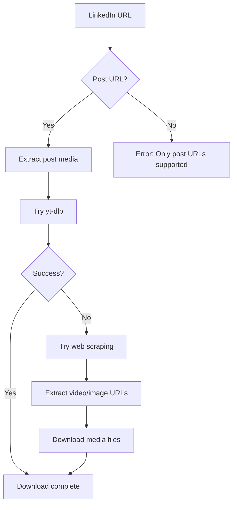

### Key Features

- Direct post URL support only (no profile scraping)
- Video and image extraction
- Multiple fallback methods
- Rich progress bars with download speed
- No Selenium dependency (faster and more reliable)
- User agent rotation
- Cloudflare bypass support

### Limitations

- Profile scraping removed due to authentication requirements
- Only works with publicly accessible posts
- May require cookies for private content

---

## Pinterest Handler

**File**: `handlers/pinterest_handler.py`

Handles downloading images and videos from Pinterest pins, boards, and user profiles with advanced multi-tier download strategy.

### Supported Content Types

| Content Type | URL Pattern | Example |
|--------------|-------------|---------||
| Single Pin | `/pin/PIN_ID/` | `https://www.pinterest.com/pin/123456789/` |
| Board | `/username/board-name/` | `https://www.pinterest.com/username/travel-photos/` |
| User Profile | `/username/` | `https://www.pinterest.com/username/` |
| Short Link | `pin.it/...` | `https://pin.it/abc123` |

### Pinterest Architecture

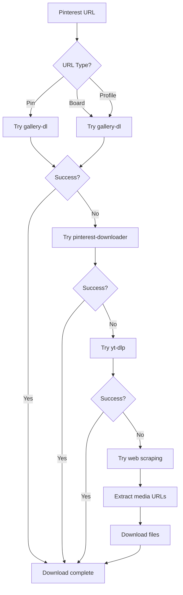

### Multi-Tier Download Strategy

The handler uses multiple methods in order of preference:

1. **gallery-dl** - Most reliable, supports boards and profiles
2. **pinterest-downloader** - Alternative library for Pinterest
3. **yt-dlp** - Generic extractor
4. **Web Scraping** - Fallback with 10 regex patterns and 7 extraction methods

### Key Features

- Multi-tier download strategy for maximum reliability
- Interactive prompt for custom pin count
- Real-time progress tracking with file names
- High-quality media selection (1000px+ images)
- 10 regex patterns for robust scraping
- Support for profiles, boards, and individual pins
- No metadata JSON files (clean downloads)
- ZIP file creation for bulk downloads
- User agent rotation and proxy support

### Pinterest API

The handler can use gallery-dl which interfaces with Pinterest's internal API:

| Tool | Purpose |
|------|---------||
| gallery-dl | Primary download tool |
| pinterest-downloader | Alternative download tool |
| Web scraping | Fallback extraction method |

---

## Reddit Handler

**File**: `handlers/reddit_handler.py`

Handles downloading videos, images, and GIFs from Reddit posts and user profiles with PRAW (Python Reddit API Wrapper) integration.

### Supported Content Types

| Content Type | URL Pattern | Example |
|--------------|-------------|---------||
| Single Post | `/r/subreddit/comments/POST_ID/title/` | `https://www.reddit.com/r/videos/comments/abc123/title/` |
| User Posts | `/user/username/` | `https://www.reddit.com/user/username/` |
| User Profile | `/u/username/` | `https://www.reddit.com/u/username/` |
| Short Link | `redd.it/POST_ID` | `https://redd.it/abc123` |

### Reddit Architecture

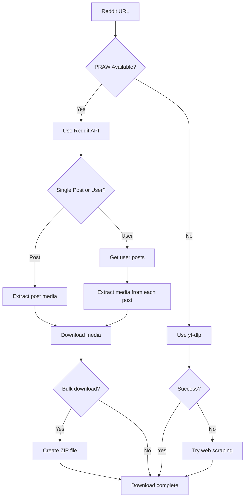

### PRAW Integration

The handler can use PRAW for API access:

| Method | Purpose |
|--------|---------||
| `submission()` | Get post by ID |
| `redditor().submissions.new()` | Get user posts |
| `subreddit().hot()` | Get subreddit posts |

### Configuration

Optional Reddit API credentials for enhanced functionality:

```bash
# Set environment variables
export REDDIT_CLIENT_ID="your_client_id"
export REDDIT_CLIENT_SECRET="your_client_secret"
export REDDIT_USER_AGENT="python:ultimate-downloader:v1.0"
```

Without API credentials, the handler uses yt-dlp and web scraping.

### Key Features

- PRAW integration for API access
- Bulk user post downloads
- Automatic ZIP file creation
- Support for videos, images, and GIFs
- Progress tracking with Rich
- Fallback to yt-dlp and web scraping
- Handles v.redd.it and i.redd.it domains
- User agent rotation
- Configurable post limits

### Media Types Supported

- Videos (v.redd.it)
- Images (i.redd.it)
- GIFs (hosted and external)
- Gallery posts (multiple images)
- Cross-posts
- External media (imgur, gfycat, etc.)

---

## Pornhub Handler

**File**: `handlers/pornhub_handler.py`

Handles video downloads from Pornhub with age verification bypass.

### Session Management

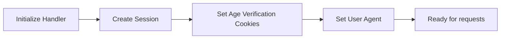

### Cookie Configuration

The handler automatically sets cookies to bypass age verification:

```python
cookies = {
    'age_verified': '1',
    'accessAgeDisclaimerPH': '1',
    'accessPH': '1'
}
```

### Supported Content

| Content | URL Pattern |
|---------|-------------|
| Single Video | `/view_video.php?viewkey=xxx` |
| Channel | `pornhub.com/channels/xxx` |
| Model | `pornhub.com/model/xxx` |
| Playlist | `pornhub.com/playlist/xxx` |

### Key Features

- Automatic age verification bypass
- Quality selection (best, 720p, 480p, etc.)
- Channel and playlist downloading
- User agent rotation

---

## XNXX Handler

**File**: `handlers/xnxx_handler.py`

Downloads videos from XNXX and its mirror domains.

### Supported Domains

The handler recognizes multiple domain variations:

- xnxx.com
- xnxx.dev
- xnxx.tv
- xnxx2.com, xnxx3.com, etc.

### Processing Flow

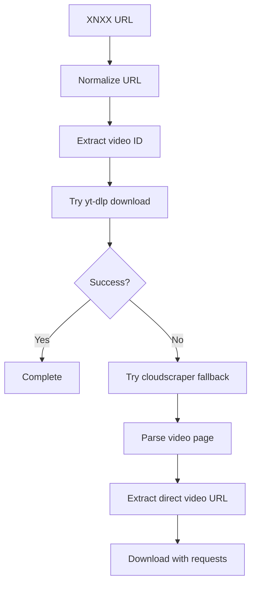

### Key Features

- Multiple domain support
- Fallback extraction methods
- SSL bypass for problematic connections

---

## xHamster Handler

**File**: `handlers/xhamster_handler.py`

Handles downloads from xHamster including videos and photo galleries.

### Supported Content Types

| Content | Description |
|---------|-------------|
| Videos | Standard video pages |
| Channels | Channel video listings |
| Photo Galleries | Image collections |
| Categories | Category browsing |

### Domain Support

The handler recognizes various mirror domains:

```python
patterns = [
    'xhamster',
    'xhwebsite', 
    'xhofficial',
    'xhlocal',
    'xhopen',
    'xhtotal',
    'megaxh',
    'xhwide',
    'xhtab',
    'xhtime'
]
```

### Key Features

- Mirror domain detection
- Photo gallery extraction
- Video quality selection
- Rate limiting to avoid bans

---

## HiAnime Handler

**File**: `handlers/hianime_handler.py`

Handles anime downloads from HiAnime with episode extraction and metadata support.

### Supported Content Types

| Content | Description |
|---------|-------------|
| Anime Series | Full series with all episodes |
| Episodes | Individual episode downloads |
| Movies | Anime movie files |
| Manga | Manga chapter collections |

### Processing Flow

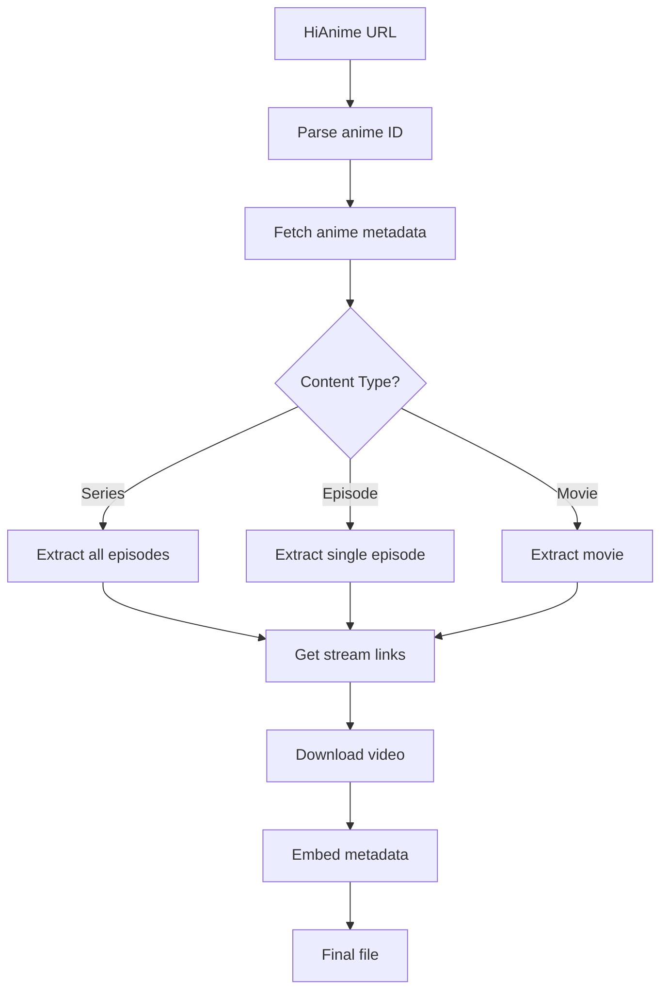

### Key Features

- Automatic episode detection
- Metadata extraction (title, synopsis, cover art)
- Multiple stream quality support
- Batch series downloading
- Episode number formatting

---

## TikTok Handler

**File**: `handlers/tiktok_handler.py`

The TikTok Handler downloads videos from TikTok with proper SSL handling and anti-bot bypass.

### TikTok Supported Domains

The handler recognizes multiple TikTok domain variations:

- tiktok.com
- www.tiktok.com
- vm.tiktok.com (shortened URLs)
- m.tiktok.com (mobile)
- vt.tiktok.com

### TikTok Processing Flow

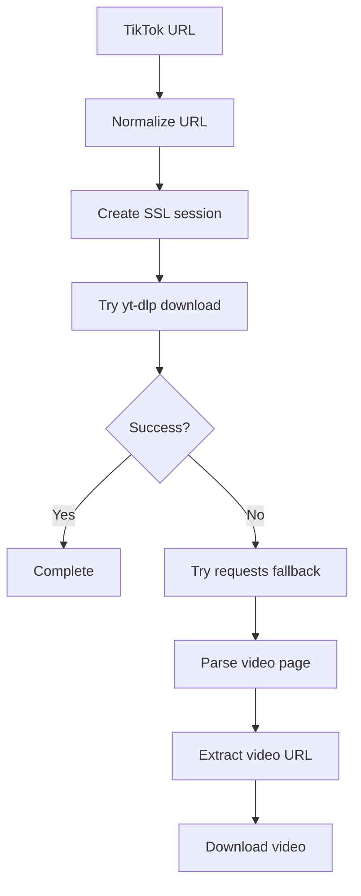

### TikTok Key Features

- Multiple domain support including shortened URLs
- SSL/TLS bypass for problematic connections
- User agent rotation
- Watermark-free download attempts
- Mobile and desktop URL handling

---

## Eporner Handler

**File**: `handlers/eporner_handler.py`

Handles video downloads from Eporner with advanced SSL bypass and multiple fallback methods.

### Eporner Supported Content

| Content | Description |
|---------|-------------|
| Videos | Standard video pages |
| Categories | Category browsing |
| Search Results | Search page videos |

### Eporner Processing Flow

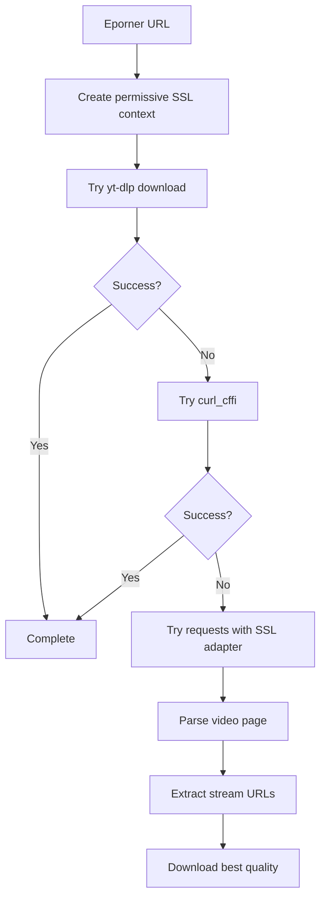

### Eporner Key Features

- Advanced SSL/TLS bypass with permissive context
- Multiple fallback extraction methods (yt-dlp, curl_cffi, requests)
- Quality selection support
- Rate limiting to avoid bans
- User agent rotation

---

## HQPorner Handler

**File**: `handlers/hqporner_handler.py`

Downloads high-quality videos from HQPorner with SSL handling and fallback methods.

### HQPorner Supported Domains

- hqporner.com
- www.hqporner.com

### HQPorner Processing Flow

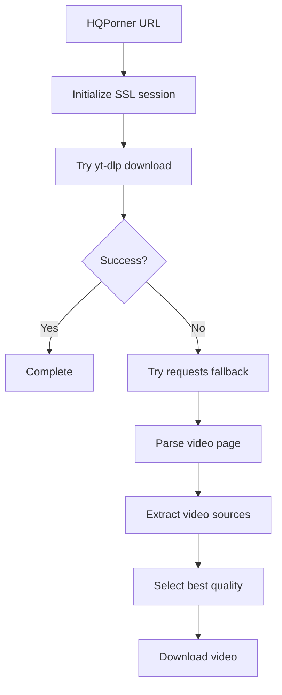

### HQPorner Key Features

- Custom SSL adapter for certificate issues
- High-quality video extraction
- Multiple resolution support
- Fallback extraction methods
- User agent rotation

---

## Beeg Handler

**File**: `handlers/beeg_handler.py`

Handles video downloads from Beeg using their API and fallback methods including subprocess curl.

### Beeg Architecture

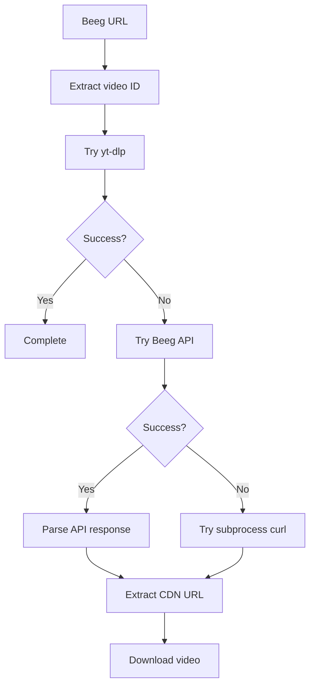

### Beeg API Integration

The handler uses Beeg's internal API for video information:

| Endpoint | Purpose |
|----------|---------|
| `store.externulls.com` | Video metadata API |
| `video.beeg.com` | Video CDN |

### Beeg Key Features

- Native API integration for reliable extraction
- Subprocess curl fallback for SSL issues
- Multiple quality options
- Progress bar display with Rich
- SSL context customization

---


## Creating Custom Handlers

If you want to add support for a new platform, follow this guide.

### Step 1: Create Handler File

Create a new file in `handlers/` directory:

```python
#!/usr/bin/env python3
"""
NewPlatform Handler Module
"""

import warnings
warnings.filterwarnings('ignore')

try:
    from rich.console import Console
    RICH_AVAILABLE = True
except ImportError:
    RICH_AVAILABLE = False

from utils.utils import sanitize_filename
from utils.ui_components import Icons, Messages


class NewPlatformHandler:
    """Handles downloads from NewPlatform"""
    
    def __init__(self, downloader):
        """Initialize handler with reference to main downloader"""
        self.downloader = downloader
        self.console = Console() if RICH_AVAILABLE else None
    
    def _print(self, message):
        """Print with Rich if available"""
        if self.console:
            self.console.print(message)
        else:
            print(message)
    
    def search_and_download(self, url, interactive=True):
        """Main entry point for downloading
        
        Args:
            url: URL to download from
            interactive: Whether to prompt user for options
            
        Returns:
            True if successful, False/None otherwise
        """
        # Implement your download logic here
        pass
    
    @classmethod
    def is_supported_url(cls, url):
        """Check if URL belongs to this platform"""
        return 'newplatform.com' in url.lower()
```

### Step 2: Register Handler in Main Downloader

Edit `ultimate_downloader.py` to import and initialize your handler:

```python
# At the top of the file
try:
    from handlers.newplatform_handler import NewPlatformHandler
    NEWPLATFORM_HANDLER_AVAILABLE = True
except ImportError:
    NEWPLATFORM_HANDLER_AVAILABLE = False

# In __init__ method
if NEWPLATFORM_HANDLER_AVAILABLE:
    self.newplatform_handler = NewPlatformHandler(self)
```

### Step 3: Add Platform Detection

Edit `utils/platform_utils.py`:

```python
# In detect_platform function
elif 'newplatform.com' in url_lower:
    return 'newplatform'
```

### Step 4: Add Configuration

Edit `config.json` if your handler needs settings:

```json
{
    "newplatform": {
        "enabled": true,
        "api_key": ""
    }
}
```

### Handler Best Practices

1. **Graceful Degradation**: Always check if dependencies are available
2. **Error Handling**: Catch exceptions and provide meaningful error messages
3. **Logging**: Use the `_print` method for consistent output
4. **Rate Limiting**: Add delays between requests to avoid getting blocked
5. **Fallbacks**: Implement multiple extraction methods when possible

---

## Summary

The handler system provides a flexible way to support different platforms. Each handler encapsulates the platform-specific logic while delegating common tasks (like actual downloading) to the main downloader class.

When adding new platforms:

- Follow the established patterns
- Test thoroughly with different URL types
- Handle errors gracefully
- Document the supported content types

For questions about handler development, refer to the existing handlers as examples.
