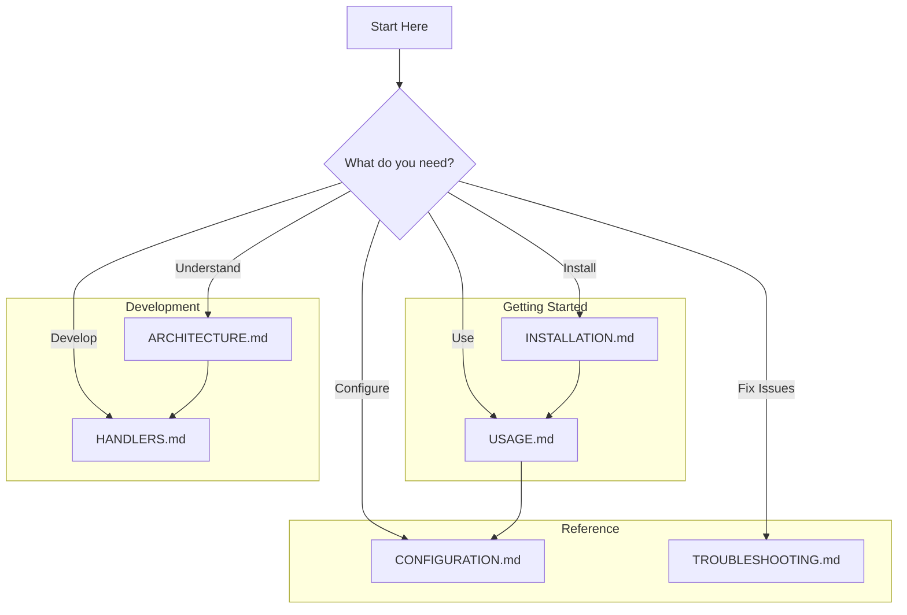

# Documentation Index

Welcome to the Ultimate Media Downloader documentation. This index helps you find the information you need.

---

## Quick Links

| I want to... | Go to... |
|--------------|----------|
| Install the application | [Installation Guide](INSTALLATION.md) |
| Learn how to use it | [Usage Guide](USAGE.md) |
| Update to latest version | [Auto-Update Guide](AUTO_UPDATE.md) |
| Understand how it works | [Architecture](ARCHITECTURE.md) |
| Configure settings | [Configuration Guide](CONFIGURATION.md) |
| Fix a problem | [Troubleshooting](TROUBLESHOOTING.md) |

---

## Documentation Map



---

## Available Documents

### For Users

| Document | Description |
|----------|-------------|
| [Installation Guide](INSTALLATION.md) | How to install on any operating system |
| [Usage Guide](USAGE.md) | Complete guide to using the application |
| [Configuration Guide](CONFIGURATION.md) | All configuration options explained |
| [Auto-Update Guide](AUTO_UPDATE.md) | Automatic version checking and updates |
| [Troubleshooting](TROUBLESHOOTING.md) | Solutions to common problems |
| [Changelog](CHANGELOG.md) | Version history and release notes |

### For Developers

| Document | Description |
|----------|-------------|
| [Architecture](ARCHITECTURE.md) | System design with diagrams |
| [Handlers Documentation](HANDLERS.md) | Platform handler details |
| [File Structure](FILE_STRUCTURE.md) | Project organization |
| [Project Overview](PROJECT_OVERVIEW.md) | High-level project summary |

---

## Reading Order for New Users

1. **[Installation Guide](INSTALLATION.md)** - Get the application running
2. **[Usage Guide](USAGE.md)** - Learn basic commands
3. **[Configuration Guide](CONFIGURATION.md)** - Customize settings (optional)

---

## Reading Order for Developers

1. **[Project Overview](PROJECT_OVERVIEW.md)** - Understand the project
2. **[Architecture](ARCHITECTURE.md)** - Learn the design
3. **[File Structure](FILE_STRUCTURE.md)** - Navigate the code
4. **[Handlers Documentation](HANDLERS.md)** - Extend functionality

---

## Quick Reference

### Basic Commands

```bash
# Start interactive mode
umd

# Download video
umd "URL"

# Download audio
umd "URL" --audio-only --format mp3

# Show help
umd --help
```

### Common Options

| Option | Description |
|--------|-------------|
| `--audio-only` | Extract audio only |
| `--format mp3` | Set output format |
| `--quality 1080p` | Set video quality |
| `--output DIR` | Set download directory |
| `--verbose` | Show detailed output |

---

## Getting Help

If you cannot find what you need:

1. Check the [Troubleshooting Guide](TROUBLESHOOTING.md)
2. Search the documentation for keywords
3. Run `umd --help` for command reference
4. Create an issue on GitHub

---

## Contributing to Documentation

Documentation improvements are welcome. When contributing:

- Use clear, simple language
- Include examples where helpful
- Add Mermaid diagrams for complex concepts
- Keep formatting consistent
