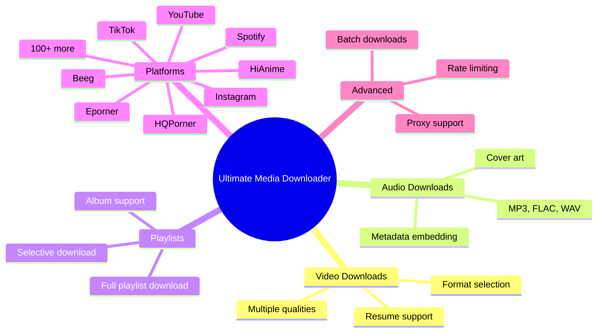
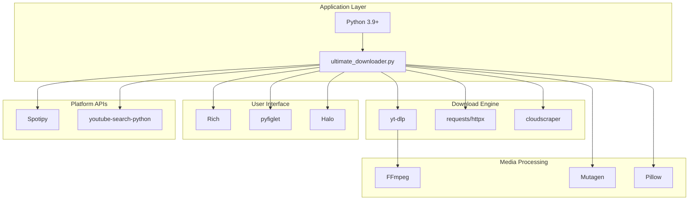

# Project Overview

This document provides a high-level overview of the Ultimate Media Downloader project, its goals, features, and technical details.

## Table of Contents

1. [What is Ultimate Media Downloader](#what-is-ultimate-media-downloader)
2. [Project Goals](#project-goals)
3. [Core Features](#core-features)
4. [Supported Platforms](#supported-platforms)
5. [Technology Stack](#technology-stack)
6. [Project Statistics](#project-statistics)

---

## What is Ultimate Media Downloader

Ultimate Media Downloader is a command-line application written in Python that allows you to download media content from over 100 different websites. It handles videos, audio, playlists, and entire channels from platforms like YouTube, Spotify, Instagram, TikTok, and many more.

The project was created to provide a single, unified tool for downloading media instead of using different tools for different platforms.

### Why This Project Exists

Many people need to download media for legitimate purposes:

- Archiving personal content
- Offline access to purchased content
- Educational research
- Creating backups
- Accessibility needs

This tool makes these tasks easier by providing a consistent interface across all platforms.

---

## Project Goals

### Primary Goals

1. **Simplicity**: One command (`umd`) to download from any supported platform
2. **Quality**: Download the highest quality available
3. **Reliability**: Handle errors gracefully and retry failed downloads
4. **Extensibility**: Easy to add support for new platforms

### Design Goals

1. **User-Friendly**: Beautiful CLI interface with progress bars
2. **Cross-Platform**: Works on Windows, macOS, and Linux
3. **Modular**: Clean code organization with separate handlers
4. **Well-Documented**: Comprehensive documentation for users and developers

---

## Core Features

### Feature Overview

### Video Features

| Feature | Description |
|---------|-------------|
| Quality Selection | Choose from 4K, 1080p, 720p, and more |
| Format Support | MP4, WebM, MKV output formats |
| Resume Downloads | Automatically resume interrupted downloads |
| Live Streams | Record live streams in progress |

### Audio Features

| Feature | Description |
|---------|-------------|
| Audio Extraction | Extract audio from any video |
| Multiple Formats | MP3, FLAC, WAV, M4A, Opus |
| Quality Settings | Up to 320kbps bitrate |
| Metadata | Embed title, artist, album, year |
| Cover Art | Embed thumbnail as cover art |

### Playlist Features

| Feature | Description |
|---------|-------------|
| Full Downloads | Download entire playlists |
| Selective | Choose specific items to download |
| Batch Mode | Parallel downloading for speed |
| Progress | Track overall playlist progress |

### Platform Features

| Feature | Description |
|---------|-------------|
| Auto-Detection | Automatically detect platform from URL |
| Fallback | Multiple download methods per platform |
| Authentication | Cookie support for private content |
| Anti-Bot Bypass | Handle Cloudflare and other protections |

---

## Supported Platforms

### Video Platforms

| Platform | Content Types |
|----------|--------------|
| YouTube | Videos, playlists, channels, shorts, live |
| Vimeo | Videos, private videos |
| Dailymotion | Videos |
| Twitch | VODs, clips, live streams |
| Facebook | Videos, live streams |
| HiAnime | Videos, Series, Episodes |
| TikTok | Videos, user content |
| Eporner | Videos |
| HQPorner | Videos |
| Beeg | Videos |

### Music Platforms

| Platform | Content Types |
|----------|--------------|
| Spotify | Tracks, albums, playlists (via YouTube) |
| SoundCloud | Tracks, playlists, user uploads |
| Apple Music | Songs, albums (via YouTube) |
| JioSaavn | Tracks, albums, playlists (via YouTube) |
| Bandcamp | Tracks, albums |

### Social Media

| Platform | Content Types |
|----------|--------------|
| Instagram | Posts, reels, IGTV, stories |
| TikTok | Videos, user content |
| Twitter/X | Video tweets |
| Reddit | Videos, posts, user content |
| Tumblr | Images, videos, blogs |
| LinkedIn | Posts, videos |
| Pinterest | Pins, boards, profiles |

### Additional Support

Through the yt-dlp integration, the application supports over 1000 additional websites. Use `umd --list-platforms` to see the full list.

---

## Technology Stack

### Core Technologies

### Key Dependencies

| Package | Purpose |
|---------|---------|
| yt-dlp | Core download engine for 1000+ sites |
| rich | Beautiful terminal formatting |
| requests | HTTP requests |
| mutagen | Audio metadata editing |
| Pillow | Image processing |
| spotipy | Spotify API wrapper |
| cloudscraper | Cloudflare bypass |
| BeautifulSoup | HTML parsing |

### Why These Technologies

- **yt-dlp**: Most comprehensive video extraction library available
- **Rich**: Modern, beautiful terminal UI with progress bars
- **Mutagen**: Industry-standard audio metadata library
- **FFmpeg**: Universal media processing tool

---

## Project Statistics

### Codebase Overview

| Metric | Value |
|--------|-------|
| Main Application | ~3500 lines |
| Generic Downloader | ~1200 lines |
| Spotify Handler | ~1200 lines |
| Apple Music Handler | ~1100 lines |
| JioSaavn Handler | ~1700 lines |
| YouTube Scorer | ~1000 lines |
| Utility Modules | ~1500 lines |
| Total Python Code | ~12000+ lines |

### File Count

| Category | Count |
|----------|-------|
| Python Files | 19 |
| Handler Modules | 16 |
| Utility Modules | 8 |
| Shell Scripts | 8 |
| Documentation | 10+ |

### Supported Sites

| Category | Count |
|----------|-------|
| Video Platforms | 50+ |
| Music Platforms | 10+ |
| Social Media | 15+ |
| Other Sites | 900+ |
| Total via yt-dlp | 1000+ |

---

## Future Development

### Planned Features

- GUI application (Electron or native)
- Browser extension integration
- Download scheduling
- Enhanced metadata from additional sources
- Mobile companion app

### Contributing

The project welcomes contributions. See the main README for contribution guidelines.

---

## Summary

Ultimate Media Downloader is a comprehensive solution for downloading media from the internet. It combines the power of yt-dlp with custom handlers for specific platforms, all wrapped in a user-friendly interface.

The modular architecture makes it easy to extend and maintain, while the extensive configuration options allow users to customize behavior to their needs.

For installation instructions, see [Installation Guide](INSTALLATION.md).
For usage instructions, see [Usage Guide](USAGE.md).
