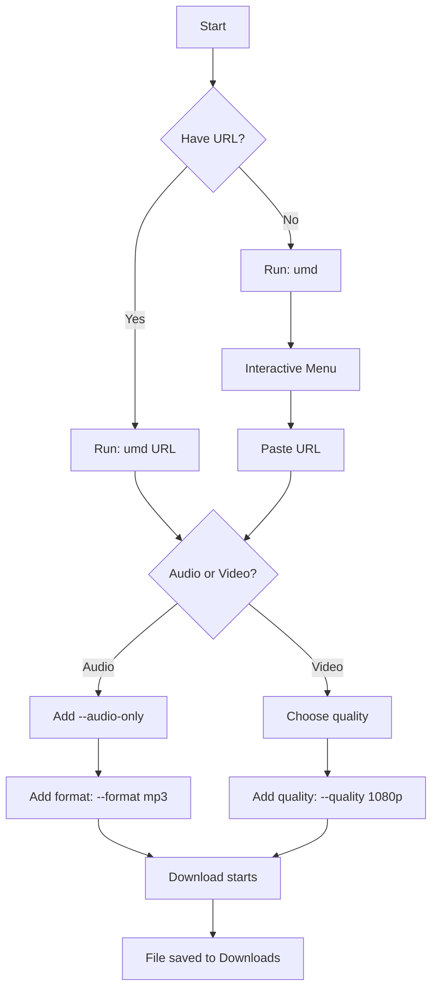
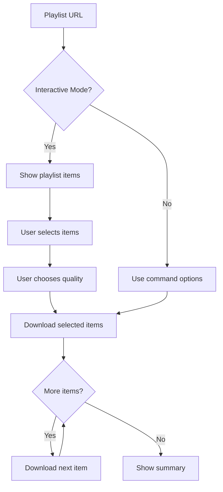

# Usage Guide

This guide explains how to use the Ultimate Media Downloader. It covers basic usage, advanced features, and practical examples for different scenarios.

## Table of Contents

1. [Getting Started](#getting-started)
2. [Basic Commands](#basic-commands)
3. [Downloading Videos](#downloading-videos)
4. [Downloading Audio](#downloading-audio)
5. [Playlists and Albums](#playlists-and-albums)
6. [Batch Downloads](#batch-downloads)
7. [Platform-Specific Usage](#platform-specific-usage)
8. [Downloading Wallpapers](#downloading-wallpapers)
9. [Command Reference](#command-reference)
10. [Tips and Best Practices](#tips-and-best-practices)

---

## Getting Started

### Interactive Mode

The easiest way to use the application is interactive mode. Just run:

```bash
umd
```

This will present a menu where you can paste URLs and choose options without memorizing commands.

### Direct Download

For quick downloads, provide the URL directly:

```bash
umd "https://www.youtube.com/watch?v=VIDEO_ID"
```

### Getting Help

To see all available options:

```bash
umd --help
```

To see the version:

```bash
umd --version
```

---

## Basic Commands

### Download Workflow

Here is the typical workflow for downloading content:



### Basic Options

| Option | Short | Description |
|--------|-------|-------------|
| `--help` | `-h` | Show help message |
| `--version` | `-v` | Show version number |
| `--verbose` | | Enable detailed output |
| `--output` | `-o` | Set download directory |
| `--info` | `-i` | Show info without downloading |

---

## Downloading Videos

### Default Video Download

Downloads the best available quality:

```bash
umd "https://www.youtube.com/watch?v=VIDEO_ID"
```

### Specific Quality

Choose a specific resolution:

```bash
# 1080p HD
umd "https://www.youtube.com/watch?v=VIDEO_ID" --quality 1080p

# 720p HD
umd "https://www.youtube.com/watch?v=VIDEO_ID" --quality 720p

# 4K if available
umd "https://www.youtube.com/watch?v=VIDEO_ID" --quality 4k
```

### Available Quality Options

| Quality | Description |
|---------|-------------|
| `best` | Highest available quality (default) |
| `worst` | Lowest available quality |
| `4k` / `2160p` | Ultra HD 4K |
| `1440p` | Quad HD |
| `1080p` | Full HD |
| `720p` | HD |
| `480p` | Standard definition |
| `360p` | Low quality |

### Video Format

Specify the output format:

```bash
# Download as MP4
umd "URL" --format mp4

# Download as WebM
umd "URL" --format webm

# Download as MKV
umd "URL" --format mkv
```

### View Available Formats

Before downloading, see what formats are available:

```bash
umd "URL" --show-formats
```

This shows a table with all available video and audio formats, their quality, file size, and codecs.

---

## Downloading Audio

### Audio Only Mode

Extract just the audio from a video:

```bash
umd "URL" --audio-only
```

### Audio Formats

```bash
# MP3 (most compatible)
umd "URL" --audio-only --format mp3

# FLAC (lossless quality)
umd "URL" --audio-only --format flac

# M4A (Apple compatible)
umd "URL" --audio-only --format m4a

# WAV (uncompressed)
umd "URL" --audio-only --format wav

# Opus (efficient compression)
umd "URL" --audio-only --format opus
```

### Audio Quality Levels

```bash
# Best quality (default)
umd "URL" --audio-only --audio-quality best

# High quality
umd "URL" --audio-only --audio-quality high

# Medium quality
umd "URL" --audio-only --audio-quality medium

# Low quality (smaller files)
umd "URL" --audio-only --audio-quality low
```

### Embedding Metadata

Add song information and cover art:

```bash
umd "URL" --audio-only --embed-metadata --embed-thumbnail
```

This embeds:

- Song title
- Artist name
- Album name
- Year
- Cover art/thumbnail

---

## Playlists and Albums

### Downloading Playlists

```bash
# Download entire playlist
umd "https://www.youtube.com/playlist?list=PLAYLIST_ID"

# Force playlist mode
umd "URL" --playlist

# Download only one video from playlist URL
umd "PLAYLIST_URL" --no-playlist
```

### Playlist Options

```bash
# Limit number of downloads
umd "PLAYLIST_URL" --max-downloads 10

# Start from specific position
umd "PLAYLIST_URL" --start-index 5

# Combine options: download items 5-15
umd "PLAYLIST_URL" --start-index 5 --max-downloads 10
```

### Interactive Playlist Mode

By default, playlist downloads show an interactive menu where you can:

- See all playlist items
- Choose which ones to download
- Select quality settings

To skip the interactive menu:

```bash
umd "PLAYLIST_URL" --no-interactive
```

### Playlist Download Flow



---

## Batch Downloads

### From File

Create a text file with URLs (one per line):

```text
https://www.youtube.com/watch?v=VIDEO1
https://www.youtube.com/watch?v=VIDEO2
https://www.youtube.com/watch?v=VIDEO3
```

Then download all:

```bash
umd --batch-file urls.txt
```

### Optimized Batch Download

For faster batch downloads with parallel processing:

```bash
umd --batch-file urls.txt --optimized-batch --max-concurrent 5
```

This downloads 5 files simultaneously instead of one at a time.

### Batch with Options

Combine batch download with other options:

```bash
# Batch download as audio
umd --batch-file urls.txt --audio-only --format mp3

# Batch download specific quality
umd --batch-file urls.txt --quality 720p
```

---

## Platform-Specific Usage

### YouTube

```bash
# Video
umd "https://www.youtube.com/watch?v=VIDEO_ID"

# Playlist
umd "https://www.youtube.com/playlist?list=PLAYLIST_ID"

# Channel (all videos)
umd "https://www.youtube.com/@ChannelName/videos"

# Shorts
umd "https://www.youtube.com/shorts/SHORT_ID"
```

### Spotify

Spotify URLs are converted to YouTube searches:

```bash
# Track
umd "https://open.spotify.com/track/TRACK_ID" --audio-only

# Album
umd "https://open.spotify.com/album/ALBUM_ID" --audio-only

# Playlist
umd "https://open.spotify.com/playlist/PLAYLIST_ID" --audio-only
```

### Apple Music

Similar to Spotify:

```bash
# Song
umd "https://music.apple.com/us/song/..." --audio-only

# Album
umd "https://music.apple.com/us/album/..." --audio-only
```

### JioSaavn

Indian music platform with comprehensive metadata:

```bash
# Track
umd "https://www.jiosaavn.com/song/..." --audio-only

# Album
umd "https://www.jiosaavn.com/album/..." --audio-only

# Playlist
umd "https://www.jiosaavn.com/featured/..." --audio-only
```

### Gaana

Indian music platform with comprehensive metadata:

```bash
# Track
umd "https://gaana.com/song/..." --audio-only

# Album
umd "https://gaana.com/album/..." --audio-only

# Playlist
umd "https://gaana.com/playlist/..." --audio-only

# Artist
umd "https://gaana.com/artist/..." --audio-only
```

### Instagram

```bash
# Single post
umd "https://www.instagram.com/p/POST_ID/"

# Single reel
umd "https://www.instagram.com/reel/REEL_ID/"

# Profile with interactive menu (shows options)
umd "https://www.instagram.com/username/"

# Direct download all profile reels
umd "https://www.instagram.com/username/reels/"

# Download stories
umd "https://www.instagram.com/stories/username/"
```

**Instagram Notes:**
- First-time use: Requires authentication via cookies.json
- Cookie file locations: `./cookies.json` or `~/.instagram_cookies.json`
- Profile downloads show interactive menu with 5 options
- Supports range selection (e.g., posts 1-20)
- Can create ZIP files for bulk downloads
- Stories expire after 24 hours

### TikTok

```bash
umd "https://www.tiktok.com/@user/video/VIDEO_ID"
```

### Twitter/X

```bash
umd "https://twitter.com/user/status/TWEET_ID"
```

### SoundCloud

```bash
# Track
umd "https://soundcloud.com/artist/track" --audio-only

# Playlist
umd "https://soundcloud.com/artist/sets/playlist" --audio-only
```

### LinkedIn

```bash
# Post with video
umd "https://www.linkedin.com/posts/username_POST_ID"

# Profile posts
umd "https://www.linkedin.com/in/username/"
```

### Reddit

```bash
# Single post
umd "https://www.reddit.com/r/subreddit/comments/POST_ID/title/"

# User posts
umd "https://www.reddit.com/user/username/"
```

### Pinterest

```bash
# Single pin
umd "https://www.pinterest.com/pin/PIN_ID/"

# Board
umd "https://www.pinterest.com/username/board-name/"

# User profile
umd "https://www.pinterest.com/username/"
```

---

## Downloading Wallpapers

The built-in 4K Wallpapers module lets you browse and download high-resolution wallpapers from [4kwallpapers.com](https://4kwallpapers.com).

### Open the Wallpaper Browser

```bash
# Interactive menu (CLI flag)
umd --wallpaper

# Search directly from the command line
umd --wallpaper-search "anime"
umd --wallpaper-search "space galaxy"
```

### Wallpaper Command in Interactive Mode

While inside `umd` interactive mode, type any of these:

```
wallpaper
wallpapers
wp
```

### Paste a 4kwallpapers.com URL

You can also paste any 4kwallpapers.com URL directly into the interactive prompt:

```
https://4kwallpapers.com/anime/
https://4kwallpapers.com/search/?q=cyberpunk
https://4kwallpapers.com/nature/mountains-123456.html
```

The handler will auto-detect the URL type and behave accordingly.

### Interactive Menu Options

| Option | Description |
|--------|-------------|
| `1` | Home / Featured wallpapers |
| `2` | Recently Added wallpapers |
| `3` | Browse by Tag (scraped from live site) |
| `4` | Categories (anime, nature, space, etc.) |
| `5` | Search by keyword |
| `0` | Exit wallpaper browser |

### Browsing & Downloading Wallpapers

After selecting a section, the handler will:

1. Fetch wallpapers from page 1 and show the count
2. Ask how many wallpapers to browse (default: 96, max per session: 2400)
3. Show the numbered list of wallpapers
4. Prompt you to select which ones to download

#### Selection Syntax

| Input | Meaning |
|-------|---------|
| `all` | Download every wallpaper in the list |
| `1` | Download wallpaper #1 only |
| `1,3,7` | Download wallpapers 1, 3, and 7 |
| `1-10` | Download wallpapers 1 through 10 |
| `1-5,8,10-15` | Combined ranges and individual picks |
| *(press Enter)* | Skip / cancel |

#### Resolution Selection

After selecting wallpapers, you will be asked to choose a resolution. Available resolutions are scraped live from each wallpaper page (e.g., `3840x2160`, `1920x1080`, `1280x720`). The highest available resolution is highlighted as the default.

### Download Location

Wallpapers are saved to:

```
~/Downloads/UltimateDownloader/4kwallpapers/
```

### Notes

- **Search results** are limited to 24 per session (site limitation — search pages are single-page only)
- **Category / tag pages** support pagination up to 2400 wallpapers per session
- **Cloudflare** is automatically bypassed — no extra setup needed

---

## Command Reference

### Complete Option List

#### Basic Options

| Option | Description |
|--------|-------------|
| `url` | URL to download (optional, starts interactive mode if not provided) |
| `-h, --help` | Show help and exit |
| `-v, --version` | Show version and exit |
| `--verbose` | Show detailed output |

#### Quality Options

| Option | Description |
|--------|-------------|
| `-q, --quality` | Video quality (best, 1080p, 720p, etc.) |
| `--audio-quality` | Audio quality level (best, high, medium, low) |

#### Format Options

| Option | Description |
|--------|-------------|
| `-a, --audio-only` | Download audio only |
| `-f, --format` | Output format (mp4, mp3, flac, etc.) |
| `--audio-format` | Audio format (mp3, flac, opus, m4a, aac, wav) |
| `--custom-format` | Custom yt-dlp format selector |

#### Output Options

| Option | Description |
|--------|-------------|
| `-o, --output` | Output directory |
| `--embed-metadata` | Embed metadata in file |
| `--embed-thumbnail` | Embed thumbnail/cover art |

#### Playlist Options

| Option | Description |
|--------|-------------|
| `-p, --playlist` | Download as playlist |
| `--no-playlist` | Download single video from playlist URL |
| `-m, --max-downloads` | Maximum items to download |
| `-s, --start-index` | Starting position in playlist |

#### Batch Options

| Option | Description |
|--------|-------------|
| `--batch-file` | File containing URLs |
| `--optimized-batch` | Enable parallel downloading |
| `--max-concurrent` | Number of parallel downloads |

#### Information Options

| Option | Description |
|--------|-------------|
| `-i, --info` | Show info without downloading |
| `--show-formats` | List available formats |
| `--check-support` | Check if URL is supported |
| `--list-platforms` | Show supported platforms |

#### Mode Options

| Option | Description |
|--------|-------------|
| `--interactive` | Force interactive mode |
| `--no-interactive` | Disable interactive prompts |

#### Wallpaper Options

| Option | Description |
|--------|-------------|
| `--wallpaper` | Open the 4K Wallpapers interactive browser |
| `--wallpaper-search QUERY` | Search 4kwallpapers.com for QUERY and show results |

---

## Tips and Best Practices

### For Best Audio Quality

```bash
umd "URL" --audio-only --format flac --embed-metadata --embed-thumbnail
```

FLAC gives lossless quality, and embedding metadata makes files easier to organize in music players.

### For Smaller Video Files

```bash
umd "URL" --quality 720p --format mp4
```

720p offers good quality with reasonable file sizes.

### For Music Collections

When downloading music albums or playlists:

```bash
umd "SPOTIFY_PLAYLIST_URL" --audio-only --format mp3 --embed-metadata --embed-thumbnail --optimized-batch
```

### Check Before Downloading

Always check what you are getting:

```bash
# See what formats are available
umd "URL" --show-formats

# See video info
umd "URL" --info
```

### Organize Downloads

Use a custom output directory for different content types:

```bash
# Music
umd "URL" --audio-only --output ~/Music/Downloads

# Videos
umd "URL" --output ~/Videos/Downloads
```

### Resume Failed Downloads

The application automatically resumes interrupted downloads. If a download fails, just run the same command again.

### Avoid Rate Limiting

When downloading many files, use reasonable concurrency:

```bash
umd --batch-file urls.txt --optimized-batch --max-concurrent 3
```

Using too many concurrent downloads might trigger rate limiting from the source.

---

## Download Location

By default, files are saved to:

```text
~/Downloads/UltimateDownloader/
```

The folder structure:

```text
~/Downloads/UltimateDownloader/
    Artist Name - Song Title.mp3
    Video Title.mp4
    Playlist Name/
        01 - Song One.mp3
        02 - Song Two.mp3
    Album Name/
        01 - Track One.mp3
        02 - Track Two.mp3
```

---

## Examples Summary

Here are quick copy-paste examples for common tasks:

```bash
# Simple video download
umd "https://youtube.com/watch?v=xxx"

# Audio from YouTube
umd "https://youtube.com/watch?v=xxx" --audio-only --format mp3

# High quality audio with metadata
umd "URL" --audio-only --format flac --embed-metadata --embed-thumbnail

# Specific video quality
umd "URL" --quality 1080p --format mp4

# Spotify album
umd "https://open.spotify.com/album/xxx" --audio-only

# YouTube playlist
umd "https://youtube.com/playlist?list=xxx"

# Batch download
umd --batch-file urls.txt --audio-only --format mp3

# Check what is available
umd "URL" --show-formats
```

---

## Next Steps

Now that you know how to use the application, you might want to explore:

- [Architecture Documentation](ARCHITECTURE.md) - Understand how the application works
- [Handlers Documentation](HANDLERS.md) - Learn about platform-specific features
- [Configuration Guide](CONFIGURATION.md) - Customize default settings
